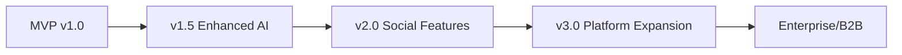
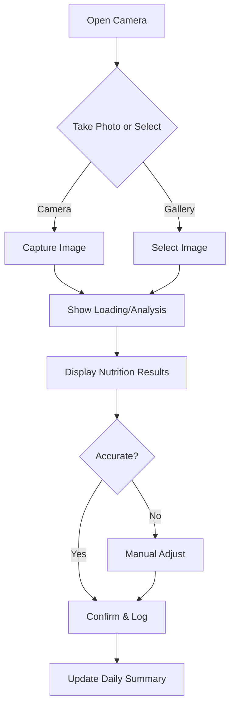
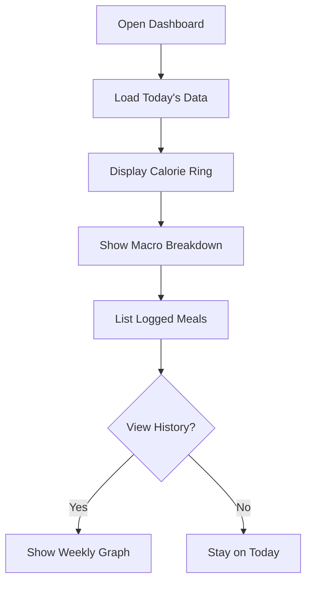
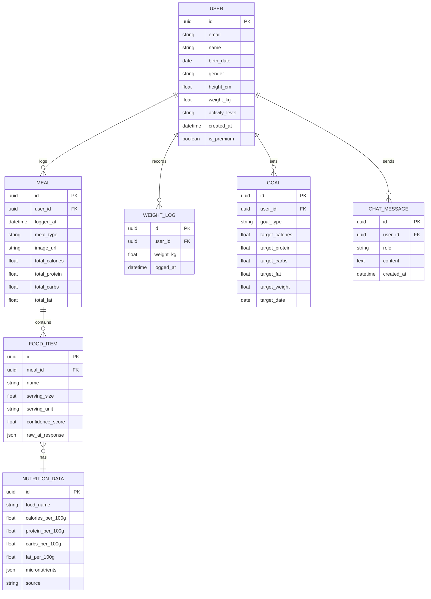
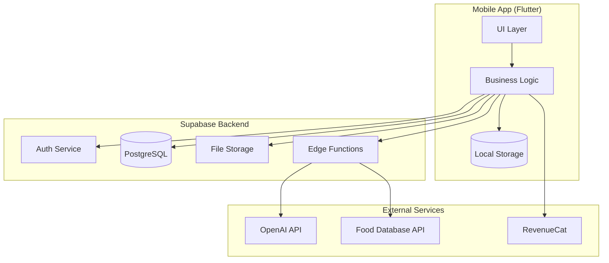
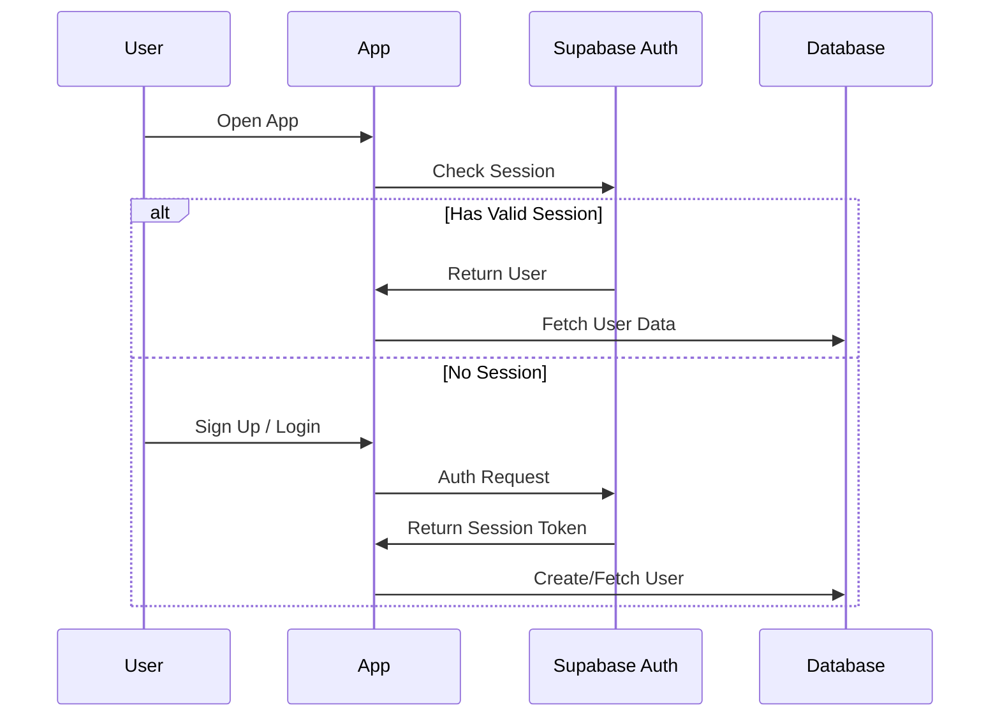
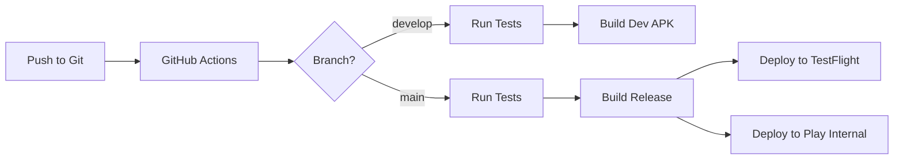

# AI Meal Scanner Flutter App - Comprehensive Evaluation

> **Evaluation Date:** January 2026  
> **App Type:** AI-Powered Nutrition & Calorie Tracker  
> **Platform:** Cross-Platform Mobile (Flutter)

---

## Reference Links

### Source App Template
- **CodeCanyon Template:** [AI Meal Scanner Flutter App - Nutrition & Calorie Tracker](https://codecanyon.net/item/ai-meal-scanner-flutter-app-nutrition-calorie-tracker-chatgptpowered-analysis/59111788) - $49 (ChatGPT/OpenAI-powered)

### Top Competitor Apps

| App | Platform | Downloads | Rating | Key Features |
|-----|----------|-----------|--------|--------------|
| [MyFitnessPal](https://apps.apple.com/app/id341232718) | iOS/Android | 220M+ registered users | 4.7★ | AI meal scanner, voice logging, 14M+ food database |
| [YAZIO](https://apps.apple.com/app/id946099498) | iOS/Android | 100M+ users | 4.8★ | AI tracking, intermittent fasting, barcode scanner |
| [Lose It!](https://apps.apple.com/app/id297368629) | iOS/Android | 50M+ downloads | 4.7★ | Snap It photo recognition, extensive food database |
| [Foodvisor](https://apps.apple.com/app/id1021634279) | iOS/Android | 10M+ downloads | 4.6★ | AI photo recognition, personalized meal plans |
| [SnapCalorie](https://apps.apple.com/app/id1535966589) | iOS | 1M+ downloads | 4.5★ | LiDAR precision tracking, 30+ micronutrients |

### Open Source References (GitHub)

| Repository | Stars | Description |
|------------|-------|-------------|
| [codeofmochi/kcal](https://github.com/codeofmochi/kcal) | - | Open-source Flutter calorie tracker (GPL v3) |
| [amirdora/ai_calorie_tracker](https://github.com/amirdora/ai_calorie_tracker) | - | Flutter + Google Gemini AI food analysis |
| [praveenhonavar/NutriScan](https://github.com/praveenhonavar/NutriScan) | - | Flutter + FirebaseMLVision food recognition |
| [simonoppowa/OpenNutriTracker](https://github.com/simonoppowa/OpenNutriTracker) | - | Privacy-focused open-source calorie tracker |
| [luisdibdin/foodApp](https://github.com/luisdibdin/foodApp) | - | Flutter diet tracker with Firebase backend |

---

## 1. Idea Summary

### Core Problem Solved
This app addresses the **friction in traditional calorie tracking** by using AI-powered image recognition to instantly analyze meals. Users struggle with:
- Manual food logging being tedious and time-consuming
- Inaccurate portion size estimation
- Lack of understanding of nutritional content
- Poor adherence to diet tracking due to complexity

### Target User Personas

**Primary: Health-Conscious Millennials & Gen Z (25-40)**
- Fitness enthusiasts tracking macros and calories
- Weight loss seekers wanting convenient tracking
- Tech-savvy users expecting AI-powered solutions
- Busy professionals with limited time for manual logging

**Secondary: Health Management Users (35-55)**
- Diabetics monitoring carbohydrate intake
- Users with dietary restrictions needing nutritional awareness
- Post-workout nutrition trackers
- Meal preppers planning weekly nutrition

---

## 2. Market Demand & Trends

### Market Size & Growth

| Metric | Value | Source |
|--------|-------|--------|
| Calorie Counting App Market (2024) | $1.75 - $2.1 Billion | Cognitive Market Research |
| Projected Market (2032) | $4.7 - $7.7 Billion | CAGR 9.1-9.27% |
| Diet & Nutrition Apps (2024) | $5.06 - $11.71 Billion | Roots Analysis |
| AI in Personalized Nutrition (2024) | $4.15 Billion | TowardsFNB |
| Mobile Apps & Cloud Platforms Share | 60% of market | 2024 Data |

### Key Trends Supporting This Idea

✅ **AI Integration Acceleration**
- 50%+ of diet apps expected to feature AI-driven recommendations by 2025
- Computer vision segment growing at 28% CAGR (2025-2034)

✅ **Rising Health Consciousness**
- Obesity epidemic driving demand for tracking tools
- Post-pandemic health awareness at all-time high

✅ **Simplified User Experience Demand**
- Voice input, AR menu scanning emerging as standard features
- 25% of diet apps expected to have AR by 2025

✅ **Wearable Integration**
- Seamless sync with Apple Watch, Fitbit, Samsung Health expected

### Threats to Consider

⚠️ **Market Saturation** - Dominated by established players (MyFitnessPal, YAZIO)
⚠️ **AI Accuracy Concerns** - Food recognition still imperfect, leading to user frustration
⚠️ **Privacy Regulations** - GDPR, CCPA compliance required for health data
⚠️ **Platform Dependency** - Heavy reliance on OpenAI API pricing and availability

---

## 3. ASO & Discoverability Analysis

### Keyword Analysis

| Keyword | Monthly Searches | Competition | Difficulty |
|---------|------------------|-------------|------------|
| "calorie counter" | 100K+ | Very High | 85/100 |
| "calorie tracker" | 80K+ | Very High | 82/100 |
| "AI food scanner" | 15K+ | Medium | 55/100 |
| "meal scanner" | 10K+ | Medium | 50/100 |
| "AI calorie tracker" | 8K+ | Medium-Low | 45/100 |
| "food photo calories" | 5K+ | Medium-Low | 40/100 |
| "AI nutrition tracker" | 3K+ | Low | 35/100 |

### ASO Strategy Assessment

**Ranking Viability: MEDIUM**

- **Head Keywords:** Extremely competitive; ranking for "calorie counter" is near-impossible against MyFitnessPal's domain authority
- **Long-tail Opportunity:** "AI meal scanner," "photo calorie tracker," "AI nutrition analyzer" offer achievable ranking potential
- **Differentiation Required:** Must emphasize AI accuracy, specific dietary focuses (keto, vegan), or niche use cases

### Recommended App Store Title
```
MealScan AI - Photo Calorie & Nutrition Tracker
```

### Acquisition Viability

| Channel | Viability | Cost Estimate |
|---------|-----------|---------------|
| Organic ASO | Medium | Time investment required |
| Apple Search Ads | High | $2-5 CPI for targeted keywords |
| Google UAC | Medium | $1-3 CPI |
| Social Media | High | TikTok/Instagram food content resonates |
| Influencer Marketing | High | Fitness influencers drive conversions |

---

## 4. Monetization Potential

### Recommended Model: **Freemium + Subscription (Hybrid)**

#### Pricing Strategy

| Tier | Price | Features |
|------|-------|----------|
| **Free** | $0 | 3 daily AI scans, basic nutrition info, limited history |
| **Premium Monthly** | $9.99/month | Unlimited scans, detailed insights, meal planning |
| **Premium Annual** | $49.99/year | All Premium + AI chatbot, priority support |
| **Lifetime** | $149.99 | One-time purchase for early adopters |

### Revenue Projections

#### Low Effort Scenario (Basic MVP, minimal marketing)
- **Users after 12 months:** 5,000 - 10,000
- **Conversion Rate:** 2-3%
- **Monthly Revenue:** $500 - $2,000
- **Annual Revenue:** $6,000 - $24,000

#### Medium Execution Scenario (Quality app, moderate marketing)
- **Users after 12 months:** 50,000 - 100,000
- **Conversion Rate:** 4-5%
- **Monthly Revenue:** $10,000 - $25,000
- **Annual Revenue:** $120,000 - $300,000

#### High Execution Scenario (Premium quality, strong marketing)
- **Users after 12 months:** 500,000+
- **Conversion Rate:** 6-8%
- **Monthly Revenue:** $150,000 - $400,000
- **Annual Revenue:** $1.8M - $5M+

### API Cost Considerations

> [!CAUTION]
> **OpenAI API costs can significantly impact margins at scale.**

| Usage Level | Monthly Scans | Est. API Cost | Revenue Needed |
|-------------|---------------|---------------|----------------|
| Low | 10,000 | $30-50 | $500+ |
| Medium | 100,000 | $300-500 | $5,000+ |
| High | 1,000,000 | $3,000-5,000 | $50,000+ |

**GPT-4o Pricing (2024):**
- Input: $3.00 / 1M tokens
- Output: $10.00 / 1M tokens
- Image processing: ~$0.008 per image (high-detail)

---

## 5. Development Effort & Time

### MVP Development Timeline

| Phase | Duration | Key Deliverables |
|-------|----------|------------------|
| **Setup & Architecture** | 1 week | Project setup, CI/CD, design system |
| **Core Features** | 4-5 weeks | AI scanning, nutrition display, history |
| **User Management** | 1-2 weeks | Auth, profiles, settings |
| **Premium Features** | 2-3 weeks | Subscriptions, meal planning, chatbot |
| **Polish & Testing** | 2 weeks | Bug fixes, performance, UI polish |
| **Total MVP** | **10-13 weeks** | Production-ready app |

### Tech Complexity: **MEDIUM-HIGH**

| Component | Complexity | Notes |
|-----------|------------|-------|
| AI Integration (OpenAI) | Medium | Well-documented API, but requires prompt engineering |
| Image Processing | Medium | Camera/gallery integration, image compression |
| Nutrition Database | High | Need reliable food database API or build custom |
| Offline Support | High | Local storage sync with cloud |
| Subscription Billing | Medium | RevenueCat simplifies IAP |
| Charts/Progress | Medium | Flutter has good charting libraries |

### Developer Feasibility

| Scenario | Feasibility | Timeline |
|----------|-------------|----------|
| **Solo Developer (Flutter Experienced)** | ✅ Feasible | 3-4 months for MVP |
| **Solo Developer (Learning Flutter)** | ⚠️ Challenging | 5-6 months+ |
| **2-Person Team** | ✅ Recommended | 2-3 months |
| **Full Team (3-5)** | ✅ Optimal | 6-8 weeks |

---

## 6. Competition Analysis

### Competition Level: **HIGH**

### Competitor Strengths & Weaknesses

#### MyFitnessPal (Market Leader)
**Strengths:**
- 220M+ user base with network effects
- 14M+ verified food database
- Under Armour ecosystem integration
- Strong brand recognition

**Weaknesses:**
- Complex UI, steep learning curve
- Premium required for basic features
- Slow to adopt latest AI features

#### YAZIO
**Strengths:**
- Beautiful, modern UI
- Integrated fasting tracker
- Strong European presence

**Weaknesses:**
- Smaller food database
- Limited AI features
- Aggressive upselling

#### Foodvisor
**Strengths:**
- Dedicated AI photo recognition
- Clean, focused experience
- Good accuracy for European foods

**Weaknesses:**
- Limited database for international cuisines
- Higher price point
- Smaller user community

### Differentiation Opportunities

1. **Superior AI Accuracy** - Focus on specific cuisines (Asian, Indian, Middle Eastern)
2. **Privacy-First Approach** - On-device processing where possible
3. **Gamification** - Streaks, achievements, social challenges
4. **Dietary Niche Focus** - Keto, Vegan, Halal, Medical diets
5. **Integration Depth** - Smart kitchen appliances, grocery apps
6. **AI Chatbot Coach** - Personalized nutrition advice

---

## 7. Scalability & Future Expansion

### Product Roadmap Vision



### Phase 1: Core App (Months 1-6)
- AI meal scanning
- Nutrition tracking & history
- Basic meal planning
- Premium subscriptions

### Phase 2: Enhanced Experience (Months 6-12)
- AI nutrition chatbot
- Wearable integrations (Apple Watch, WearOS)
- Recipe suggestions based on goals
- Barcode scanning

### Phase 3: Social & Community (Year 2)
- Friend challenges and leaderboards
- Community recipes sharing
- Professional nutritionist marketplace
- Family plans

### Phase 4: Platform Expansion (Year 2-3)
- Apple Watch standalone app
- Web dashboard
- API for third-party integrations
- White-label solution for gyms/health companies

### Moat Potential: **MEDIUM**

**Defensible advantages to build:**
- Proprietary nutrition database with AI-verified data
- User behavior data for personalized recommendations
- Community and social graph
- Brand recognition in specific dietary niches

---

## 8. Risk Assessment

### Risk Matrix

| Risk | Probability | Impact | Mitigation |
|------|-------------|--------|------------|
| API Cost Overruns | High | High | Implement caching, limit free tier, explore alternatives |
| Low User Retention | High | High | Gamification, notifications, personalization |
| AI Accuracy Issues | Medium | High | Confidence scores, user correction, continuous training |
| Competition Response | Medium | Medium | Move fast, focus on niche, differentiate |
| App Store Rejection | Low | High | Follow guidelines, health app compliance |
| Data Breach | Low | Very High | SOC2 compliance, encryption, security audits |
| OpenAI API Changes | Medium | High | Abstract AI layer, prepare fallbacks (Claude, Gemini) |
| Regulatory Issues | Medium | Medium | HIPAA awareness, GDPR compliance, clear privacy policy |

### Failure Probability Assessment

| Execution Level | Chance of Failure | Primary Failure Mode |
|-----------------|-------------------|---------------------|
| Low Effort | 80-90% | No differentiation, can't acquire users |
| Average Effort | 50-60% | Retention issues, API costs exceed revenue |
| High Effort | 25-35% | Still risky due to market saturation |

---

## 9. Final Verdict

### Status: **ACTIONABLE (With Caution)**

### Recommended Developer Level: **INTERMEDIATE to EXPERIENCED**

Requires understanding of:
- API integration and cost management
- Subscription/IAP implementation
- Flutter state management at scale
- Basic ML/AI concepts for prompt engineering

### Clear Recommendation: **BUILD (With Modifications)**

> [!IMPORTANT]
> **This idea is viable but requires strategic differentiation to succeed in a saturated market.**

**Why Build:**
- Large, growing market ($2B+ and expanding)
- Clear monetization path with proven subscription models
- AI differentiation is still emerging
- CodeCanyon template provides 60-70% code foundation

**Key Success Factors:**
1. Must differentiate from competitors (niche focus or superior AI)
2. Must manage API costs aggressively
3. Must nail user retention with gamification/personalization
4. Must invest in marketing (organic won't be enough)

---

## 10. Improvement Suggestions

### Critical Improvements for Success

#### 1. Niche Down Aggressively
**Don't compete broadly.** Choose a specific focus:
- **Cultural Cuisine:** "AI Calorie Tracker for South Asian Foods"
- **Dietary Protocol:** "The Keto AI Meal Scanner"
- **User Segment:** "AI Nutrition for Busy Athletes"

#### 2. Hybrid AI Approach
Reduce API dependency:
- On-device TensorFlow Lite for basic food recognition
- Cloud AI (OpenAI/Gemini) for detailed analysis
- Significant cost savings at scale

#### 3. Build Retention Engines
- Daily streaks with rewards
- Weekly progress reports
- Social accountability features
- Personalized goal milestones

#### 4. Leverage the CodeCanyon Template Wisely
**Use as foundation, but heavily customize:**
- Redesign UI for brand differentiation
- Replace generic nutrition data with verified sources
- Add unique features not in template
- Implement robust error handling

#### 5. Smart Marketing Strategy
- TikTok/Instagram Reels showing AI in action
- Partnership with micro-influencers (1K-50K followers)
- Reddit communities (r/loseit, r/fitness, r/nutrition)
- App review sites and health blogs

---

## 11. Product Requirements Document (PRD)

### 11.1 Product Overview

#### Vision Statement
*"To make nutrition tracking effortless by using AI to instantly understand what you eat, so you can focus on living healthier without the burden of manual logging."*

#### Target User Personas

**Persona 1: Active Achiever (Primary)**
| Attribute | Details |
|-----------|---------|
| Demographics | 25-35, urban professional, $50K-100K income |
| Behaviors | Works out 3-5x/week, tracks macros, meal preps |
| Pain Points | Manual logging is tedious, forgets to track |
| Goals | Lose body fat, build muscle, optimize nutrition |
| Tech Comfort | High - uses multiple fitness apps |

**Persona 2: Health Conscious Beginner (Secondary)**
| Attribute | Details |
|-----------|---------|
| Demographics | 30-45, suburban, family-focused |
| Behaviors | Just starting health journey, wants simplicity |
| Pain Points | Overwhelmed by nutrition info, doesn't know portions |
| Goals | Lose 20+ lbs, understand what's healthy |
| Tech Comfort | Medium - uses basic apps |

**Persona 3: Medical Manager (Tertiary)**
| Attribute | Details |
|-----------|---------|
| Demographics | 40-60, managing diabetes/heart conditions |
| Behaviors | Needs to track specific nutrients (carbs, sodium) |
| Pain Points | Complex medical guidelines, needs accuracy |
| Goals | Manage condition, stay within dietary limits |
| Tech Comfort | Low-Medium - needs simple interface |

#### User Stories

**Epic: Meal Logging**
```
As a busy professional,
I want to take a photo of my meal and get instant nutrition info,
So that I can track my calories without spending time manually searching.
```

**Epic: Progress Tracking**
```
As a weight loss seeker,
I want to see my weekly calorie trends and progress toward my goal,
So that I can stay motivated and adjust my eating habits.
```

**Epic: AI Guidance**
```
As a nutrition beginner,
I want an AI assistant that answers my diet questions,
So that I can learn about healthy eating without hiring a nutritionist.
```

#### Success Metrics & KPIs

| Metric | Target (6 months) | Target (12 months) |
|--------|-------------------|-------------------|
| Daily Active Users (DAU) | 5,000 | 25,000 |
| MAU/DAU Ratio | 25% | 30% |
| D1 Retention | 40% | 50% |
| D7 Retention | 20% | 30% |
| D30 Retention | 10% | 15% |
| Free-to-Paid Conversion | 4% | 6% |
| Average Revenue Per User | $2.50 | $4.00 |
| App Store Rating | 4.3★ | 4.5★ |
| NPS Score | 30 | 50 |

---

### 11.2 Feature Specifications

#### Feature 1: AI Meal Scanner (Must-Have)

**Priority:** P0 - Must Have  
**Description:** Core feature allowing users to photograph meals for AI analysis

**User Flow:**


**Acceptance Criteria:**
- [ ] Image capture completes in <1 second
- [ ] AI analysis returns results in <5 seconds
- [ ] Displays calories, protein, carbs, fat at minimum
- [ ] Confidence score shown for each item detected
- [ ] User can correct/adjust identified foods
- [ ] Works offline (queues for later processing)

**Edge Cases & Error Handling:**
- No food detected → "We couldn't identify food. Try a clearer photo or enter manually."
- Multiple items → Display all detected items with individual nutrition
- Low confidence → Flag for user verification
- API timeout → Retry with exponential backoff, show cached result if available
- No internet → Queue locally, sync when connected

---

#### Feature 2: Nutrition Dashboard (Must-Have)

**Priority:** P0 - Must Have  
**Description:** Daily/weekly summary of nutritional intake with visual charts

**User Flow:**


**Acceptance Criteria:**
- [ ] Calorie progress ring updates in real-time
- [ ] Macro breakdown shows protein/carbs/fat percentages
- [ ] Weekly trend chart shows 7-day calorie history
- [ ] Tapping a day shows detailed meal log
- [ ] Goal progress indicator (e.g., "500 calories remaining")

**Dependencies:**
- Requires meal logging functionality
- Requires user goal settings

---

#### Feature 3: Meal History & Diary (Must-Have)

**Priority:** P0 - Must Have  
**Description:** Chronological log of all scanned/logged meals

**Acceptance Criteria:**
- [ ] Meals grouped by date
- [ ] Each entry shows: image thumbnail, food name, calories, time
- [ ] Search/filter by date range
- [ ] Delete or edit past entries
- [ ] Export option (CSV/PDF) for premium users

---

#### Feature 4: User Goals & Profile (Must-Have)

**Priority:** P0 - Must Have  
**Description:** Onboarding flow to capture user data and set calorie goals

**Acceptance Criteria:**
- [ ] Capture: age, gender, height, weight, activity level
- [ ] Calculate BMR and TDEE automatically
- [ ] Goal options: lose weight, maintain, gain muscle
- [ ] Custom calorie override option
- [ ] Macro ratio selection (balanced, low-carb, high-protein)

---

#### Feature 5: AI Nutrition Chatbot (Should-Have)

**Priority:** P1 - Should Have  
**Description:** Conversational AI assistant for nutrition questions

**Acceptance Criteria:**
- [ ] Natural language understanding for diet questions
- [ ] Context-aware responses (knows user's logged meals)
- [ ] Suggests alternatives for unhealthy choices
- [ ] Rate-limited for free users (5 messages/day)
- [ ] Chat history preserved

---

#### Feature 6: Progress Tracking & Insights (Should-Have)

**Priority:** P1 - Should Have  
**Description:** Weight logging and trend analysis

**Acceptance Criteria:**
- [ ] Manual weight entry
- [ ] Smart scale integration (optional)
- [ ] Weekly/monthly trend charts
- [ ] Projected goal achievement date
- [ ] Personalized insights ("You're eating less protein on weekends")

---

#### Feature 7: Barcode Scanner (Should-Have)

**Priority:** P1 - Should Have  
**Description:** Scan packaged food barcodes for instant nutrition

**Acceptance Criteria:**
- [ ] Fast barcode recognition (<2 seconds)
- [ ] Lookup in Open Food Facts database
- [ ] Manual entry if not found
- [ ] Portion size adjustment

---

#### Feature 8: Meal Planning (Nice-to-Have)

**Priority:** P2 - Nice to Have  
**Description:** AI-generated meal suggestions based on goals

**Acceptance Criteria:**
- [ ] Daily meal plan suggestions
- [ ] Respects dietary preferences (vegan, keto, etc.)
- [ ] Generates shopping list
- [ ] Recipe links/instructions

---

### 11.3 Technical Requirements

#### Platform Requirements

| Requirement | Specification |
|-------------|---------------|
| iOS Minimum | iOS 14.0+ |
| Android Minimum | Android 8.0+ (API 26) |
| Camera | Required (8MP+ recommended) |
| Storage | 100MB app size, 500MB+ for local data |
| Network | Required for AI features, offline mode for viewing |

#### Performance Requirements

| Metric | Requirement |
|--------|-------------|
| App Launch Time | <2 seconds cold start |
| Camera Capture | <1 second |
| AI Analysis Response | <5 seconds (95th percentile) |
| Dashboard Load | <500ms |
| Memory Usage | <200MB RAM during scanning |
| Battery Impact | <5% per hour of active use |

#### Security & Privacy Requirements

- [ ] HTTPS/TLS 1.3 for all API communications
- [ ] Images processed and deleted from cloud within 24 hours
- [ ] GDPR-compliant: right to deletion, data export
- [ ] CCPA-compliant: opt-out of data sale (N/A for this app)
- [ ] Health data not shared with third parties without consent
- [ ] Biometric authentication option for app access
- [ ] Encrypted local storage for sensitive data

#### Accessibility Requirements (WCAG 2.1 AA)

- [ ] VoiceOver/TalkBack screen reader support
- [ ] Minimum 4.5:1 contrast ratio
- [ ] Touch targets ≥44x44 points
- [ ] Dynamic font size support
- [ ] Alternative text for all images
- [ ] Keyboard navigation support (iPadOS)

#### Offline Functionality

| Feature | Offline Capability |
|---------|-------------------|
| View history | ✅ Full access |
| View dashboard | ✅ Cached data |
| Log meal manually | ✅ Syncs when online |
| AI meal scan | ⚠️ Queued, processed when online |
| AI chatbot | ❌ Requires internet |

---

### 11.4 Data Requirements

#### Data Models



#### Data Retention & Backup

| Data Type | Retention Period | Backup Frequency |
|-----------|-----------------|------------------|
| User profile | Account lifetime | Daily |
| Meal logs | Account lifetime | Daily |
| Meal images | 30 days (then thumbnails only) | Weekly |
| Weight history | Account lifetime | Daily |
| Chat history | 90 days | Weekly |
| Anonymous analytics | 24 months | Monthly |

#### DataPrivacy & Compliance

**GDPR Compliance:**
- [ ] Consent collection at signup
- [ ] Data access request API (within 30 days)
- [ ] Right to erasure (data deletion within 72 hours)
- [ ] Data portability (JSON export)
- [ ] DPO contact information in privacy policy

**Analytics & Tracking:**
- Posthog or Amplitude for product analytics (privacy-focused)
- No selling of personal health data
- Aggregate, anonymized data only for internal insights

---

## 12. Development Strategy & Roadmap

### 12.1 Technology Stack Recommendation

#### Mobile Framework: **Flutter (Recommended)**

| Factor | Flutter | React Native | Native |
|--------|---------|--------------|--------|
| Development Speed | ⭐⭐⭐⭐⭐ | ⭐⭐⭐⭐ | ⭐⭐ |
| Performance | ⭐⭐⭐⭐ | ⭐⭐⭐ | ⭐⭐⭐⭐⭐ |
| UI Consistency | ⭐⭐⭐⭐⭐ | ⭐⭐⭐ | ⭐⭐⭐⭐ |
| Camera/ML Integration | ⭐⭐⭐⭐ | ⭐⭐⭐ | ⭐⭐⭐⭐⭐ |
| Team Required | 1-2 | 2-3 | 4+ |
| Cost | $ | $$ | $$$$ |

**Recommendation: Flutter**
- CodeCanyon template is Flutter-based
- Excellent for graphically-rich nutrition charts
- Strong camera and image processing plugins
- Single codebase for iOS and Android
- Growing adoption in health/fitness apps

---

#### Backend Architecture Comparison

| Factor | Supabase | Firebase | Spring Boot |
|--------|----------|----------|-------------|
| Setup Time | ⭐⭐⭐⭐⭐ | ⭐⭐⭐⭐⭐ | ⭐⭐ |
| Pricing Predictability | ⭐⭐⭐⭐⭐ | ⭐⭐ | ⭐⭐⭐⭐ |
| SQL Queries | ⭐⭐⭐⭐⭐ | ⭐⭐ | ⭐⭐⭐⭐⭐ |
| Real-time | ⭐⭐⭐⭐ | ⭐⭐⭐⭐⭐ | ⭐⭐⭐ |
| Scalability | ⭐⭐⭐⭐ | ⭐⭐⭐⭐⭐ | ⭐⭐⭐⭐⭐ |
| Vendor Lock-in | Low | High | None |
| Self-Host Option | ✅ | ❌ | ✅ |

**Recommendation: Supabase**

Reasons:
1. **Predictable pricing** - No per-operation charges like Firebase
2. **PostgreSQL** - Complex nutrition queries, joins, full-text search
3. **Open Source** - Migration path if needed
4. **Built-in Auth** - Social login, magic links included
5. **Edge Functions** - For AI API proxy/caching
6. **Real-time** - For future social features

#### Cost Analysis by Scale

| Users (MAU) | Supabase | Firebase | Spring Boot (AWS) |
|-------------|----------|----------|-------------------|
| 1,000 | Free | Free | $50/month |
| 10,000 | $25/month | $50-100/month | $150/month |
| 100,000 | $75-100/month | $300-500/month | $500/month |
| 1,000,000 | $500-800/month | $2,000-5,000/month | $2,000/month |

---

#### Database: **PostgreSQL (via Supabase)**

- Complex queries for nutrition analysis
- Full-text search for food lookup
- JSON columns for AI response storage
- Strong ecosystem for data analysis

#### AI/ML Services

| Service | Use Case | Cost Estimate |
|---------|----------|---------------|
| OpenAI GPT-4o | Primary meal analysis | $3-10 per 1M tokens |
| OpenAI GPT-4o-mini | Chatbot, lighter tasks | $0.15 per 1M tokens |
| Google Gemini | Backup/alternative | $0.25 per 1M tokens |
| TensorFlow Lite | On-device pre-filtering | Free (compute only) |

**Recommendation:** Tiered approach
1. On-device ML for quick food detection (reduces API calls)
2. GPT-4o-mini for chatbot and simple queries
3. GPT-4o for complex meal analysis

#### Third-Party Integrations

| Integration | Purpose | Provider |
|-------------|---------|----------|
| Payments | Subscriptions | RevenueCat |
| Analytics | Product metrics | PostHog (privacy-focused) |
| Crash Reporting | Stability | Sentry |
| Push Notifications | Retention | OneSignal |
| Food Database | Barcode lookup | Open Food Facts API |
| Health Sync | Apple Health/Google Fit | Native plugins |

---

### 12.2 Architecture Design

#### High-Level Architecture



#### Client-Server Communication

- **REST API** for CRUD operations (Supabase auto-generated)
- **Real-time subscriptions** for live dashboard updates
- **Edge Functions** as API proxy for OpenAI (adds caching, rate limiting)
- **Offline-first** with Hive/SQLite local storage

#### Authentication Flow



#### Data Synchronization Strategy

**Approach: Offline-First with Cloud Sync**

1. All data written to local storage first
2. Background sync to Supabase when online
3. Conflict resolution: Last-write-wins with timestamps
4. Critical data (purchases) synced immediately

---

### 12.3 Development Phases & Timeline

#### Phase 1: MVP (10-12 weeks)

**Goal:** Launch functional app with core AI scanning feature

| Week | Milestone | Deliverables |
|------|-----------|--------------|
| 1-2 | Foundation | Project setup, CI/CD, design system, Supabase config |
| 3-4 | Auth & Onboarding | Sign up/login, profile setup, goal setting |
| 5-7 | Core AI Feature | Camera integration, OpenAI integration, nutrition display |
| 8-9 | Dashboard & History | Calorie tracking, meal log, basic charts |
| 10-11 | Monetization | RevenueCat integration, paywall, premium features |
| 12 | Polish & Launch | Testing, bug fixes, App Store submission |

**MVP Success Criteria:**
- [ ] User can scan a meal and see nutrition info
- [ ] User data persists and syncs
- [ ] Premium subscription functional
- [ ] <5% crash rate
- [ ] App Store approval

**Resource Requirements:**
- 1 Senior Flutter Developer (full-time)
- 1 Backend/DevOps (part-time)
- 1 Designer (part-time for first 4 weeks)

---

#### Phase 2: Enhancement (Months 4-6)

**Goal:** Improve retention and add key features based on user feedback

| Week | Milestone | Deliverables |
|------|-----------|--------------|
| 1-2 | Analytics & Insights | Progress charts, weekly reports, goal tracking |
| 3-4 | AI Chatbot | Nutrition assistant, contextual advice |
| 5-6 | Barcode Scanning | Open Food Facts integration, manual entry |
| 7-8 | Retention Features | Streaks, achievements, notifications |

**Success Criteria:**
- [ ] D7 retention ≥25%
- [ ] App Store rating ≥4.3
- [ ] 5% free-to-paid conversion

---

#### Phase 3: Scale (Months 7-12)

**Goal:** Grow user base and revenue

| Feature | Timeline | Impact |
|---------|----------|--------|
| Apple Watch App | Month 7-8 | Quick logging, glanceable data |
| Wearable Integration | Month 8-9 | Auto-sync activity data |
| Social Features | Month 9-10 | Challenges, friend feed |
| Meal Planning | Month 10-12 | AI-generated meal plans |

**Success Criteria:**
- [ ] 100K+ monthly active users
- [ ] $50K+ MRR
- [ ] Expand to 5+ countries

---

### 12.4 Team Structure & Roles

#### Solo Developer Feasibility: ⚠️ CHALLENGING BUT POSSIBLE

**Realistic for solo developer if:**
- Has 2+ years Flutter experience
- Comfortable with backend/cloud services
- Can dedicate 40+ hours/week
- Uses CodeCanyon template as foundation
- Accepts 4-5 month timeline for MVP

#### Ideal Team Structure (For Faster Execution)

| Role | Responsibility | Commitment |
|------|----------------|------------|
| **Flutter Developer** | App development, AI integration | Full-time |
| **Backend Developer** | Supabase, Edge Functions, API | Part-time → Full-time |
| **UI/UX Designer** | Design system, screens, user testing | Contract (first 2 months) |
| **Product Manager** | Roadmap, user research, analytics | Part-time (can be founder) |
| **QA Tester** | Testing, bug reporting | Part-time (last 4 weeks of each phase) |

#### Person-Hours Estimate

| Phase | Effort (Person-Hours) |
|-------|----------------------|
| Phase 1 (MVP) | 400-500 hours |
| Phase 2 (Enhancement) | 300-400 hours |
| Phase 3 (Scale) | 500-700 hours |
| **Total Year 1** | **1,200-1,600 hours** |

---

### 12.5 Infrastructure & DevOps

#### Hosting & Deployment

| Component | Provider | Cost Estimate |
|-----------|----------|---------------|
| Backend | Supabase Pro | $25/month |
| Edge Functions | Supabase (included) | $0 |
| Image Storage | Supabase (100GB) | Included |
| CDN | Supabase (250GB transfer) | Included |
| App Distribution | App Store / Play Store | $125/year |
| CI/CD | GitHub Actions | Free tier |
| Monitoring | Sentry | Free tier |

**Total Infra Cost (Year 1):** ~$500-1,000

#### CI/CD Pipeline



#### Monitoring & Logging

- **Sentry** - Crash reporting, performance monitoring
- **PostHog** - Product analytics, user journeys
- **Supabase Dashboard** - Database metrics, API usage
- **RevenueCat** - Revenue dashboards, subscription analytics

#### Backup & Disaster Recovery

| Data | Backup Frequency | Recovery Time |
|------|------------------|---------------|
| Database | Daily (auto by Supabase) | <1 hour |
| User Images | Weekly to S3 | <4 hours |
| Configuration | Git (continuous) | <30 min |

---

### 12.6 Quality Assurance Strategy

#### Testing Approach

| Test Type | Coverage Target | Tools |
|-----------|-----------------|-------|
| Unit Tests | 60%+ business logic | Flutter Test |
| Widget Tests | 40% of UI components | Flutter Test |
| Integration Tests | Critical user flows | Integration Test |
| E2E Tests | Sign up, scan, purchase | Patrol or Maestro |
| Performance Tests | Load time, memory | Flutter DevTools |
| Security Tests | OWASP Top 10 | Manual + automated |

#### Beta Testing Plan

**Phase 1: Internal Alpha (Week 10)**
- Team + friends/family
- Focus on critical bugs
- 20-50 testers

**Phase 2: Closed Beta (Week 11)**
- TestFlight / Play Internal Testing
- 100-500 users from waitlist
- Gather NPS and feature feedback

**Phase 3: Open Beta (Week 12)**
- Public TestFlight / Open Beta
- 500-1,000 users
- Final polish before launch

#### Security Audit Checklist

- [ ] API keys in secure storage (not hardcoded)
- [ ] Certificate pinning enabled
- [ ] Input validation on all user inputs
- [ ] SQL injection prevention (parameterized queries)
- [ ] Rate limiting on Edge Functions
- [ ] HTTPS enforced
- [ ] Sensitive data encrypted at rest
- [ ] Logging excludes PII

---

## 13. Go-to-Market Strategy

### 13.1 Launch Plan

#### Pre-Launch (6 Weeks Before)

| Week | Activity |
|------|----------|
| -6 | Landing page live, email capture |
| -5 | Social media accounts created, content calendar |
| -4 | Beta signups open, influencer outreach begins |
| -3 | Closed beta launch, gather testimonials |
| -2 | Press release prepared, review site outreach |
| -1 | Final bugs fixed, screenshots/video ready |
| 0 | **LAUNCH DAY** |

#### Launch Week Activities

- [ ] Submit to App Store & Play Store (5-7 days before)
- [ ] Coordinate email blast to waitlist
- [ ] Social media announcements
- [ ] Reddit posts in r/fitness, r/loseit, r/nutrition
- [ ] Product Hunt launch
- [ ] Press outreach follow-up

#### ASO Launch Optimization

**App Store:**
- Title: "MealScan AI - Photo Calorie Counter & Nutrition Tracker"
- Subtitle: "Instant AI food recognition"
- Keywords: calorie,tracker,AI,nutrition,meal,scanner,diet,fitness,food,log

**Play Store:**
- Title: "MealScan AI: Photo Calorie Counter & Food Scanner"
- Short Description: "Snap a photo. Get instant calories. AI-powered nutrition tracking made effortless."

**Visual Assets:**
- 5 App Store screenshots showing key features
- 30-second promo video demonstrating AI scanning
- Feature graphic emphasizing AI technology

---

### 13.2 User Acquisition

#### Organic Growth Tactics

| Channel | Tactic | Expected Impact |
|---------|--------|-----------------|
| ASO | Keyword optimization, ratings push | 40% of installs |
| TikTok | Viral food scanning videos | High potential |
| Instagram Reels | Before/after AI demonstrations | Medium |
| YouTube | Tutorial content, vs competitor videos | Long-term SEO |
| Reddit | Community engagement, AMA | Early adopter trust |
| App Store Features | Submit for App of the Day | Lottery, but high impact |

#### Paid Acquisition (Budget: $5,000/month initial)

| Channel | Budget Allocation | Target CPI | Notes |
|---------|------------------|------------|-------|
| Apple Search Ads | 40% | $2-3 | High intent users |
| Google UAC | 30% | $1-2 | Broad reach |
| TikTok Ads | 20% | $1.50 | Video performs well |
| Meta Ads | 10% | $2-3 | Retargeting mainly |

#### Partnership Opportunities

- **Fitness Influencers** (10K-100K followers) - Free premium for reviews
- **Gym Chains** - B2B deals for member discounts
- **Nutritionists/Dietitians** - White-label or referral program
- **Wearable Brands** - Cross-promotion with Fitbit, Garmin

---

### 13.3 Retention & Engagement

#### Onboarding Optimization

**5-Screen Onboarding Flow:**
1. Welcome + value proposition
2. Goal selection (lose weight / gain muscle / maintain)
3. Basic info capture (height, weight, activity)
4. First scan tutorial (guided photo)
5. Enable notifications + get started

**Onboarding KPI Target:** 70% completion rate

#### Engagement Tactics

| Tactic | Implementation | Retention Impact |
|--------|----------------|------------------|
| Daily Streaks | Consecutive logging days | +15% D30 retention |
| Weekly Reports | Email/push with progress | +10% reactivation |
| Achievements | Milestone badges | +8% engagement |
| Smart Notifications | Meal time reminders | +12% DAU |
| Personalized Goals | Dynamic calorie adjustments | +20% goal completion |

#### Notification Strategy

| Notification | Timing | Frequency |
|--------------|--------|-----------|
| Meal reminder | Breakfast/Lunch/Dinner times | 3x daily (opt-in) |
| Streak at risk | 8 PM if no log today | Daily |
| Weekly report | Sunday 9 AM | Weekly |
| Goal milestone | On achievement | As earned |
| Win-back | After 3 days inactive | Once |

#### Community Building

- In-app recipe/meal sharing (Phase 2)
- Leaderboards and challenges (Phase 3)
- Discord community for power users
- User-generated content promotion on social

---

### 13.4 Monetization Implementation

#### Pricing Strategy

**Initial Pricing (Soft Launch):**
- Monthly: $9.99
- Annual: $49.99 (58% savings)
- Lifetime: $149.99 (early adopter special)

**A/B Testing Plan:**
- Test $7.99 vs $9.99 vs $12.99 monthly
- Test annual discount (50% vs 60% vs 70%)
- Test 3-day vs 7-day free trial

#### Payment Integration (RevenueCat)

- Unified subscription management
- Cross-platform entitlements
- Subscription analytics
- Promo code support
- Grace period handling

#### Paywall Strategy

**Freemium with Soft Paywall:**
- Free: 3 AI scans/day, 7-day history, basic dashboard
- Premium prompt after 3rd scan: "Unlock unlimited scans"
- Feature-based upsells throughout app

**Hard Paywall (Alternative for testing):**
- 7-day free trial with full access
- Paywall after trial ends

#### Revenue Tracking

**Key Metrics:**
- MRR (Monthly Recurring Revenue)
- ARPU (Average Revenue Per User)
- LTV (Lifetime Value)
- CAC (Customer Acquisition Cost)
- LTV:CAC Ratio (target: >3:1)
- Churn Rate (target: <8% monthly)
- Trial-to-Paid Conversion (target: >25%)

#### Conversion Optimization Tactics

- Show value before asking for payment
- Social proof (user count, testimonials)
- Progress toward goals visible in free tier
- Gentle premium feature prompts, not aggressive pop-ups
- Seasonal promotions (New Year, Summer body)

---

## Summary & Next Steps

### Key Takeaways

| Aspect | Assessment |
|--------|------------|
| Market Opportunity | ✅ Strong ($2B+ market, growing) |
| Competition | ⚠️ High (established players) |
| Technical Feasibility | ✅ Achievable (template available) |
| Monetization | ✅ Proven model (subscriptions work) |
| Risk Level | ⚠️ Medium-High (requires differentiation) |

### Recommended Immediate Actions

1. **Acquire CodeCanyon template** ($49) and audit codebase
2. **Define niche focus** (cultural cuisine, dietary protocol, or user segment)
3. **Set up Supabase project** and basic schema
4. **Create OpenAI developer account** and test food recognition prompts
5. **Design MVP screens** (Figma) with brand identity
6. **Build landing page** and start collecting waitlist emails
7. **Begin MVP development** following Phase 1 roadmap

### Final Recommendation

> [!TIP]
> **This is a BUILD recommendation with strategic modifications.** The AI meal scanner market is real and growing, but success requires clear differentiation and excellent execution. Focus on a specific niche, manage AI costs aggressively, and prioritize user retention from day one.

**Confidence Level:** 65-70% chance of achieving sustainable revenue ($50K+ ARR) with high-quality execution.

---

*Evaluation completed January 2026*
