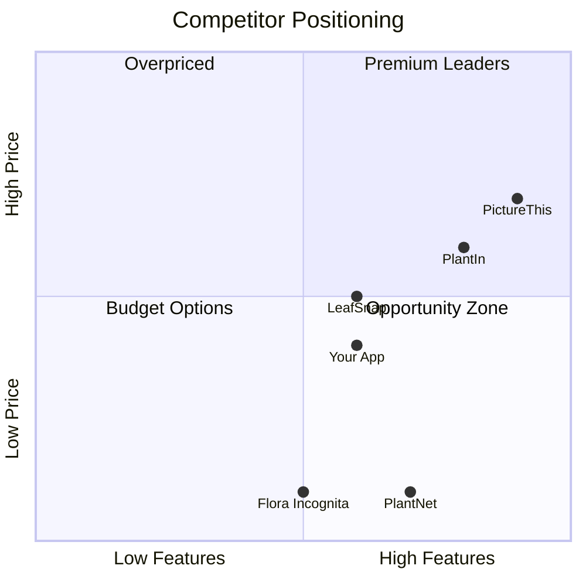

# AI Plant Identifier Flutter App - Comprehensive Evaluation

> **Evaluation Date:** January 11, 2026  
> **Evaluator:** Senior Mobile App Publisher & Product Strategist

---

## Reference Links

### Source App Template
- **CodeCanyon Template:** [AI Plant Identifier Flutter App | Plant Care & Recognition](https://codecanyon.net/item/ai-plant-identifier-flutter-app-plant-care-recognition/58201933)

### Top Competitor Apps

| App | Platform | Downloads | Rating | Revenue (Monthly) |
|-----|----------|-----------|--------|-------------------|
| [PictureThis](https://apps.apple.com/app/picturethis-plant-identifier/id1252497129) | iOS/Android | 100M+ | 4.8★ | ~$2.7M |
| [PlantNet](https://play.google.com/store/apps/details?id=org.plantnet) | iOS/Android | 10M+ | 4.5★ | Free (Research) |
| [PlantIn](https://myplantin.com/) | iOS/Android | 10M+ | 4.6★ | ~$900K |
| [LeafSnap](https://apps.apple.com/app/leafsnap-plant-identification/id1487972880) | iOS/Android | 5M+ | 4.4★ | ~$200K |
| [Flora Incognita](https://floraincognita.com/) | iOS/Android | 5M+ | 4.7★ | Free (Academic) |

### Open Source Alternatives on GitHub

| Repository | Framework | Stars | Features |
|------------|-----------|-------|----------|
| [kartiksharmakk/Vrikshved](https://github.com/kartiksharmakk/Vrikshved) | Flutter + TensorFlow | Active | Plant recognition & disease detection |
| [Junaid-Zulfiqar/plants_identification](https://github.com/Junaid-Zulfiqar/plants_identification) | Flutter + ML | Active | Multi-plant identification from photo |
| [brakenseddik/Flutter-Plants-Identification](https://github.com/brakenseddik/Flutter-Plants-Identification) | Flutter + Firebase + TF | Active | Auth, plant search, favorites |
| [MSSkowron/smart-plant-care-assistant](https://github.com/MSSkowron/smart-plant-care-assistant) | React Native + Supabase | Active | Recognition, care schedules, disease detection |
| [Jerry-spec-code/Flora-Finder](https://github.com/Jerry-spec-code/Flora-Finder) | React Native + Node | Active | API-based identification |

---

## 1. Idea Summary

### Core Problem Solved
The app addresses the universal challenge faced by plant enthusiasts, gardeners, farmers, and nature lovers: **instant identification of plants and understanding their care needs**. Secondary problems include:
- Plant health assessment and disease diagnosis
- Personalized care routines and reminders
- Tracking plant growth and health over time

### Target User Segments

| Segment | Size Estimate | Primary Need |
|---------|---------------|--------------|
| Home Gardeners | 50M+ globally | Care tips, watering schedules |
| Plant Parents (Millennials/Gen Z) | 30M+ | Instagram-worthy plants, easy care |
| Hikers & Nature Enthusiasts | 20M+ | Quick identification in the wild |
| Students & Educators | 10M+ | Learning tool for botany |
| Farmers & Agricultural Workers | 15M+ | Disease detection, crop health |

---

## 2. Market Demand & Trends

### Market Size & Growth

| Metric | 2024 Value | 2033 Projection | CAGR |
|--------|------------|-----------------|------|
| Global Market Size | $285-381M | $1.1-1.2B | 13-17% |
| Active Users (US) | 20M+ | 45M+ | ~12% |

### Key Growth Drivers

1. **AI Advancement**: 95%+ accuracy in modern ML models
2. **Urban Gardening Boom**: 35% global increase (2021-2024)
3. **Smartphone Penetration**: Universal access platform
4. **Environmental Awareness**: Citizen science participation
5. **Pandemic Effect**: Continued interest in home plants

### Trend Analysis

| Trend | Impact | Status |
|-------|--------|--------|
| AI-powered plant care | 🟢 Positive | Growing |
| AR plant visualization | 🟢 Positive | Emerging |
| Subscription fatigue | 🟡 Neutral | Watch closely |
| Privacy concerns | 🟡 Neutral | Manageable |
| Free alternatives | 🔴 Negative | Competition |

> [!IMPORTANT]
> The market is growing but increasingly DOMINATED by well-funded players (PictureThis has 100M+ downloads). New entrants must differentiate or die.

---

## 3. ASO & Discoverability Analysis

### Keyword Competition Analysis

| Keyword | Search Volume | Competition | Difficulty |
|---------|---------------|-------------|------------|
| plant identifier | Very High | 🔴 Extreme | 9/10 |
| plant care app | High | 🔴 High | 8/10 |
| identify plant from photo | High | 🔴 High | 8/10 |
| plant disease identifier | Medium | 🟡 Medium | 6/10 |
| garden plant tracker | Medium | 🟡 Medium | 5/10 |
| houseplant care guide | Medium | 🟢 Low | 4/10 |
| succulent identifier | Low-Medium | 🟢 Low | 3/10 |

### ASO Strategy Recommendations

**Long-tail Niche Keywords (Better Opportunity):**
- "identify poisonous plants for pets"
- "indoor plant light meter"
- "tropical houseplant care"
- "medicinal herbs identifier"
- "invasive species identifier"

**Realistic Ranking Assessment:**
- **Top 10 for main keywords**: ❌ Nearly impossible without massive budget
- **Top 50 for niche keywords**: ✅ Achievable with quality execution
- **Category ranking (Lifestyle/Education)**: Top 100 achievable

### Acquisition Viability

| Channel | Cost | Effectiveness | Recommendation |
|---------|------|---------------|----------------|
| Organic ASO | Low | 🟡 Medium | Focus here first |
| Apple Search Ads | $2-5 CPA | 🟡 Medium | Test carefully |
| Google UAC | $1-3 CPA | 🟢 Good | Main paid channel |
| TikTok/Instagram | $0.50-2 CPE | 🟢 Excellent | Plant content viral |
| Influencer Marketing | Variable | 🟢 Excellent | Plant influencers |

---

## 4. Monetization Potential

### Recommended Model: **Freemium with Subscription + Ads Hybrid**

```
┌─────────────────────────────────────────────────────────────┐
│                    MONETIZATION STRATEGY                    │
├─────────────────────────────────────────────────────────────┤
│  FREE TIER                                                  │
│  ├─ 3-5 identifications per day                            │
│  ├─ Basic plant info                                       │
│  ├─ Ads between scans                                      │
│  └─ Limited history (10 plants)                            │
├─────────────────────────────────────────────────────────────┤
│  PREMIUM ($29.99/year or $4.99/month)                      │
│  ├─ Unlimited identifications                              │
│  ├─ Disease diagnosis                                      │
│  ├─ Personalized care schedules                            │
│  ├─ Unlimited history & collections                        │
│  ├─ Offline mode                                           │
│  └─ Expert botanist access                                 │
├─────────────────────────────────────────────────────────────┤
│  LIFETIME ($59.99-79.99 one-time)                          │
│  └─ All premium features forever                           │
└─────────────────────────────────────────────────────────────┘
```

### Revenue Projections

| Scenario | DAU | Conversion | ARPU | Monthly Revenue |
|----------|-----|------------|------|-----------------|
| **Low (Basic MVP)** | 1K | 2% | $2.50 | $500-1K |
| **Medium (Quality)** | 10K | 3% | $2.50 | $5-8K |
| **High (Excellence)** | 50K | 5% | $3.00 | $50-75K |
| **Success (Top 100)** | 200K | 6% | $3.50 | $250-400K |

### API Cost Considerations

Using Plant.id/Kindwise API:
- €0.05/credit at low volume → €0.01/credit at high volume
- Each scan = 1-2 credits (ID + health)
- **Cost per user per month**: €0.30-1.50 depending on usage

> [!WARNING]
> API costs can kill profitability. At low scale, you'll lose money on active free users. Plan carefully.

---

## 5. Development Effort & Time

### MVP Development Estimate

| Component | Hours | Complexity |
|-----------|-------|------------|
| UI/UX Design | 40-60 | Medium |
| Core App Shell (Flutter) | 30-40 | Low |
| Camera Integration | 15-20 | Low |
| Plant.id API Integration | 20-30 | Medium |
| Local Storage (Hive/SQLite) | 20-25 | Low |
| Results & History Screens | 25-35 | Medium |
| Care Routines & Reminders | 30-40 | Medium |
| Settings & Onboarding | 15-20 | Low |
| Testing & Polish | 40-50 | Medium |
| **Total MVP** | **235-320 hours** | **Medium** |

**Timeline:**
- Solo Developer: 8-12 weeks full-time
- Small Team (2-3): 4-6 weeks

### Tech Complexity Assessment

| Aspect | Complexity | Notes |
|--------|------------|-------|
| AI/ML Integration | 🟢 Low | Using 3rd party API |
| Camera & Image Processing | 🟢 Low | Native Flutter plugins |
| Offline Functionality | 🟡 Medium | Caching, sync logic |
| Push Notifications | 🟢 Low | Well-documented |
| Backend (if needed) | 🟡 Medium | User accounts, sync |
| Disease Diagnosis | 🟡 Medium | Additional API calls |

### Solo Developer Feasibility: ✅ **FEASIBLE**

The CodeCanyon template provides a strong foundation. A solo developer with 1-2 years Flutter experience can deliver MVP in 8-12 weeks.

---

## 6. Competition Analysis

### Competition Level: 🔴 **HIGH**

### Competitor Landscape



### What Competitors Do Right

| Competitor | Strengths |
|------------|-----------|
| PictureThis | Massive database, 98% accuracy, expert access, full ecosystem |
| PlantNet | Free, scientific backing, community-driven, trust |
| PlantIn | Beautiful UI, gamification, care features, light meter |
| Flora Incognita | Academic credibility, education focus, free |

### What Competitors Do Wrong

| Competitor | Weaknesses |
|------------|------------|
| PictureThis | Expensive, aggressive upsells, limited free tier |
| PlantIn | Subscription complaints, billing confusion |
| LeafSnap | Less accurate, dated UI |
| Generic apps | Poor accuracy, no care features |

### Differentiation Opportunities

1. **Niche Focus**: Specialize (houseplants, edible, medicinal, regional)
2. **Better Free Tier**: More generous limits
3. **Pet Safety**: Built-in toxicity warnings for pet owners
4. **Seasonal Tips**: Location-based care recommendations
5. **Community Features**: Plant trading, local gardener connections
6. **Gamification**: Plant leveling, achievements, streaks
7. **Privacy-First**: On-device ML option

---

## 7. Scalability & Future Expansion

### Growth Path

```
Phase 1: MVP (Month 1-3)
├── Core identification
├── Basic care tips
└── Local history

Phase 2: Enhancement (Month 4-8)
├── User accounts & cloud sync
├── Disease diagnosis
├── Care reminders
├── Collection management
└── Widget support

Phase 3: Ecosystem (Month 9-18)
├── Social features
├── Plant marketplace
├── Expert consultations
├── Smart pot integration
├── Web dashboard
└── B2B licensing

Phase 4: Platform (Year 2+)
├── API for third parties
├── White-label solutions
├── Agricultural enterprise
└── Regional expansions
```

### Platform Expansion

| Platform | Difficulty | Market Size | Priority |
|----------|------------|-------------|----------|
| iOS | Already | Large | P0 |
| Android | Already | Largest | P0 |
| Web App | Medium | Medium | P2 |
| Wear OS/Watch | Medium | Small | P3 |
| Smart Display | High | Emerging | P4 |

### Moat Building

- **Data Moat**: Proprietary plant care data from user feedback
- **Community Moat**: Active gardening community
- **Integration Moat**: Smart garden device partnerships
- **Brand Moat**: Trusted plant care authority

---

## 8. Risk Assessment

### Risk Matrix

| Risk | Probability | Impact | Mitigation |
|------|-------------|--------|------------|
| High competition | 🔴 90% | High | Niche focus, superior UX |
| API cost overrun | 🟡 60% | High | Usage limits, caching |
| Low conversion rate | 🟡 50% | Medium | Free tier optimization |
| Accuracy complaints | 🟡 40% | High | Use best API, set expectations |
| App store rejection | 🟢 20% | Medium | Follow guidelines |
| Subscription fatigue | 🟡 50% | Medium | Offer lifetime, ads hybrid |
| Legal (plant advice) | 🟢 15% | High | Disclaimers, terms |

### Failure Probability

| Execution Level | Failure Chance | Expected Outcome |
|-----------------|----------------|------------------|
| Poor/Rushed | 85% | Dead within 6 months |
| Average | 65% | Break-even or small loss |
| Good | 45% | Profitable, modest success |
| Excellent | 25% | Significant success |

> [!CAUTION]
> The plant identification space is brutally competitive. Even with excellent execution, there's no guarantee of success. Only proceed if you have a unique angle or are willing to invest heavily in marketing.

---

## 9. Final Verdict

| Criterion | Assessment |
|-----------|------------|
| **Status** | 🟡 **ACTIONABLE WITH MODIFICATIONS** |
| **Recommended Developer Level** | **Intermediate to Experienced** |
| **Clear Recommendation** | **MODIFY** - Don't build a generic clone |

### Honest Assessment

Building a **generic AI plant identifier app in 2026 is NOT recommended** unless you have:
- $50K+ marketing budget
- Unique differentiation strategy
- Patience for 18-24 month runway

**However**, if you can:
1. Find an underserved niche
2. Leverage the CodeCanyon template as foundation
3. Add unique value propositions
4. Execute with high quality

Then this can be a viable business with $5-20K/month potential.

---

## 10. Improvement Suggestions

### Essential Pivots for Success

1. **Pick a Niche Instead of Going Broad**
   - Pet-safe plants only
   - Edible/medicinal plants
   - Regional native plants
   - Tropical houseplants
   - Succulents & cacti

2. **Add Unique Value Competitors Lack**
   - **AR Plant Placement**: Visualize how plants look in your space
   - **Plant Trade Network**: Connect local plant swappers
   - **Smart Pot Integration**: Connect with SOMA, Parrot, etc.
   - **AI Plant Doctor**: Chat-based plant troubleshooting

3. **Optimize Unit Economics**
   - Cache common plant IDs locally
   - Implement on-device ML for basic identification
   - Rate limit free tier aggressively
   - Focus on subscription conversion

4. **Growth Hacking Strategies**
   - Plant care content on TikTok/Instagram
   - Partner with plant influencers
   - Seasonal marketing (spring gardening)
   - Referral program with premium days

5. **Quality Execution Priorities**
   - Invest heavily in onboarding (first 3 scans matter)
   - Make free tier useful but leave clear upgrade path
   - Fast, delightful UI transitions
   - Excellent empty states and error handling

---

## 11. Product Requirements Document (PRD)

### 11.1 Product Overview

#### Vision Statement
> Empower every plant enthusiast to understand, care for, and nurture their plants with AI-powered instant identification and personalized care guidance - making plant parenthood accessible, enjoyable, and successful.

#### Target User Personas

**Persona 1: "Casual Plant Parent" - Maya (28, Urban Professional)**
| Attribute | Details |
|-----------|---------|
| Demographics | 25-35, urban dweller, apartment living |
| Behavior | Buys plants impulsively, often kills them |
| Pain Points | Doesn't know plant names or care needs |
| Goal | Keep plants alive, grow collection |
| Tech Savvy | High (Instagram, TikTok user) |
| Willingness to Pay | Medium ($30-50/year) |

**Persona 2: "Serious Gardener" - Robert (52, Suburban Homeowner)**
| Attribute | Details |
|-----------|---------|
| Demographics | 45-65, homeowner, outdoor garden |
| Behavior | Weekend gardening, seasonal planning |
| Pain Points | Identifying weeds, disease diagnosis |
| Goal | Healthy, productive garden |
| Tech Savvy | Medium |
| Willingness to Pay | High ($50-100/year) |

**Persona 3: "Nature Explorer" - Emma (22, Student)**
| Attribute | Details |
|-----------|---------|
| Demographics | 18-26, student/entry-level |
| Behavior | Hiking, outdoor activities, learning |
| Pain Points | Quick identification on trails |
| Goal | Learn about local flora |
| Tech Savvy | Very high |
| Willingness to Pay | Low ($0-20/year) |

#### User Stories

| ID | As a... | I want to... | So that... |
|----|---------|--------------|------------|
| US1 | New user | Identify a plant with my camera | I know what plant I found |
| US2 | Plant owner | See care instructions | I can keep my plant healthy |
| US3 | Regular user | Track my plant collection | I rememberall my plants |
| US4 | Premium user | Get watering reminders | I never forget to water |
| US5 | Curious user | Learn about plant diseases | I can diagnose problems |
| US6 | Pet owner | Check if a plant is toxic | I keep my pets safe |
| US7 | Gardener | View seasonal tips | I plant at the right time |

#### Success Metrics (KPIs)

| Metric | Target (Month 1) | Target (Month 6) | Target (Month 12) |
|--------|------------------|------------------|-------------------|
| Downloads | 5K | 50K | 150K |
| DAU | 500 | 5K | 20K |
| Free→Premium Conversion | 2% | 3.5% | 5% |
| D7 Retention | 25% | 35% | 40% |
| D30 Retention | 10% | 18% | 25% |
| Average Session Length | 2 min | 3 min | 4 min |
| NPS Score | 30 | 40 | 50 |
| MRR | $500 | $8K | $40K |

### 11.2 Feature Specifications

#### Feature 1: Plant Identification (Camera Scan)

| Attribute | Details |
|-----------|---------|
| **Priority** | 🔴 Must-have |
| **Description** | User takes/selects a photo and receives plant identification |

**User Flow:**
```
Home → Tap Camera → Capture/Select → Processing → Results
                                           ↓
                                    [ERROR HANDLING]
                                    ├─ Poor image → Retry prompt
                                    ├─ No plant detected → Suggestions
                                    └─ Multiple plants → Selection

Results Screen:
├─ Plant Name (Common + Scientific)
├─ Confidence Score (visual meter)
├─ Quick Facts (light, water, toxicity)
├─ "Learn More" → Details Screen
├─ "Save to Collection"
└─ "Share" / "Try Another"
```

**Acceptance Criteria:**
- [ ] Camera launches within 500ms
- [ ] Identification result returned within 3 seconds
- [ ] Minimum 90% accuracy for common plants
- [ ] Works offline for previously identified plants
- [ ] Gallery selection as alternative to camera
- [ ] Image cropping/adjustment available

**Edge Cases:**
- No internet connection → Show cached results or offline message
- Multiple plants in frame → Primary plant highlighted, secondary listed
- Blurry/dark image → Quality warning before submission
- API rate limit reached → Upgrade prompt or wait message

---

#### Feature 2: Plant Details & Care Guide

| Attribute | Details |
|-----------|---------|
| **Priority** | 🔴 Must-have |
| **Description** | Comprehensive information about identified plants |

**Content Structure:**
```
Plant Details Screen:
├─ Header (Image, Name, Family)
├─ Quick Stats Cards (Light, Water, Temp, Humidity)
├─ Toxicity Warning (Pets/Children)
├─ Description
├─ Care Guide
│   ├─ Watering needs
│   ├─ Light requirements
│   ├─ Soil type
│   ├─ Fertilizing schedule
│   └─ Pruning tips
├─ Common Problems
├─ Growth Timeline
└─ Related Plants
```

**Acceptance Criteria:**
- [ ] Page loads within 1 second
- [ ] All text readable (WCAG AA contrast)
- [ ] Images lazy-loaded and cached
- [ ] Save button persists plant to collection

---

#### Feature 3: My Collection / History

| Attribute | Details |
|-----------|---------|
| **Priority** | 🔴 Must-have |
| **Description** | Track and manage identified plants |

**Features:**
- Grid/List view toggle
- Search and filter
- Custom categories/rooms
- Photo for each saved plant
- Notes per plant
- Health tracking log

**Acceptance Criteria:**
- [ ] Supports 1000+ plants without lag
- [ ] Offline access to saved plants
- [ ] Sort by date, name, category
- [ ] Bulk delete option

---

#### Feature 4: Care Reminders (Notifications)

| Attribute | Details |
|-----------|---------|
| **Priority** | 🟡 Should-have |
| **Description** | Scheduled reminders for watering, fertilizing |

**Notification Types:**
- Watering reminders (daily/weekly/custom)
- Fertilizing schedule (monthly)
- Repotting reminders (yearly)
- Seasonal care tips (quarterly)

**Acceptance Criteria:**
- [ ] Local notifications work offline
- [ ] Customizable reminder times
- [ ] Snooze and mark complete options
- [ ] Notification grouping for multiple plants

---

#### Feature 5: Plant Health Assessment

| Attribute | Details |
|-----------|---------|
| **Priority** | 🟡 Should-have |
| **Description** | Diagnose diseases and health issues |

**User Flow:**
```
Collection → Select Plant → Health Check → Photo → Analysis
                                                    ↓
                                            Health Report:
                                            ├─ Health Score (0-100)
                                            ├─ Detected Issues
                                            ├─ Treatment Recommendations
                                            └─ Prevention Tips
```

**Acceptance Criteria:**
- [ ] Requires clear, close-up photo
- [ ] Analysis within 5 seconds
- [ ] Confidence indicator for diagnosis
- [ ] Track health history over time

---

#### Feature 6: Onboarding & Tutorial

| Attribute | Details |
|-----------|---------|
| **Priority** | 🟢 Nice-to-have (but important for conversion) |
| **Description** | First-time user education |

**Flow:**
```
Install → 4 Onboarding Screens → Permission Request → First Scan Demo → Home
```

**Screens:**
1. Welcome + Value proposition
2. How it works (camera demo)
3. Collection features
4. Premium benefits (soft sell)

**Acceptance Criteria:**
- [ ] Skippable after first screen
- [ ] Progress indicator
- [ ] Deep link after onboarding complete
- [ ] Re-accessible from settings

---

### 11.3 Technical Requirements

#### Platform Requirements

| Platform | Minimum | Recommended |
|----------|---------|-------------|
| iOS | 13.0+ | 15.0+ |
| Android | API 23 (6.0) | API 28 (9.0)+ |
| Flutter SDK | 3.16+ | Latest stable |
| Dart | 3.0+ | Latest stable |

**Device Capabilities Required:**
- Camera (rear-facing)
- Internet connectivity
- 100MB storage
- Push notification support

#### Performance Requirements

| Metric | Target |
|--------|--------|
| Cold start time | < 2 seconds |
| Camera launch | < 500ms |
| Identification result | < 4 seconds |
| Screen transitions | < 300ms |
| Scroll FPS | 60 FPS |
| Memory usage | < 200MB |
| Battery drain | < 3% per 10 minutes use |

#### Security & Privacy Requirements

| Requirement | Implementation |
|-------------|----------------|
| Data encryption | AES-256 for local storage |
| API communication | HTTPS/TLS 1.3 only |
| User data | Anonymized analytics |
| Photo handling | Not uploaded unless scanning |
| Authentication | Optional, secure tokens |
| GDPR compliance | Consent, data deletion |
| CCPA compliance | Do not sell, data access |

#### Accessibility Requirements (WCAG 2.1 AA)

- [ ] Minimum 4.5:1 contrast ratio
- [ ] Touch targets minimum 48x48dp
- [ ] Screen reader support (TalkBack/VoiceOver)
- [ ] Font scaling support (up to 200%)
- [ ] Motion reduction option
- [ ] Alternative text for images

#### Offline Functionality

| Feature | Offline Support |
|---------|-----------------|
| View saved plants | ✅ Full |
| Add notes/photos | ✅ Full |
| View care guides (cached) | ✅ Partial |
| New identification | ❌ Requires internet |
| Health assessment | ❌ Requires internet |
| Sync | ✅ Auto-sync when online |

---

### 11.4 Data Requirements

#### Data Models

```
┌─────────────────────────────────────────────────────────────┐
│                      DATA ENTITIES                          │
├─────────────────────────────────────────────────────────────┤
│                                                             │
│  User (if authenticated)                                    │
│  ├─ id: UUID                                               │
│  ├─ email: String                                          │
│  ├─ created_at: Timestamp                                  │
│  ├─ subscription_status: Enum                              │
│  └─ preferences: JSON                                      │
│                                                             │
│  Plant (Local + Synced)                                    │
│  ├─ id: UUID                                               │
│  ├─ user_id: UUID (FK)                                     │
│  ├─ scientific_name: String                                │
│  ├─ common_name: String                                    │
│  ├─ family: String                                         │
│  ├─ identification_date: Timestamp                         │
│  ├─ confidence_score: Float                                │
│  ├─ image_path: String (local)                             │
│  ├─ category_id: UUID (FK)                                 │
│  ├─ care_data: JSON                                        │
│  ├─ is_synced: Boolean                                     │
│  └─ updated_at: Timestamp                                  │
│                                                             │
│  Category                                                   │
│  ├─ id: UUID                                               │
│  ├─ name: String                                           │
│  ├─ icon: String                                           │
│  └─ color: String                                          │
│                                                             │
│  HealthLog                                                  │
│  ├─ id: UUID                                               │
│  ├─ plant_id: UUID (FK)                                    │
│  ├─ score: Integer (0-100)                                 │
│  ├─ issues: JSON                                           │
│  ├─ image_path: String                                     │
│  └─ logged_at: Timestamp                                   │
│                                                             │
│  Reminder                                                   │
│  ├─ id: UUID                                               │
│  ├─ plant_id: UUID (FK)                                    │
│  ├─ type: Enum (water, fertilize, repot, custom)           │
│  ├─ frequency: String                                      │
│  ├─ next_due: Timestamp                                    │
│  └─ is_active: Boolean                                     │
│                                                             │
│  Scan                                                       │
│  ├─ id: UUID                                               │
│  ├─ user_id: UUID (FK, nullable)                           │
│  ├─ timestamp: Timestamp                                   │
│  ├─ result: JSON                                           │
│  └─ saved_as_plant: Boolean                                │
│                                                             │
└─────────────────────────────────────────────────────────────┘
```

#### Data Retention Policy

| Data Type | Retention | Deletion |
|-----------|-----------|----------|
| Local plant data | Indefinite | User-initiated |
| Scan history (free) | 30 days | Auto-cleanup |
| Scan history (premium) | Indefinite | User-initiated |
| Analytics data | 24 months | Anonymized after |
| Crash logs | 90 days | Auto-purge |
| User account | Active subscription + 24 months | GDPR request |

#### Privacy & Compliance

**GDPR Requirements:**
- [ ] Privacy policy in-app
- [ ] Consent before data collection
- [ ] Data export (JSON format)
- [ ] Account deletion within 30 days
- [ ] Under-16 restrictions

**CCPA Requirements:**
- [ ] "Do Not Sell" option
- [ ] Data disclosure on request
- [ ] Categories of data collected listed

---

## 12. Development Strategy & Roadmap

### 12.1 Technology Stack Recommendation

#### Mobile Framework: **Flutter** ✅ RECOMMENDED

| Factor | Flutter | React Native | Native |
|--------|---------|--------------|--------|
| Development Speed | ⭐⭐⭐ | ⭐⭐⭐ | ⭐ |
| Performance | ⭐⭐⭐ | ⭐⭐ | ⭐⭐⭐ |
| Code Reuse | 95% | 90% | 30% |
| Camera/Image | ⭐⭐⭐ | ⭐⭐ | ⭐⭐⭐ |
| Developer Pool | Growing | Large | Varies |
| CodeCanyon Template | ✅ Available | ❌ | ❌ |

**Recommendation**: Flutter is ideal given the CodeCanyon template exists and provides 95% code sharing between iOS/Android.

---

#### Backend Comparison

| Factor | Supabase | Firebase | Spring Boot |
|--------|----------|----------|-------------|
| **Setup Time** | Hours | Hours | Weeks |
| **Scalability** | ⭐⭐⭐ | ⭐⭐⭐ | ⭐⭐⭐ |
| **Cost (0-10K users)** | ~$25/mo | ~$50/mo | ~$100/mo |
| **Cost (100K users)** | ~$300/mo | ~$500/mo | ~$400/mo |
| **Auth** | Built-in | Built-in | Custom |
| **Real-time** | Built-in | Built-in | WebSocket |
| **Database** | PostgreSQL | Firestore | Any SQL |
| **File Storage** | S3-compatible | GCS | S3/Custom |
| **Edge Functions** | ✅ | ✅ | Custom APIs |
| **Learning Curve** | Low | Low | High |
| **Vendor Lock-in** | Low | Medium | None |
| **Flutter SDK** | Good | Excellent | Custom |

**Recommendation for MVP**: **Supabase** (or even local-first with no backend)

For MVP, consider a **local-first approach** using Hive/SQLite with optional Supabase sync:
- Day 0: No backend needed
- Phase 2: Add Supabase for premium features (sync, accounts)
- This minimizes initial costs and complexity

---

#### AI/ML Service Comparison

| Service | Cost/Request | Accuracy | Features |
|---------|--------------|----------|----------|
| **Plant.id (Kindwise)** | €0.05-0.01 | 95%+ | ID + Health |
| Google Cloud Vision | $1.50/1K | 80-85% | Generic |
| AWS Rekognition | $1.00/1K | 75-80% | Generic |
| On-device (TFLite) | Free | 70-85% | Limited plants |

**Recommendation**: **Plant.id** for best accuracy, consider on-device TFLite for offline fallback.

---

#### Database Choice

| Factor | SQLite (Local) | Supabase (PostgreSQL) | Firebase (Firestore) |
|--------|----------------|----------------------|---------------------|
| Offline-first | ⭐⭐⭐ | ⭐⭐ | ⭐⭐ |
| Query Flexibility | ⭐⭐⭐ | ⭐⭐⭐ | ⭐⭐ |
| Sync Complexity | N/A | Medium | Low |
| Cost | Free | Pay-as-grow | Free tier |

**Recommendation**: SQLite/Hive for local, Supabase PostgreSQL for cloud (if needed).

---

### 12.2 Architecture Design

#### High-Level Architecture

```
┌─────────────────────────────────────────────────────────────┐
│                      CLIENT (Flutter)                       │
├─────────────────────────────────────────────────────────────┤
│                                                             │
│  ┌─────────────┐  ┌─────────────┐  ┌─────────────┐         │
│  │ Presentation│  │   Domain    │  │    Data     │         │
│  │   Layer     │  │   Layer     │  │   Layer     │         │
│  │             │  │             │  │             │         │
│  │  - Screens  │  │  - Use Cases│  │  - Repos    │         │
│  │  - Widgets  │  │  - Entities │  │  - Sources  │         │
│  │  - State    │  │  - Logic    │  │  - APIs     │         │
│  └──────┬──────┘  └──────┬──────┘  └──────┬──────┘         │
│         │                │                │                 │
│         └────────────────┴────────────────┘                 │
│                          │                                  │
└──────────────────────────┼──────────────────────────────────┘
                           │
           ┌───────────────┴───────────────┐
           │                               │
     ┌─────▼─────┐                   ┌─────▼─────┐
     │  Local    │                   │  Remote   │
     │  Storage  │                   │  Services │
     │           │                   │           │
     │ - Hive    │                   │ - Plant.id│
     │ - SQLite  │                   │ - Supabase│
     │ - Images  │                   │ - RevenueCat
     └───────────┘                   └───────────┘
```

#### Authentication Flow (Optional Premium)

```
App Launch
     │
     ├─ Anonymous Mode (Default)
     │   └─ Local data only
     │
     └─ Sign In (Premium)
         ├─ Email/Password
         ├─ Google Sign-In
         └─ Apple Sign-In
              │
              ▼
         Token Storage (Secure)
              │
              ▼
         Sync Local → Cloud
```

#### Data Synchronization Strategy

**Approach**: Offline-first with background sync

```
1. All writes go to local DB first
2. Queue changes for sync
3. Background sync when online
4. Conflict resolution: Last-write-wins
5. Critical sync: User-initiated
```

---

### 12.3 Development Phases & Timeline

#### Phase 1: MVP (6-8 Weeks)

| Week | Focus | Deliverables |
|------|-------|--------------|
| 1-2 | Foundation | Project setup, architecture, UI shell |
| 3-4 | Core Features | Camera, API integration, results screen |
| 5-6 | Data Layer | Local storage, history, collections |
| 7-8 | Polish | Onboarding, settings, testing, bugs |

**MVP Features:**
- [x] Camera-based plant identification
- [x] Results with care information
- [x] Local history (10 free, unlimited premium)
- [x] Basic onboarding
- [x] Settings and about

**Success Criteria:**
- Crash-free rate > 99%
- Identification accuracy > 90%
- User can complete scan in < 30 seconds
- App Store approval

---

#### Phase 2: Enhancement (Months 3-6)

| Month | Focus | Features |
|-------|-------|----------|
| 3 | Engagement | Care reminders, notifications |
| 4 | Premium | Subscription, cloud sync, accounts |
| 5 | Health | Disease diagnosis feature |
| 6 | Growth | Widgets, share features, referrals |

**Deliverables:**
- In-app purchase/subscription
- User authentication (optional)
- Cloud data sync
- Push notifications
- Health assessment
- Home screen widget

---

#### Phase 3: Scale (Months 7-12)

| Month | Focus |
|-------|-------|
| 7-8 | Performance optimization, caching |
| 9-10 | Social features, community |
| 11-12 | Advanced features, B2B exploration |

**Deliverables:**
- On-device ML fallback
- Community features
- API for partners
- Analytics dashboard
- A/B testing framework

---

### 12.4 Team Structure & Roles

#### Solo Developer Path (Viable)

| Role | Hours/Week | Duration | Cost |
|------|------------|----------|------|
| Solo Flutter Developer | 40 | 12 weeks | $0 (own time) or $8-15K (contractor) |
| Designer (one-time) | 20 | 2 weeks | $1-3K |
| QA (part-time) | 10 | 4 weeks | $500-1K |

**Total Solo MVP Cost**: $2-5K + own time

---

#### Small Team Path (Faster)

| Role | Responsibility | Allocation |
|------|---------------|------------|
| Lead Developer | Architecture, core features | Full-time |
| Junior Developer | UI, tests, minor features | Full-time |
| Designer | UI/UX, assets | Part-time (20%) |
| QA | Testing, bug reports | Part-time (25%) |

**Total Team MVP Cost**: $15-25K + 4-6 weeks

---

#### Skill Requirements

| Role | Skills Required |
|------|-----------------|
| Flutter Developer | Dart, state management (Riverpod/Bloc), REST APIs, local storage |
| Backend (if any) | Supabase, PostgreSQL, authentication |
| Designer | Mobile UI/UX, Figma, plant-themed design |
| QA | Mobile testing, automation basics |

---

### 12.5 Infrastructure & DevOps

#### Hosting & Deployment

| Service | Purpose | Monthly Cost |
|---------|---------|--------------|
| Apple Developer Account | iOS distribution | $8 (yearly $99) |
| Google Play Developer | Android distribution | $2 (one-time $25) |
| Supabase (if used) | Backend, auth, storage | $25-300 |
| Plant.id API | Identification | $50-500 variable |
| RevenueCat | In-app purchases | Free < $2.5K MRR |
| Sentry | Crash reporting | Free tier |
| Codemagic/GitHub Actions | CI/CD | Free tier |

**Total Monthly Infrastructure (MVP)**: $100-250

---

#### CI/CD Pipeline

```yaml
# codemagic.yaml / GitHub Actions
Triggers:
  - Push to main → Build & Deploy (TestFlight/Internal)
  - Push to release/* → Build & Deploy (Production)
  - PR → Build & Test only

Steps:
  1. Install dependencies
  2. Run static analysis (dart analyze)
  3. Run tests (unit, widget)
  4. Build iOS/Android
  5. Upload to app stores (beta)
  6. Notify Slack/Discord
```

---

#### Cost Estimation Summary

| Phase | Duration | Development | Infrastructure | API Costs | Total |
|-------|----------|-------------|----------------|-----------|-------|
| MVP | 2 months | $5-20K | $200 | $100 | $5-20K |
| Year 1 | 12 months | $30-60K | $2-4K | $1-5K | $35-65K |
| Break-even | - | - | - | - | ~$10K MRR |

---

### 12.6 Quality Assurance Strategy

#### Testing Pyramid

```
          ┌──────────┐
          │  E2E     │ 5-10 critical flows
          │  Tests   │ (10%)
          ├──────────┤
          │ Widget   │ UI components
          │ Tests    │ (30%)
          ├──────────┤
          │  Unit    │ Business logic
          │  Tests   │ (60%)
          └──────────┘
```

#### Testing Checklist

**Unit Tests:**
- [ ] Data models serialization
- [ ] Repository methods
- [ ] Business logic (use cases)
- [ ] Utility functions

**Widget Tests:**
- [ ] Screen rendering
- [ ] User interactions
- [ ] State changes
- [ ] Error states

**Integration/E2E Tests:**
- [ ] Full scan flow (camera → result → save)
- [ ] Onboarding completion
- [ ] Purchase flow
- [ ] Settings changes persist

#### Beta Testing Plan

| Phase | Users | Duration | Focus |
|-------|-------|----------|-------|
| Alpha (Internal) | 5-10 | 1 week | Critical bugs |
| Closed Beta | 50-100 | 2 weeks | Usability, crashes |
| Open Beta | 500+ | 2-4 weeks | Scale, performance |

---

## 13. Go-to-Market Strategy

### 13.1 Launch Plan

#### Pre-Launch (4 weeks before)

| Week | Activity |
|------|----------|
| -4 | Landing page live, social accounts created |
| -3 | Content creation begins (TikTok/Instagram) |
| -2 | Beta testing, influencer outreach |
| -1 | App store metadata optimization, final polish |
| Launch | Coordinated release, PR push |

#### Launch Checklist

- [ ] App store assets (screenshots, preview video)
- [ ] Keyword-optimized descriptions
- [ ] Localized for top 5 markets (US, UK, DE, ES, FR)
- [ ] Press kit ready
- [ ] Social media scheduled posts
- [ ] Influencer posts lined up
- [ ] Review request strategy defined

---

### 13.2 User Acquisition

#### Organic Growth Tactics

| Tactic | Effort | Impact | Priority |
|--------|--------|--------|----------|
| ASO optimization | Medium | High | P0 |
| TikTok content | High | Very High | P0 |
| Instagram Reels | High | High | P1 |
| Pinterest boards | Low | Medium | P2 |
| YouTube tutorials | High | Medium | P2 |
| Plant subreddit engagement | Low | Low | P3 |

#### Paid Acquisition

| Channel | Budget (Monthly) | Expected CPI | Priority |
|---------|------------------|--------------|----------|
| Apple Search Ads | $500-2K | $2-4 | P0 |
| Google UAC | $500-2K | $1-3 | P0 |
| TikTok Ads | $300-1K | $0.50-2 | P1 |
| Meta (FB/IG) | $500-1K | $1-3 | P2 |

#### Partnership Opportunities

- Plant nurseries and garden centers
- Home & garden influencers
- Gardening YouTube channels
- Plant subscription boxes
- Smart garden device makers

---

### 13.3 Retention & Engagement

#### Onboarding Optimization

| Element | Goal | Measurement |
|---------|------|-------------|
| Value demonstration | First scan within 60 seconds | Time to first action |
| Aha moment | Successful ID with care tips | D1 retention |
| Permission priming | Camera permission granted | Permission rate |
| Collection seed | Save first plant | D7 retention |

#### Engagement Tactics

| Tactic | Implementation |
|--------|----------------|
| **Push Notifications** | Care reminders, seasonal tips, weekly digests |
| **Gamification** | Scan streaks, plant collections, achievements |
| **Seasonal Content** | Spring planting guides, winter care tips |
| **Community** | Share plants, compare collections |
| **Content** | Weekly plant spotlight, care tips blog |

#### Feedback Loop

```
User Feedback → Analytics → Prioritize → Build → Ship → Measure
        ↑                                                   │
        └───────────────────────────────────────────────────┘
```

Tools: In-app feedback, App Store reviews, Hotjar, Mixpanel

---

### 13.4 Monetization Implementation

#### Pricing Strategy

| Tier | Price | Positioning |
|------|-------|-------------|
| Free | $0 | Try the app, limited scans |
| Monthly | $4.99/mo | Casual users |
| Annual | $29.99/yr | Best value (50% off) |
| Lifetime | $69.99 | Power users |

#### Payment Integration

**Recommended**: RevenueCat (wraps StoreKit + Google Billing)

Benefits:
- Unified API for iOS/Android
- Analytics dashboard
- Paywall experiments
- Free under $2.5K MRR

#### A/B Testing Plan

| Test | Hypothesis | Metric |
|------|------------|--------|
| Free tier limit (3 vs 5 scans) | Lower limit drives conversion | CVR |
| Paywall timing | Show after 2nd scan vs home | CVR |
| Annual vs Monthly first | Annual first increases LTV | ARPU |
| Lifetime offer visibility | Visible lifetime increases urgency | CVR |

#### Revenue Tracking

Key metrics to track:
- MRR (Monthly Recurring Revenue)
- ARPU (Average Revenue Per User)
- LTV (Lifetime Value)
- Trial-to-paid conversion
- Churn rate (monthly)
- Refund rate

---

## Summary & Recommendation

### TL;DR

| Aspect | Assessment |
|--------|------------|
| Market | Growing but competitive |
| Opportunity | Niche focus required |
| Development | Feasible for intermediate developer |
| Revenue Potential | $5-50K/month with excellent execution |
| Risk | Medium-High |
| Verdict | **BUILD with modifications** |

### Final Recommendation

1. **Don't build a generic clone** - You'll be crushed by PictureThis
2. **Pick a specific niche** - Pet-safe, edible, or regional plants
3. **Use the CodeCanyon template** - Save 40-60% development time
4. **Start local-first** - No backend complexity initially
5. **Invest in marketing content** - TikTok/Instagram are your friends
6. **Set realistic expectations** - 12-18 month runway minimum

> [!TIP]
> The best strategy: Build MVP in 8 weeks, validate with 1000 users, iterate based on feedback, then decide whether to scale up or pivot.
