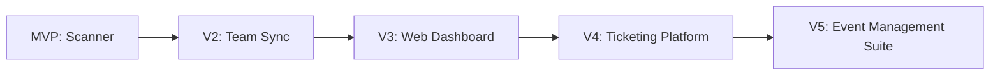
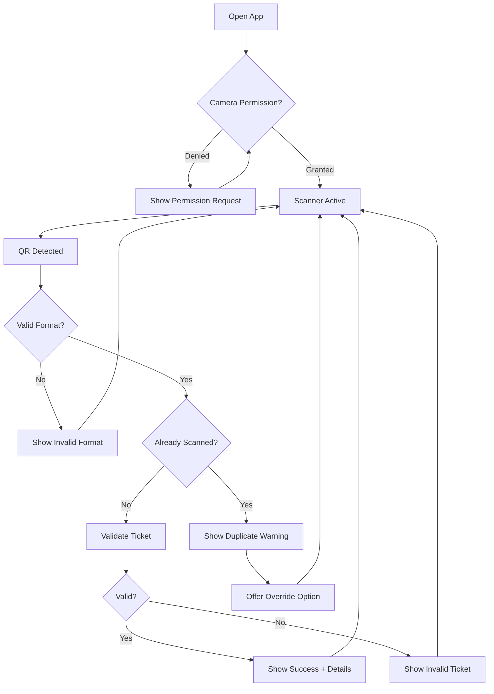
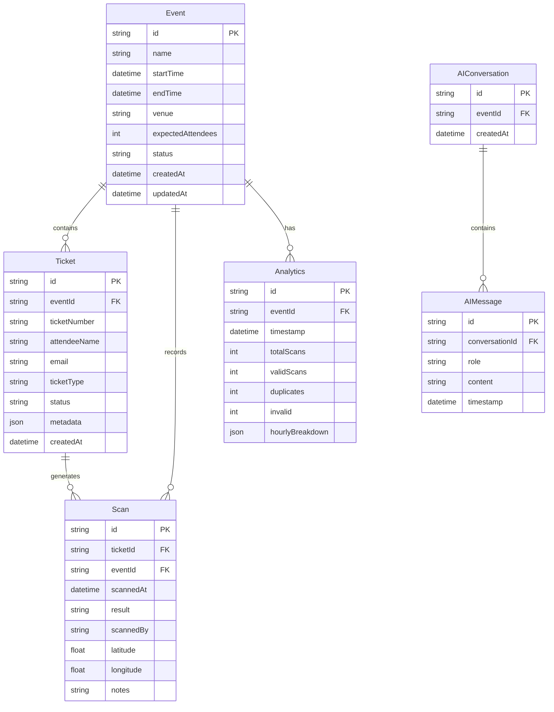
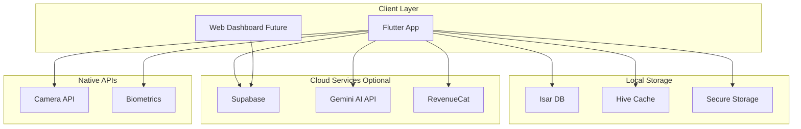
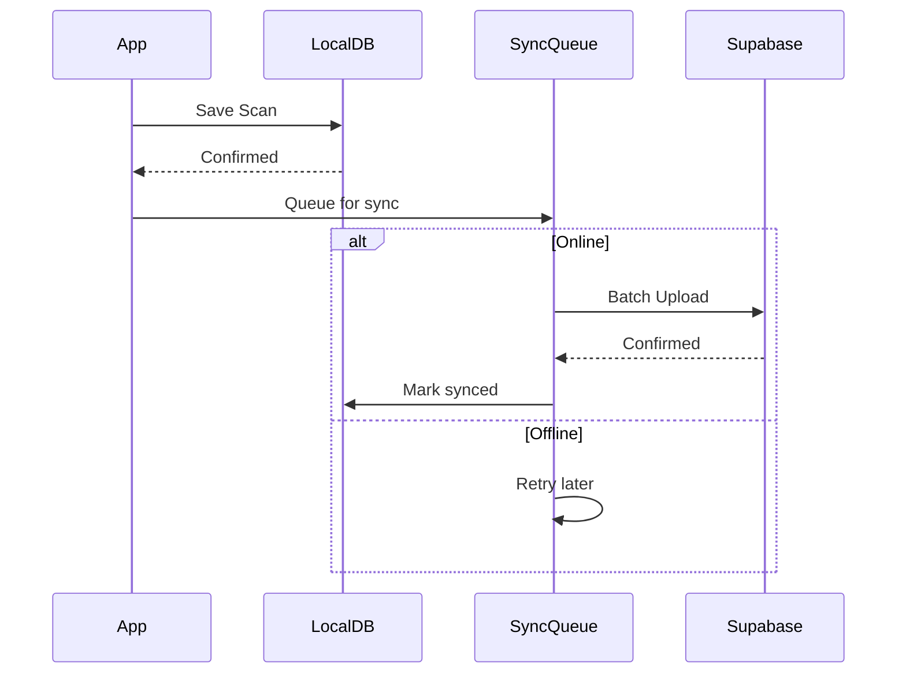
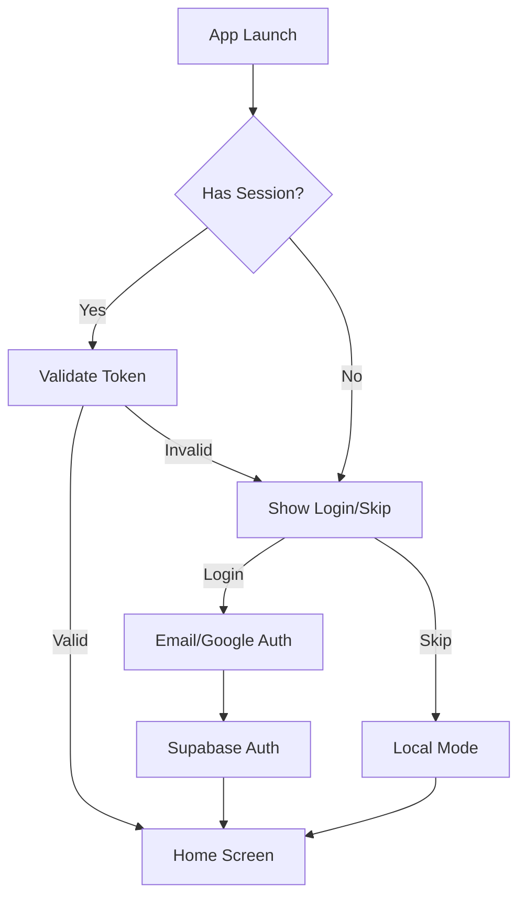
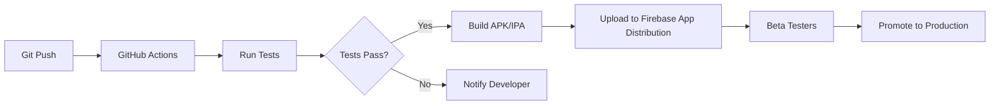
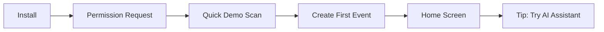

# AI-Powered QR Code Ticket Scanner App Evaluation

**Evaluation Date:** January 11, 2026  
**App Type:** B2B/B2C Event Management & Check-in Tool  
**Platform:** Mobile (iOS/Android) - Flutter

---

## Reference Links

### Source App
- **CodeCanyon Listing:** [AI-Powered QR Code Ticket Scanner Flutter App](https://codecanyon.net/item/aipowered-qr-code-ticket-scanner-flutter-app-guest-verification-checkin-system/61061767)

### Top Competitor Apps

| App Name | Platform | Rating | Downloads | Key Features |
|----------|----------|--------|-----------|--------------|
| [Eventbrite Organizer](https://play.google.com/store/apps/details?id=com.eventbrite.organizer) | Android/iOS | 4.7 (iOS), 3.5 (Android) | 1M+ | Industry leader, full event management, QR scanning |
| [TicketSpice Scanner](https://apps.apple.com/us/app/ticketspice/id896594359) | Android/iOS | 4.0 | 5K+ | Fast scanning, fraud detection, multi-entry support |
| [Cvent OnArrival](https://play.google.com/store/apps/details?id=com.cvent.checkin) | Android/iOS | 4.3 | 50K+ | Enterprise-grade, badge printing, real-time alerts |
| [Whova Check-in](https://play.google.com/store/apps/details?id=com.whova.event) | Android/iOS | 4.6 | 100K+ | Networking focus, session tracking, badges |
| [Ticket Tailor Scanner](https://apps.apple.com/app/ticket-tailor/id1466152469) | Android/iOS | 4.5 | 10K+ | Simple, offline mode, thermal ticket support |

### Open Source Alternatives (GitHub)

| Repository | Stars | Description |
|------------|-------|-------------|
| [GodWindows/flutter_event](https://github.com/GodWindows/flutter_event) | ~50 | Event management with QR ticket generation & scanning |
| [Shariqbinrashid/eTicket-Flutter-App](https://github.com/Shariqbinrashid/eTicket-Flutter-App) | ~80 | Complete ticket system with Firebase, organizer/user roles |
| [FlutterTicketQR](https://flutterawesome.com/flutter-project-for-issuing-scanning-and-managing-tickets/) | N/A | Ticket issuing, scanning & management with Firebase |
| [charles-yim/Ticket-Scanner-Flutter](https://github.com/charles-yim/Ticket-Scanner-Flutter) | ~30 | ML Vision-based ticket text scanner |
| [khoren93/flutter_zxing](https://github.com/khoren93/flutter_zxing) | 300+ | High-performance ZXing-based QR scanner library |

---

## 1. Idea Summary

### Core Problem Solved
Event organizers face significant challenges in:
- **Manual check-in inefficiency:** Paper lists and manual verification cause long queues and poor attendee experience
- **Ticket fraud:** Duplicate tickets, counterfeit QR codes, and shared screenshots lead to revenue loss
- **Lack of real-time insights:** No visibility into attendance patterns, peak entry times, or no-shows
- **Disconnected systems:** Multiple tools for ticketing, check-in, and analytics that don't integrate

### Specific Target Users

**Primary Persona - Event Organizer (B2B):**
- Small-to-medium event organizers (weddings, conferences, concerts, community events)
- 50-5,000 attendees per event
- Budget-conscious, seeking alternatives to expensive platforms like Eventbrite
- Need offline capability for outdoor/remote venues

**Secondary Persona - Corporate Event Manager:**
- Corporate training, seminars, product launches
- Requires professional analytics and reporting
- Multiple staff members scanning simultaneously
- Integration with existing CRM/HR systems

**Tertiary Persona - Solo Entrepreneurs:**
- Workshop hosts, fitness instructors, community leaders
- Tech-savvy but time-constrained
- Need simple, no-backend solutions

---

## 2. Market Demand & Trends

### Market Size & Growth
The global online event ticketing market presents a substantial opportunity:

| Metric | 2024 Value | 2025 Projection | CAGR |
|--------|------------|-----------------|------|
| Market Size (Conservative) | $40-50B | $42-53B | 4.8% |
| Market Size (Optimistic) | $100B+ | $109B+ | 8.0% |
| Mobile Ticket Purchases | 58.95% | 62%+ | Growing |

### Key Trends Supporting This Idea

| Trend | Impact | Relevance |
|-------|--------|-----------|
| ✅ **AI Integration** | AI-driven personalization and fraud detection gaining traction | **HIGH** - Key differentiator |
| ✅ **Contactless Entry** | Post-pandemic shift to touchless experiences | **HIGH** - Core feature |
| ✅ **Mobile-First** | 59%+ purchases on mobile | **HIGH** - Flutter native |
| ✅ **Offline Capability** | Events in low-connectivity areas | **MEDIUM** - Local storage USP |
| ⚠️ **Subscription Fatigue** | Users resistant to new monthly fees | **MEDIUM** - Pricing strategy crucial |
| ⚠️ **Platform Consolidation** | Large players acquiring smaller tools | **LOW** - Niche opportunity |

### Demand Validation
- **Growing:** Live events industry surpassed pre-pandemic peaks in 2024
- **20% ticket sales growth** projected 2024-2028
- **Real demand:** Multiple CodeCanyon purchases indicate market interest
- **AI trend timing:** Perfect timing as AI-powered tools become mainstream

> [!TIP]
> The "AI-powered" positioning is timely and valuable—differentiate strongly on this.

---

## 3. ASO & Discoverability Analysis

### Keyword Analysis

| Keyword | Competition | Monthly Searches (Est.) | Difficulty | Recommendation |
|---------|-------------|------------------------|------------|----------------|
| "ticket scanner app" | HIGH | 15K-25K | Hard | Secondary target |
| "QR code event check-in" | MEDIUM | 5K-10K | Medium | Primary target |
| "event check-in app" | HIGH | 20K-30K | Hard | Long-tail focus |
| "AI ticket scanner" | LOW | 500-2K | Easy | **Strong primary** |
| "guest check-in app" | MEDIUM | 3K-8K | Medium | Secondary target |
| "event registration scanner" | LOW | 1K-3K | Easy | Good opportunity |

### Ranking Potential

**Realistic Assessment:**
- **Immediate ranking (Month 1-3):** Low-competition AI-focused keywords
- **Medium-term (Month 3-6):** "event check-in" + modifiers (free, simple, offline)
- **Long-term (Month 6+):** Compete on broader terms with reviews/authority

**ASO Strategy:**
```
App Title: AI Ticket Scanner - Event Check-In & QR Verification
Subtitle: Fast Guest Check-in, Fraud Detection & Analytics
```

### Organic vs Paid Acquisition

| Channel | Viability | Cost Efficiency | Recommended Budget |
|---------|-----------|-----------------|-------------------|
| Organic ASO | HIGH | Best | $0 + effort |
| Google Ads | MEDIUM | $2-5 CPI | $500-2K/month |
| Meta Ads | LOW | $5-10 CPI | Limited |
| Influencer (Event Bloggers) | HIGH | $1-3 CPI | $300-1K/month |
| Content Marketing | HIGH | Best ROI | Time investment |

> [!IMPORTANT]
> Focus on organic ASO + content marketing first. B2B apps require credibility before paid acquisition scales.

---

## 4. Monetization Potential

### Recommended Monetization Model: **Freemium + Subscription (Hybrid)**

| Tier | Price | Features | Target Segment |
|------|-------|----------|----------------|
| **Free** | $0 | 50 scans/month, 1 event, basic analytics | Trial/Hobbyists |
| **Starter** | $9.99/month | 500 scans, 5 events, AI fraud detection | Small organizers |
| **Pro** | $29.99/month | Unlimited scans, team access, advanced analytics | Professional |
| **Enterprise** | Custom | API, white-label, dedicated support | Large organizations |

### Earning Potential Estimates

| Scenario | Monthly Users | Conversion Rate | ARPU | Monthly Revenue |
|----------|---------------|-----------------|------|-----------------|
| **Low Effort** | 1,000 | 2% | $15 | $300 |
| **Medium Execution** | 10,000 | 4% | $20 | $8,000 |
| **High-Quality Execution** | 50,000 | 6% | $25 | $75,000 |

### Alternative Revenue Streams
1. **Per-event pricing:** $5-15 per large event (1,000+ attendees)
2. **White-label licensing:** $500-5,000/year to agencies
3. **API access:** $0.01-0.05 per scan for integrations
4. **Affiliate partnerships:** Event venues, ticketing platforms

> [!NOTE]
> The "no backend required" aspect is both a feature AND a monetization limitation. Consider optional cloud sync as premium upsell.

---

## 5. Development Effort & Time

### MVP Development Estimate

| Component | Hours | Complexity |
|-----------|-------|------------|
| QR Scanner Core | 20-30 | Medium |
| Ticket Validation Logic | 15-20 | Low |
| Local Storage (Hive/Isar) | 15-20 | Low |
| Gemini AI Integration | 25-35 | Medium |
| History & Analytics UI | 30-40 | Medium |
| UI/UX (Modern Design) | 40-50 | Medium |
| Settings & Customization | 10-15 | Low |
| Testing & Polish | 25-35 | Medium |
| **Total MVP** | **180-245 hours** | **Medium** |

### Timeline Estimate

| Developer Type | Timeline | Confidence |
|----------------|----------|------------|
| Solo (Part-time, 15hrs/week) | 12-16 weeks | High |
| Solo (Full-time, 40hrs/week) | 4-6 weeks | High |
| Small Team (2 devs) | 3-4 weeks | High |

### Technical Complexity Assessment

| Area | Complexity | Notes |
|------|------------|-------|
| QR Scanning | LOW | `mobile_scanner` package mature |
| AI Integration | MEDIUM | Gemini API straightforward |
| Offline Sync | MEDIUM | Local-first architecture |
| Multi-device Sync | HIGH | Not in MVP, optional |
| Fraud Detection | MEDIUM | AI-assisted pattern matching |
| Real-time Analytics | LOW | Local aggregation |

### Solo Developer Feasibility: ✅ **HIGHLY FEASIBLE**

The no-backend architecture significantly reduces complexity. A competent Flutter developer can ship a polished MVP in 4-8 weeks.

---

## 6. Competition Analysis

### Competition Level: **MEDIUM-HIGH**

The market has established players, but **significant differentiation opportunities exist**.

### Competitor Strengths & Weaknesses

| Competitor | Strengths | Weaknesses | Opportunity |
|------------|-----------|------------|-------------|
| **Eventbrite Organizer** | Brand recognition, ecosystem | Android rating 3.5, fees (~2.5%+), overkill for simple events | Simpler, no-fee alternative |
| **TicketSpice** | Fast scanning, fraud detection | Bugs reported, 5K downloads only | Reliability + design |
| **Cvent OnArrival** | Enterprise features | Expensive, complex setup | SMB-focused simplicity |
| **Generic QR Scanners** | Free, simple | No event-specific features | Specialization |

### Differentiation Opportunities

1. **AI-First Positioning:** "The only scanner that thinks like an event manager"
2. **Zero Setup:** No accounts, no backend, just scan
3. **Stunning UI:** Outclass functional-but-ugly competitors
4. **Offline-First:** Perfect for outdoor events, developing markets
5. **Transparent Pricing:** No per-ticket fees, no surprises
6. **Open Analytics:** Export data in any format

### Competitive Moat Potential

| Moat Type | Feasibility | Build Time |
|-----------|-------------|------------|
| Brand/Community | Medium | 12-24 months |
| Feature Depth | High | 6-12 months |
| Data/AI Models | Medium | 12-18 months |
| Network Effects | Low | N/A (not social) |

---

## 7. Scalability & Future Expansion

### Product Evolution Roadmap



### Expansion Opportunities

| Direction | Effort | Revenue Potential | Timeline |
|-----------|--------|-------------------|----------|
| **Multi-device sync** | Medium | +30% premium | V2 |
| **Web dashboard** | High | +50% B2B | V3 |
| **Ticket generation** | Medium | New market | V3 |
| **Badge printing** | Low | +20% enterprise | V2 |
| **Integration APIs** | High | B2B partnerships | V4 |
| **White-label solution** | High | $$$$ | V4+ |
| **Payment processing** | Very High | Market expansion | V5 |

### Platform Expansion

| Platform | Priority | Notes |
|----------|----------|-------|
| iOS | P0 | Core (Flutter) |
| Android | P0 | Core (Flutter) |
| Web App | P1 | Dashboard/reporting |
| Desktop | P3 | Admin-only |
| Smartwatch | P4 | Nice-to-have |

### Long-term Vision
Evolve from "scanner app" → "event operations platform" with:
- Pre-event: Ticket creation, distribution, marketing
- During event: Check-in, real-time monitoring, staff coordination
- Post-event: Analytics, surveys, attendee engagement

---

## 8. Risk Assessment

### Risk Matrix

| Risk Category | Risk | Probability | Impact | Mitigation |
|---------------|------|-------------|--------|------------|
| **Market** | Market saturation | Medium | High | Niche focus, differentiation |
| **Technical** | AI API costs escalate | Low | Medium | Caching, local models fallback |
| **Technical** | QR library deprecation | Low | Medium | Abstract scanner layer |
| **Policy** | App store rejection | Low | High | Privacy compliance |
| **Monetization** | Low conversion rates | Medium | High | Freemium + content marketing |
| **Retention** | Event organizers churn | Medium | Medium | Engagement features, community |
| **Legal** | GDPR/data privacy | Medium | High | Privacy-first architecture |

### Failure Probability Analysis

| Execution Level | Failure Probability | Primary Cause |
|-----------------|---------------------|---------------|
| Below Average | 70-80% | Can't differentiate from free scanners |
| Average | 50-60% | Insufficient marketing, poor ASO |
| Good | 30-40% | Monetization struggles |
| Excellent | 15-25% | Market timing, competition |

> [!WARNING]
> The biggest risk is building **just another scanner**. Success requires strong branding, modern UX, and the AI angle to be genuinely useful—not gimmicky.

---

## 9. Final Verdict

### Status: **ACTIONABLE** ✅

### Recommended Developer Level: **INTERMEDIATE**

A developer comfortable with Flutter, state management, and API integrations can execute this. No advanced skills required.

### Clear Recommendation: **BUILD** (With Modifications)

| Aspect | Rating | Notes |
|--------|--------|-------|
| Market Opportunity | ⭐⭐⭐⭐ | Growing market with real demand |
| Technical Feasibility | ⭐⭐⭐⭐⭐ | Highly achievable solo |
| Competition Level | ⭐⭐⭐ | Crowded but beatable |
| Monetization Clarity | ⭐⭐⭐⭐ | Clear path, proven models |
| Scalability | ⭐⭐⭐⭐ | Strong growth potential |
| Risk Level | ⭐⭐⭐ | Manageable if differentiated |

### Success Probability
- **With average execution:** 35-45%
- **With excellent execution:** 60-70%

---

## 10. Improvement Suggestions

### High-Impact Pivots

1. **Niche Down Initially**
   - Target ONE vertical: Weddings, fitness classes, or conferences
   - Build features specifically for that audience
   - Expand once established

2. **Make AI Actually Useful**
   - Not just "AI-powered" marketing fluff
   - Predictive no-show alerts
   - Anomaly detection (unusual scan patterns)
   - Natural language queries ("How many VIPs checked in?")

3. **Community-Driven Development**
   - Open-source core components
   - Build public roadmap
   - Free tier to build reviews/ratings

4. **Content-First Marketing**
   - "Event Check-in Guide" blog series
   - YouTube tutorials
   - LinkedIn presence in event management space

### Quick Wins

- [ ] Add haptic feedback on successful scans
- [ ] Include sound/visual cues for invalid tickets
- [ ] One-tap share of event summary
- [ ] Dark mode optimized for outdoor use
- [ ] Accessibility features (VoiceOver, large fonts)

### Avoid These Mistakes

- ❌ Launching without sufficient reviews (need 50+ before paid ads)
- ❌ Underpricing (race to bottom is unwinnable)
- ❌ Over-engineering backend for MVP
- ❌ Ignoring the web dashboard (organizers want it)
- ❌ Generic branding (be memorable)

---

## 11. Product Requirements Document (PRD)

### 11.1 Product Overview

#### Vision Statement
> "Empower every event organizer—from wedding planners to conference hosts—with AI-powered check-in technology that eliminates fraud, reduces wait times, and delivers actionable insights, all without requiring technical expertise or expensive infrastructure."

#### Target User Personas

**Persona 1: Sarah - Wedding Planner**
| Attribute | Details |
|-----------|---------|
| Age | 32 |
| Tech Comfort | Moderate |
| Events/Year | 25-40 |
| Attendees/Event | 100-300 |
| Pain Points | Manual guest lists, no-shows, VIP tracking |
| Goals | Seamless check-in, impress clients |
| Willingness to Pay | $10-30/month |

**Persona 2: Marcus - Corporate Event Manager**
| Attribute | Details |
|-----------|---------|
| Age | 45 |
| Tech Comfort | High |
| Events/Year | 10-15 |
| Attendees/Event | 200-2,000 |
| Pain Points | Multiple entry points, team coordination, reporting |
| Goals | Professional analytics, brand consistency |
| Willingness to Pay | $50-200/month |

**Persona 3: Aisha - Fitness Studio Owner**
| Attribute | Details |
|-----------|---------|
| Age | 28 |
| Tech Comfort | High |
| Events/Year | 100+ (classes as events) |
| Attendees/Event | 10-50 |
| Pain Points | Class capacity management, member tracking |
| Goals | Quick check-in, attendance history |
| Willingness to Pay | $5-15/month |

#### User Stories

```gherkin
Feature: QR Ticket Scanning

  Scenario: Quick ticket validation
    Given I am an event organizer at the venue entrance
    When I scan a valid QR code ticket
    Then I should see a confirmation within 0.5 seconds
    And hear a success sound
    And see the attendee's name and ticket type

  Scenario: Duplicate ticket detection
    Given I have already scanned a ticket with ID "TICKET-001"
    When I scan the same QR code again
    Then I should see a warning "Already checked in at 2:30 PM"
    And the scan should be logged as duplicate
    And I should have option to override

  Scenario: Offline scanning
    Given I have no internet connection
    When I scan tickets
    Then all scans should be stored locally
    And synced when connection restores
```

#### Success Metrics & KPIs

| Metric | Target (Month 3) | Target (Month 12) |
|--------|------------------|-------------------|
| App Downloads | 5,000 | 50,000 |
| DAU/MAU Ratio | 15% | 25% |
| Free-to-Paid Conversion | 3% | 5% |
| App Store Rating | 4.3 | 4.6 |
| User Retention (Day 30) | 20% | 35% |
| NPS Score | 30 | 50 |
| Avg. Scans per Event | 50 | 200 |

---

### 11.2 Feature Specifications

#### Feature: QR Scanner Core

| Attribute | Value |
|-----------|-------|
| **Priority** | Must-have (P0) |
| **Complexity** | Medium |
| **Dependencies** | Camera permissions, mobile_scanner package |

**User Flow:**


**Acceptance Criteria:**
- [ ] Scan QR code within 0.3 seconds
- [ ] Support QR codes up to 1,000 characters
- [ ] Work in low-light conditions
- [ ] Provide haptic + audio feedback
- [ ] Display attendee name and ticket type
- [ ] Show timestamp of scan
- [ ] Handle camera focus issues gracefully

**Edge Cases:**
| Case | Handling |
|------|----------|
| Damaged QR code | Show "Unable to read. Try again or enter manually" |
| Non-ticket QR | Show "Not a valid ticket format" |
| Camera blocked | Show guidance to remove obstruction |
| Permission denied | Explain why camera needed, link to settings |

---

#### Feature: Ticket Validation Engine

| Attribute | Value |
|-----------|-------|
| **Priority** | Must-have (P0) |
| **Complexity** | Low |
| **Dependencies** | Local database |

**Acceptance Criteria:**
- [ ] Validate ticket structure (format, required fields)
- [ ] Check against local scan history
- [ ] Support custom validation rules
- [ ] Flag potential duplicates
- [ ] Track validation time < 100ms

---

#### Feature: AI Assistant (Gemini Integration)

| Attribute | Value |
|-----------|-------|
| **Priority** | Should-have (P1) |
| **Complexity** | Medium |
| **Dependencies** | Google Gemini API, internet connection |

**Capabilities:**
1. Natural language queries ("How many VIPs arrived?")
2. Anomaly detection alerts
3. Predictive insights ("Expect 30 more arrivals based on patterns")
4. Fraud pattern recognition

**Acceptance Criteria:**
- [ ] Respond to queries within 2 seconds
- [ ] Maintain conversation context
- [ ] Cache frequent queries offline
- [ ] Graceful degradation without internet
- [ ] Clear AI response attribution

---

#### Feature: Analytics Dashboard

| Attribute | Value |
|-----------|-------|
| **Priority** | Should-have (P1) |
| **Complexity** | Medium |
| **Dependencies** | Local database, chart library |

**Metrics Displayed:**
- Total checked-in vs. expected
- Check-in rate over time (line chart)
- Ticket type distribution (pie chart)
- Peak arrival times
- Duplicate/invalid attempt count
- Staff performance (if multi-device)

**Acceptance Criteria:**
- [ ] Real-time updates (< 1 second delay)
- [ ] Export to CSV/PDF
- [ ] Date range filtering
- [ ] Comparison with previous events

---

#### Feature: Scan History

| Attribute | Value |
|-----------|-------|
| **Priority** | Must-have (P0) |
| **Complexity** | Low |
| **Dependencies** | Local database |

**Acceptance Criteria:**
- [ ] Display all scans chronologically
- [ ] Search by name, ticket ID, or time
- [ ] Filter by status (valid, duplicate, invalid)
- [ ] Bulk actions (export, delete)
- [ ] Pagination for large datasets

---

#### Feature: Event Management

| Attribute | Value |
|-----------|-------|
| **Priority** | Should-have (P1) |
| **Complexity** | Low |
| **Dependencies** | Local database |

**Acceptance Criteria:**
- [ ] Create, edit, delete events
- [ ] Set event date, time, venue
- [ ] Import guest list (CSV)
- [ ] Set capacity limits
- [ ] Archive completed events

---

#### Feature: Offline Mode

| Attribute | Value |
|-----------|-------|
| **Priority** | Must-have (P0) |
| **Complexity** | Medium |
| **Dependencies** | Hive/Isar local storage |

**Acceptance Criteria:**
- [ ] All core features work offline
- [ ] Clear indicator of offline status
- [ ] Queue sync operations
- [ ] Conflict resolution on reconnect
- [ ] No data loss during disconnection

---

### 11.3 Technical Requirements

#### Platform Requirements

| Platform | Minimum | Recommended |
|----------|---------|-------------|
| iOS | 13.0 | 15.0+ |
| Android | API 23 (6.0) | API 30 (11.0)+ |
| Camera | 5MP rear | 12MP+ with autofocus |
| Storage | 50MB free | 200MB+ free |
| RAM | 2GB | 4GB+ |

#### Performance Requirements

| Metric | Target | Critical Threshold |
|--------|--------|-------------------|
| App launch time | < 2 seconds | < 4 seconds |
| QR scan time | < 0.3 seconds | < 1 second |
| Validation response | < 100ms | < 500ms |
| AI query response | < 2 seconds | < 5 seconds |
| Offline data sync | < 10 seconds | < 30 seconds |
| Battery drain/hour | < 5% | < 10% |

#### Security & Privacy Requirements

| Requirement | Implementation |
|-------------|----------------|
| Data at rest | AES-256 encryption |
| API communication | HTTPS/TLS 1.3 |
| API key storage | Flutter Secure Storage |
| PII handling | Minimize collection, local-first |
| GDPR compliance | Data export, deletion support |
| CCPA compliance | Clear privacy policy, opt-out |
| Biometric unlock | Optional for sensitive data |

#### Accessibility Requirements (WCAG 2.1 Level AA)

| Area | Requirements |
|------|--------------|
| Visual | High contrast mode, adjustable font sizes |
| Auditory | Visual indicators for all audio cues |
| Motor | Large touch targets (48dp+), gesture alternatives |
| Screen readers | Full VoiceOver/TalkBack support |
| Color | No color-only information |

#### Offline Functionality Requirements

| Feature | Offline Capability |
|---------|-------------------|
| QR Scanning | ✅ Full |
| Ticket Validation | ✅ Full (cached rules) |
| Scan History | ✅ Full |
| Analytics | ✅ Full (local data) |
| AI Assistant | ⚠️ Limited (cached responses) |
| Event Creation | ✅ Full |
| Data Sync | ⏳ Queued |

---

### 11.4 Data Requirements

#### Data Models



#### Data Retention & Backup

| Data Type | Local Retention | Cloud Sync (Premium) | Backup Frequency |
|-----------|-----------------|---------------------|------------------|
| Events | Indefinite | Optional | On change |
| Tickets | Until event archived | Optional | Daily |
| Scans | 90 days after event | Optional | Real-time |
| Analytics | 1 year | Optional | Daily |
| AI Conversations | 30 days | Optional | Weekly |

#### Data Privacy & Compliance

| Regulation | Compliance Measure |
|------------|-------------------|
| GDPR | Data minimization, export API, deletion rights |
| CCPA | Privacy policy, opt-out mechanisms |
| COPPA | Not targeting children, no data from minors |
| SOC 2 | (Future) For enterprise tier |

#### Analytics & Tracking

| Event | Purpose | PII Level |
|-------|---------|-----------|
| App opened | Usage patterns | None |
| Event created | Feature adoption | None |
| Scan completed | Core usage | Hashed only |
| AI query made | Feature value | Content analyzed |
| Subscription started | Revenue tracking | Anonymized |
| Error occurred | Debugging | Stack trace only |

**Tools:** Firebase Analytics (or privacy-first: Posthog, Plausible)

---

## 12. Development Strategy & Roadmap

### 12.1 Technology Stack Recommendation

#### Mobile Framework Comparison

| Factor | Flutter | React Native | Native (Swift/Kotlin) |
|--------|---------|--------------|----------------------|
| Development Speed | ⭐⭐⭐⭐⭐ | ⭐⭐⭐⭐ | ⭐⭐ |
| Performance | ⭐⭐⭐⭐ | ⭐⭐⭐ | ⭐⭐⭐⭐⭐ |
| Camera/QR Support | ⭐⭐⭐⭐⭐ | ⭐⭐⭐ | ⭐⭐⭐⭐⭐ |
| Developer Pool | ⭐⭐⭐⭐ | ⭐⭐⭐⭐⭐ | ⭐⭐⭐ |
| Long-term Maintenance | ⭐⭐⭐⭐ | ⭐⭐⭐ | ⭐⭐⭐⭐⭐ |
| Code Reuse | ⭐⭐⭐⭐⭐ | ⭐⭐⭐⭐ | ⭐ |

**Recommendation: Flutter** ✅
- Excellent camera/QR scanning packages
- Single codebase for iOS + Android
- Web app potential for dashboard
- Strong adoption in startup ecosystem

#### Backend Architecture Comparison

| Factor | Supabase | Firebase | Spring Boot | No Backend (Local-only) |
|--------|----------|----------|-------------|------------------------|
| Setup Time | ⭐⭐⭐⭐⭐ | ⭐⭐⭐⭐⭐ | ⭐⭐ | ⭐⭐⭐⭐⭐ |
| Cost at MVP | Free | Free | $20-50/mo | $0 |
| Cost at 10K users | $25/mo | $50-100/mo | $100-200/mo | $0 |
| Cost at 100K users | $200/mo | $500-1000/mo | $500-1000/mo | $0 |
| Offline Support | ⭐⭐⭐ | ⭐⭐⭐⭐ | ⭐⭐ | ⭐⭐⭐⭐⭐ |
| Real-time Sync | ⭐⭐⭐⭐⭐ | ⭐⭐⭐⭐⭐ | ⭐⭐⭐ | N/A |
| Vendor Lock-in | Low | Medium | None | None |

**Recommendation: Hybrid Approach**
1. **MVP:** Local-only (Hive/Isar) - Zero backend cost, fast launch
2. **V2:** Add optional Supabase sync for premium users
3. **Scale:** Evaluate dedicated backend based on needs

#### Database Recommendation

| Layer | Technology | Purpose |
|-------|------------|---------|
| Local | Isar | Fast, type-safe, Flutter-native |
| Cloud (Optional) | Supabase (PostgreSQL) | Real-time sync, team features |
| Cache | Hive | Settings, AI responses |

#### AI/ML Services

| Option | Pros | Cons | Recommendation |
|--------|------|------|----------------|
| Google Gemini API | Powerful, affordable | Requires internet | Primary |
| On-device ML Kit | Offline, fast | Limited NLP | Fallback for scanning |
| OpenAI API | Excellent NLP | Expensive, rate limits | Alternative |

**Recommendation:** Gemini API (primary) + ML Kit (QR detection)

#### Third-Party Integrations

| Integration | Purpose | Priority |
|-------------|---------|----------|
| RevenueCat | Subscription management | P0 |
| Firebase Analytics | Usage tracking | P0 |
| Sentry | Crash reporting | P0 |
| OneSignal | Push notifications | P1 |
| Stripe | Direct payments (web) | P2 |

---

### 12.2 Architecture Design

#### High-Level Architecture



#### Client-Server Communication



#### Authentication Flow



#### Data Synchronization Strategy

**Primary:** Offline-First
- All operations complete locally first
- Background sync when online
- Conflict resolution: Last-write-wins with version vectors

**Sync Priority:**
1. Scans (real-time when online)
2. Events (on change)
3. Settings (low priority)

#### Scalability Considerations

| Scale Point | Strategy |
|-------------|----------|
| 10K scans/event | Local DB handles easily |
| 100K scans/month | Optional cloud archival |
| 1M scans/month | CDN for assets, read replicas |
| Multi-region | Supabase Edge Functions |

**Architecture Decision:** Monolith (MVP) → Modular Monolith (Scale)

No need for microservices at this stage. Keep it simple.

---

### 12.3 Development Phases & Timeline

#### Phase 1: MVP (6 weeks)

**Goals:** Launch a polished, offline-first ticket scanner

| Week | Focus | Deliverables |
|------|-------|--------------|
| 1 | Setup + Scanner | Project structure, QR scanning working |
| 2 | Validation + Storage | Ticket validation, Isar integration |
| 3 | Core UI | Scanner screen, history screen, settings |
| 4 | Analytics + Events | Local analytics, event management |
| 5 | AI Integration | Gemini integration, basic queries |
| 6 | Polish + Launch | Testing, ASO, store submission |

**MVP Feature Set:**
- [x] QR code scanning (fast, reliable)
- [x] Ticket validation (local rules)
- [x] Duplicate detection
- [x] Scan history with search
- [x] Basic analytics (counts, charts)
- [x] Event creation/management
- [x] Offline mode (full)
- [x] AI assistant (basic queries)
- [x] Settings (sounds, haptics, theme)
- [x] Export to CSV

**Success Criteria:**
- App store approval on first submission
- 4.0+ rating from beta testers
- <2 second cold start time
- <0.5 second scan time

**Resource Requirements:**
- 1 Flutter developer (full-time) or 2 (part-time)
- 1 UI/UX review (contract, 10 hours)
- $100-200 for assets/fonts/icons

---

#### Phase 2: Enhancement (Months 2-4)

**Goals:** Add premium features, monetization, team capabilities

| Month | Focus | Deliverables |
|-------|-------|--------------|
| 2 | Subscriptions | RevenueCat integration, paywall, premium features |
| 3 | Cloud Sync | Supabase integration, multi-device support |
| 4 | Advanced AI | Fraud detection, predictive insights, voice queries |

**Phase 2 Features:**
- [ ] Subscription tiers (Free/Starter/Pro)
- [ ] Cloud sync (optional, for premium)
- [ ] Team member invites
- [ ] Advanced AI insights
- [ ] Guest list import (CSV, Excel)
- [ ] Badge printing integration
- [ ] Custom branding (premium)
- [ ] Push notifications

**Success Criteria:**
- 3% free-to-paid conversion
- 25% of premium users using cloud sync
- 10K+ downloads

---

#### Phase 3: Scale (Months 5-12)

**Goals:** Enterprise features, web dashboard, market expansion

| Quarter | Focus | Deliverables |
|---------|-------|--------------|
| Q3 | Web Dashboard | Organizer web app for analytics/management |
| Q4 | Enterprise | SSO, API access, white-label, dedicated support |

**Phase 3 Features:**
- [ ] Web dashboard (React/Next.js)
- [ ] API for integrations
- [ ] White-label solution
- [ ] SSO (SAML, OAuth)
- [ ] Advanced reporting
- [ ] Ticket generation module
- [ ] Multi-language support
- [ ] Hardware scanner support

---

### 12.4 Team Structure & Roles

#### Solo Developer Feasibility: ✅ Highly Feasible for MVP

A capable Flutter developer can build and launch the MVP solo. Recommended skill set:
- 2+ years Flutter experience
- Basic understanding of local databases
- API integration experience
- App store submission experience

#### Ideal Team Structure (Growth Phase)

| Role | Phase 1 | Phase 2 | Phase 3 |
|------|---------|---------|---------|
| Flutter Developer | 1 | 1-2 | 2 |
| Backend Developer | 0 | 0.5 | 1 |
| UI/UX Designer | Contract | 0.5 | 1 |
| Product Manager | Founder | Founder | 0.5 |
| QA Engineer | 0 | 0.5 | 1 |
| DevOps | 0 | 0.25 | 0.5 |
| Marketing | 0 | 0.5 | 1 |

#### Estimated Person-Hours

| Phase | Duration | Total Hours | Cost (at $50/hr) |
|-------|----------|-------------|------------------|
| MVP | 6 weeks | 240 hours | $12,000 |
| Phase 2 | 3 months | 400 hours | $20,000 |
| Phase 3 | 8 months | 1,200 hours | $60,000 |

---

### 12.5 Infrastructure & DevOps

#### Hosting & Deployment

| Component | Provider | Cost (MVP) | Cost (Scale) |
|-----------|----------|------------|--------------|
| App Distribution | App Store / Play Store | $99 + $25/year | Same |
| Backend (Optional) | Supabase | Free tier | $25-200/mo |
| AI API | Google Cloud (Gemini) | Free tier | $50-500/mo |
| Analytics | Firebase | Free | Free-$50/mo |
| Crash Reporting | Sentry | Free tier | $26/mo |
| Subscriptions | RevenueCat | Free <$10K MRR | 1% of revenue |

#### CI/CD Pipeline



**Tools:**
- GitHub Actions for CI/CD
- Firebase App Distribution for beta
- Fastlane for store deployment

#### Monitoring & Logging

| Tool | Purpose |
|------|---------|
| Firebase Crashlytics | Crash reports |
| Firebase Analytics | Usage analytics |
| Sentry | Error tracking |
| Custom Logger | Debug logs (local) |

#### Backup & Disaster Recovery

| Data | Backup Strategy | Recovery Time |
|------|-----------------|---------------|
| User local data | Device backup (iCloud/Google) | Minutes |
| Cloud data | Supabase automated backups | < 1 hour |
| Config/Secrets | Git (encrypted) | Minutes |

#### Cost Estimation Summary

| Stage | Monthly Cost | Annual Cost |
|-------|--------------|-------------|
| Development (6 weeks) | $2,000/week | - |
| MVP Launch | $0-50 | $100-600 |
| Growth (1K users) | $50-100 | $600-1,200 |
| Scale (10K users) | $200-500 | $2,400-6,000 |
| Mature (50K users) | $500-1,500 | $6,000-18,000 |

---

### 12.6 Quality Assurance Strategy

#### Testing Approach

| Test Type | Coverage Goal | Tools |
|-----------|---------------|-------|
| Unit Tests | 70%+ business logic | Flutter Test |
| Widget Tests | Key UI components | Flutter Test |
| Integration Tests | Critical user flows | Integration Test |
| E2E Tests | Happy paths | Patrol / Maestro |
| Manual Testing | Edge cases, UX | Human testers |

#### Beta Testing Plan

**Phase 1: Internal (Week 5)**
- 5-10 team members/friends
- Focus: Crashes, critical bugs
- Duration: 3-5 days

**Phase 2: Closed Beta (Week 6)**
- 50-100 invited users
- Focus: Usability, feature completeness
- Duration: 1-2 weeks
- Platform: Firebase App Distribution

**Phase 3: Open Beta (Post-Launch)**
- Public beta channel
- Focus: Scale, edge cases
- Ongoing

#### Performance Testing

| Test | Target | Tool |
|------|--------|------|
| App startup | < 2 seconds | Flutter DevTools |
| Scan latency | < 500ms | Custom benchmarks |
| Memory usage | < 150MB | Flutter DevTools |
| Battery drain | < 5%/hour | Real device testing |

#### Security Audit Checklist

- [ ] API keys not in source code
- [ ] Secure storage for sensitive data
- [ ] Certificate pinning (optional)
- [ ] No logging of PII in production
- [ ] Input validation on all fields
- [ ] HTTPS everywhere
- [ ] Dependency vulnerability scan (Snyk)
- [ ] Privacy policy compliance

---

## 13. Go-to-Market Strategy

### 13.1 Launch Plan

#### Pre-Launch Activities (4 weeks before)

| Activity | Timeline | Owner |
|----------|----------|-------|
| Build landing page | Week -4 | Developer |
| Create explainer video | Week -3 | Contract |
| Collect beta waitlist | Week -4 to -1 | Marketing |
| Press kit preparation | Week -2 | Marketing |
| Influencer outreach | Week -2 | Marketing |
| ASO optimization | Week -1 | Developer |

#### Launch Timeline

| Day | Activity |
|-----|----------|
| D-7 | Submit to app stores |
| D-3 | Tease on social media |
| D-1 | Email waitlist |
| D-Day | Public launch, social posts, ProductHunt |
| D+1 | Respond to reviews/feedback |
| D+3 | Blog post / case study |
| D+7 | First metrics review |

#### ASO Strategy

**App Store Optimization Checklist:**
- [ ] Keyword-rich title (< 30 chars)
- [ ] Compelling subtitle (< 30 chars)
- [ ] Description with keywords front-loaded
- [ ] 6 high-quality screenshots
- [ ] App preview video (30 seconds)
- [ ] Localized for top 5 markets
- [ ] Regular keyword updates

**Target Keywords:**
1. "AI ticket scanner"
2. "event check-in app"
3. "QR code scanner for events"
4. "guest check-in"
5. "ticket validation app"

#### Launch Marketing Budget

| Channel | Allocation | Expected ROI |
|---------|------------|--------------|
| ProductHunt Launch | $0 (time) | 500-2K downloads |
| Press/Blogs | $0-500 | 200-1K downloads |
| Social Media | $200 | 100-300 downloads |
| Influencer (micro) | $300 | 200-500 downloads |
| **Total** | **$500-1,000** | **1K-4K downloads** |

---

### 13.2 User Acquisition

#### Organic Growth Tactics

1. **ASO Optimization** (Primary)
   - Update keywords monthly
   - A/B test screenshots
   - Encourage reviews via in-app prompts

2. **Content Marketing**
   - Blog: "Ultimate Guide to Event Check-in in 2026"
   - YouTube: Tutorials, feature demos
   - LinkedIn: Thought leadership posts

3. **Community Building**
   - Event planner Facebook groups
   - Wedding industry forums
   - Corporate event subreddits

4. **SEO Strategy**
   - Target long-tail keywords
   - Guest posts on event blogs
   - Landing pages for each use case

#### Paid Acquisition

| Channel | CPI Target | Monthly Budget | Priority |
|---------|------------|----------------|----------|
| Google Ads (Search) | $2-4 | $500 | High |
| Apple Search Ads | $3-5 | $300 | High |
| Facebook/Instagram | $5-8 | $200 | Medium |
| LinkedIn | $10-15 | $0 | Low (later) |

**Scaling Rule:** Only scale paid after organic drives 1K+ downloads and 4.0+ rating.

#### Partnership Opportunities

| Partner Type | Approach | Value |
|--------------|----------|-------|
| Event venues | Co-marketing, referrals | Lead generation |
| Wedding planners | Affiliate program | Niche penetration |
| Ticketing platforms | Integration partnership | Distribution |
| Event management software | API integration | B2B leads |

---

### 13.3 Retention & Engagement

#### Onboarding Optimization



**Onboarding Goals:**
- Complete demo scan: 90%
- Create first event: 50%
- Return Day 1: 40%

#### Engagement Tactics

| Tactic | Implementation | Impact |
|--------|----------------|--------|
| **Streak rewards** | "10 events scanned!" badge | Gamification |
| **Weekly digest** | Email summary of event stats | Re-engagement |
| **Feature tips** | In-app tooltips for new features | Discovery |
| **AI nudges** | "Ask me about your busiest hour" | Value demo |

#### Push Notification Strategy

| Trigger | Message | Timing |
|---------|---------|--------|
| Event in 1 hour | "Event starts soon! Ready to scan?" | -1 hour |
| Inactive 7 days | "Got an event coming up? We're ready!" | 10 AM |
| New feature | "New: Export analytics to PDF" | Low-traffic time |
| Premium expiring | "Your Pro trial ends in 3 days" | -3, -1 days |

**Rules:**
- Max 2 notifications/week
- Respect user preferences
- Personalize based on behavior

#### Feedback Collection

| Method | Timing | Purpose |
|--------|--------|---------|
| In-app rating prompt | After 5th successful event | App store rating |
| NPS survey | Monthly (engaged users) | Satisfaction tracking |
| Feature request form | Settings > Feedback | Product roadmap |
| Exit survey | Subscription cancellation | Churn understanding |

#### Community Building

1. **Discord/Slack Community** (Future)
   - Event planner tips
   - Feature requests
   - User support

2. **Ambassador Program**
   - Free premium for active users
   - Case study features
   - Early access to features

---

### 13.4 Monetization Implementation

#### Pricing Strategy

**Initial Pricing (Test):**
| Tier | Monthly | Annual | Discount |
|------|---------|--------|----------|
| Free | $0 | $0 | - |
| Starter | $9.99 | $79.99 | 33% |
| Pro | $29.99 | $249.99 | 30% |

**A/B Testing Plan:**
- Test $7.99 vs $9.99 vs $12.99 for Starter
- Test feature gating (which features drive conversion)
- Test annual discount percentage

#### Payment Integration

| Platform | Provider | Notes |
|----------|----------|-------|
| iOS | Apple In-App Purchase | Required, 15-30% fee |
| Android | Google Play Billing | Required, 15-30% fee |
| Web | Stripe | For web dashboard (lower fees) |

**RevenueCat Integration:**
- Unified subscription management
- A/B testing pricing
- Analytics and cohort tracking
- Webhook for backend sync

#### Revenue Tracking

| Metric | Tool | Frequency |
|--------|------|-----------|
| MRR | RevenueCat | Daily |
| Conversion Rate | RevenueCat + Analytics | Weekly |
| LTV | RevenueCat | Monthly |
| Churn Rate | RevenueCat | Monthly |
| ARPU | Calculated | Weekly |

#### Conversion Optimization

| Tactic | Description | Impact |
|--------|-------------|--------|
| **Free trial** | 7-day Pro trial for new users | +50% conversion |
| **Paywalled value** | Show AI insights, then paywall export | Demonstrate value |
| **Annual push** | Highlight savings on annual plans | Higher LTV |
| **Downgrade friction** | "Are you sure? Here's what you'll lose" | Reduce churn |
| **Re-activation offers** | 50% off for churned users | Win-back |

---

## Summary

This AI-Powered QR Code Ticket Scanner app represents a **solid opportunity** in a growing market. The key success factors are:

1. **Differentiate strongly** on AI capabilities and modern UX
2. **Start with local-only** architecture to minimize complexity
3. **Target a niche** initially (weddings, fitness classes, or conferences)
4. **Build organic traction** before scaling paid acquisition
5. **Iterate rapidly** based on user feedback

With disciplined execution, this app can achieve **$5-10K MRR within 12 months** and potentially scale to **$50K+ MRR** with enterprise expansion.

**Final Recommendation: BUILD IT.** 🚀
