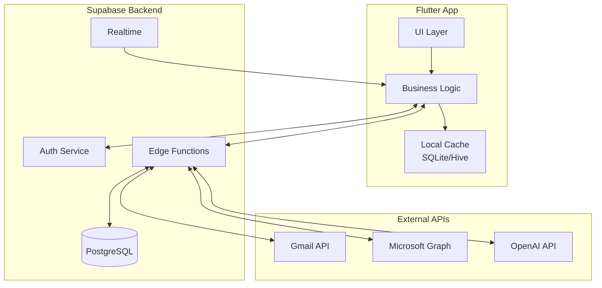

# EmailPilot — AI-Powered Inbox Zero Assistant

> **Evaluation Date:** January 11, 2026  
> **Status:** Actionable with Modifications  
> **Recommendation:** Build (with caution on margins)

---

## Reference Links & Competitor Analysis

### Competitor Apps

| App | Platform | Rating | Users/Downloads | Price | Key Features |
|-----|----------|--------|-----------------|-------|--------------|
| [Superhuman](https://superhuman.com) | iOS, Android, Web | 4.2★ (Play Store) | ~70,000 paying customers | $30/month | Speed-focused, AI drafts, keyboard shortcuts |
| [SaneBox](https://sanebox.com) | Cloud (any client) | 4.8★ (Trustpilot), 4.6★ (App Store) | N/A (cloud service) | $7-25/month | AI filtering, SaneLater, SaneBlackHole |
| [Spark Mail](https://sparkmailapp.com) | iOS, Android, Mac, Windows | 4.6★ (81K ratings on App Store) | N/A | Free / $8/mo Pro | Smart inbox, AI writing, team features |
| [Inbox Zero](https://getinboxzero.com) | Web (Gmail/Outlook) | Open Source | N/A | Free / Paid tiers | AI categorization, rule engine |
| [Clean Email](https://clean.email) | Web, iOS, Android | 4.5★ | N/A | $10/month | Bulk cleanup, smart views |

### Open Source Email Projects on GitHub

- **[Mail-0/Zero](https://github.com/Mail-0/Zero)** — Open-source AI email solution with Next.js/React, thread summarization, AI drafting
- **[anandvc/email-prioritizer](https://github.com/anandvc/email-prioritizer)** — Gmail AI classification and prioritization with Next.js
- **[Inbox Zero](https://github.com/elie222/inbox-zero)** — Open-source AI email assistant for Gmail/Outlook
- **[Aomail](https://github.com/aomail-ai/aomail)** — Open-source email management with LLM integration
- **[haasonsaas/email-agent](https://github.com/haasonsaas/email-agent)** — AI-powered email triage with priority scoring

---

## 1. Idea Summary

### Core Problem Solved
Email overload destroys productivity for professionals handling 100+ emails daily. Existing tools use rigid rules or generic AI that miss context. Users still dread opening their inbox and feel overwhelmed.

### Target Users
- **Primary:** Executives, founders, consultants, salespeople
- **Secondary:** Busy professionals, freelancers, agency owners
- **Demographics:** 25-55 years old, knowledge workers, $75K+ income
- **Behavior:** Spend 2-4 hours daily on email, value time optimization

---

## 2. Market Demand & Trends

### Market Size
- **Email Management Software Market (2024):** $4.59B — $35.59B (varying estimates)
- **Projected 2025:** $5-6B+
- **CAGR:** 10.3-10.8% through 2029
- **Target Addressable Market:** ~50M professionals globally who send 100+ emails/day

### Supporting Trends ✅
- Email volume post-2020 increased by 35%
- Remote/hybrid work increased email reliance
- AI writing quality now indistinguishable from human
- Slack/Teams haven't replaced email for external communication
- Gmail/Outlook APIs are mature and reliable

### Threatening Trends ⚠️
- Gmail AI features improving (Smart Reply, Priority Inbox)
- Microsoft Copilot integration with Outlook
- Grammarly acquired Superhuman (July 2025) — consolidation in space
- AI costs for LLM processing remain substantial

**Verdict:** Growing market with real demand, but big tech encroaching

---

## 3. ASO & Discoverability Analysis

### Keyword Analysis

| Keyword | Competition | Search Volume | Ranking Difficulty |
|---------|-------------|---------------|-------------------|
| "email app" | Very High | Very High | Extremely Hard |
| "inbox zero app" | Medium | Medium | Moderate |
| "AI email assistant" | Medium-High | Growing | Moderate-Hard |
| "email productivity" | High | High | Hard |
| "smart email" | Medium | Medium | Moderate |
| "email organizer" | High | High | Hard |

### Discoverability Strategy

**Organic Viability:** Medium-Low for generic terms, Medium-High for niche positioning

**Recommended Keywords:**
- "AI inbox manager"
- "Smart email triage"
- "Email priority app"
- "Inbox zero assistant"
- "Professional email organizer"

**Acquisition Strategy:**
- **Organic:** Focus on content marketing, ProductHunt launches, LinkedIn thought leadership
- **Paid:** LinkedIn ads targeting specific job titles, Google Ads for high-intent keywords
- **Partnerships:** Productivity podcast sponsorships, newsletter partnerships

---

## 4. Monetization Potential

### Recommended Model: **Subscription (SaaS)**

| Tier | Price | Features | Target |
|------|-------|----------|--------|
| **Free Trial** | 14 days | Full features, limited emails | Conversion funnel |
| **Professional** | $12/month | 1 inbox, core AI features | Individual users |
| **Team** | $25/user/month | Multi-inbox, team insights, shared context | Small teams |
| **Enterprise** | Custom | SSO, admin controls, priority support | Large organizations |

### Revenue Projections

| Scenario | Users | MRR | ARR | Notes |
|----------|-------|-----|-----|-------|
| **Low Effort** | 500 | $5,000 | $60,000 | Minimal marketing, organic only |
| **Medium Execution** | 3,000 | $30,000 | $360,000 | Active marketing, PR, partnerships |
| **High-Quality** | 15,000 | $150,000 | $1.8M | Strong brand, enterprise deals |

### Cost Analysis (Per User/Month)

| Cost Item | Estimate |
|-----------|----------|
| LLM API (OpenAI/Claude) | $0.50-2.00 |
| Infrastructure | $0.20-0.50 |
| Support (blended) | $0.50 |
| **Total COGS** | **$1.20-3.00** |
| **Gross Margin** | **75-90%** at $12/mo |

⚠️ **Warning:** LLM costs can spike with heavy email users (1000+ emails/month). Need aggressive caching, summarization, and batch processing.

---

## 5. Development Effort & Time

### MVP Development

| Phase | Solo Developer | Small Team (2-3) |
|-------|----------------|------------------|
| Core Email Integration | 4-6 weeks | 2-3 weeks |
| AI Prioritization Engine | 4-6 weeks | 2-3 weeks |
| Draft Generation | 2-3 weeks | 1-2 weeks |
| Mobile Apps (Flutter) | 6-8 weeks | 3-4 weeks |
| Backend & Auth | 3-4 weeks | 2 weeks |
| Testing & Polish | 2-3 weeks | 1-2 weeks |
| **Total MVP** | **21-30 weeks (5-7 months)** | **11-16 weeks (3-4 months)** |

### Tech Complexity: **Medium-High**

| Component | Complexity | Reason |
|-----------|------------|--------|
| OAuth Email Integration | High | Gmail, Outlook, IMAP variations |
| AI Processing Pipeline | Medium-High | LLM integration, embeddings, cost optimization |
| Real-time Sync | High | Push notifications, background processing |
| Privacy/Security | High | Email data is sensitive |
| Cross-platform UI | Medium | Flutter helps here |

### Solo Developer Feasibility: **Challenging but Possible**

A skilled developer can build MVP in 6-8 months, but:
- OAuth integration is time-consuming
- AI cost management requires expertise
- Ongoing maintenance is substantial

---

## 6. Competition Analysis

### Competition Level: **High**

### Competitor Breakdown

| Competitor | Strengths | Weaknesses | Your Opportunity |
|------------|-----------|------------|------------------|
| **Superhuman** | Speed, polish, brand | $30/mo pricing, Gmail/Outlook only | Price point ($12 vs $30) |
| **SaneBox** | Trusted, works with any client | No AI drafting, dated UX | Modern AI features |
| **Spark** | Free tier, good UI | Basic AI, team focus | Individual power users |
| **Gmail AI** | Free, built-in | Generic, not personalized | Relationship intelligence |

### Differentiation Opportunities

1. **Relationship Intelligence:** Learn who matters most based on interaction patterns, response rates, and implicit priority signals
2. **Contextual Awareness:** "CEO's assistant hinting urgency" vs "vendor pitch disguised as urgent"
3. **Price Point:** $12/mo vs Superhuman's $30
4. **Cross-platform:** Single codebase with Flutter for iOS, Android, and potential desktop
5. **Privacy-first:** Process minimally, store less, local-first options

---

## 7. Scalability & Future Expansion

### Expansion Roadmap

```
MVP (0-12 months)
├── Gmail integration
├── Smart triage
├── AI drafts
└── Mobile apps

Phase 2 (12-24 months)
├── Outlook/Microsoft 365
├── IMAP support
├── Web dashboard
├── Team features
└── Calendar integration

Phase 3 (24-36 months)
├── CRM integrations (HubSpot, Salesforce)
├── Enterprise SSO
├── API platform
├── White-label licensing
└── Meeting scheduling AI
```

### Moat Potential

| Factor | Strength | Notes |
|--------|----------|-------|
| Data Network Effects | High | Relationship intelligence compounds |
| Switching Costs | High | "Who matters" context irreplaceable |
| Brand | Medium | Can build with quality execution |
| Technology | Low-Medium | AI commoditizing, but implementation matters |

---

## 8. Risk Assessment

### Risk Matrix

| Risk | Probability | Impact | Mitigation |
|------|-------------|--------|------------|
| Big Tech feature parity | High (70%) | High | Focus on personalization, niche features |
| LLM cost overruns | Medium (40%) | High | Aggressive caching, batch processing |
| OAuth API changes | Medium (30%) | High | Abstract integrations, quick response |
| User privacy concerns | Medium (40%) | Medium | Transparent policies, minimal data |
| Competition from Superhuman/Grammarly | High (60%) | Medium | Different positioning, price |
| Slow user acquisition | High (50%) | High | Strong content marketing, PR |

### Failure Probability
- **Average Execution:** 55% failure (highly competitive, margin pressure)
- **Strong Execution:** 35% failure
- **Weak Execution:** 75% failure

---

## 9. Final Verdict

| Criteria | Rating |
|----------|--------|
| **Status** | ⚠️ Actionable with Modifications |
| **Recommended Developer Level** | Experienced |
| **Clear Recommendation** | **Build** (but manage margins carefully) |

### Why Build?
1. Real, growing market pain point
2. $12/mo price point undercuts Superhuman significantly
3. Relationship intelligence is a genuine differentiator
4. Daily-use product with high retention potential
5. B2B expansion path for enterprise deals

### Why Caution?
1. High competition from well-funded players
2. Big tech (Google, Microsoft) improving built-in AI
3. LLM costs eat into margins for heavy users
4. OAuth integration complexity and maintenance burden
5. Privacy/security requirements are stringent

---

## 10. Improvement Suggestions

### Smart Pivots

1. **Niche Down:** Focus on specific profession (e.g., "EmailPilot for Salespeople," "EmailPilot for Agencies")
2. **Gmail-Only MVP:** Reduce complexity by only supporting Gmail initially
3. **Browser Extension First:** Lower friction entry point before full mobile apps
4. **AI Writing Focus:** Pivot slightly to emphasize writing assistance over prioritization (less competition)

### Success Multipliers

1. Build in public on Twitter/LinkedIn for organic reach
2. Launch on ProductHunt with polished demo
3. Create "Inbox Zero Challenge" viral campaigns
4. Partner with productivity influencers (Ali Abdaal, Keep Productive)
5. Offer lifetime deals early for cash injection and social proof

---

## 11. Product Requirements Document (PRD)

### 11.1 Product Overview

#### Vision Statement
"EmailPilot transforms overwhelming inboxes into calm, actionable workspaces by teaching AI to understand your relationships, priorities, and communication style—making inbox zero achievable without the anxiety."

#### Target User Personas

**Persona 1: Executive Emma**
- **Demographics:** 42, VP of Marketing, Fortune 500 company
- **Behaviors:** 200+ emails/day, travels frequently, manages large team
- **Pain Points:** Misses important emails from board members, wastes time on vendor pitches
- **Goals:** Never miss critical emails, respond faster to leadership

**Persona 2: Founder Faisal**
- **Demographics:** 34, Tech startup CEO, Series A
- **Behaviors:** 150+ emails/day, context-switching between investors/customers/team
- **Pain Points:** Can't identify urgent investor requests quickly, follow-ups fall through cracks
- **Goals:** Look responsive to investors, close deals faster

**Persona 3: Consultant Carla**
- **Demographics:** 38, Management consultant, Big 4 firm
- **Behaviors:** 100+ emails/day across multiple clients
- **Pain Points:** Email threads are too long to read, can't track deliverables
- **Goals:** Impress clients with fast response, maintain multiple relationships

#### User Stories

| ID | User Story | Priority |
|----|------------|----------|
| US-01 | As a user, I want to see my most urgent emails immediately so I can respond to critical items first | P0 |
| US-02 | As a user, I want AI to draft responses so I can reply faster with less effort | P0 |
| US-03 | As a user, I want thread summaries so I can understand long conversations quickly | P0 |
| US-04 | As a user, I want follow-up reminders with context so nothing falls through the cracks | P1 |
| US-05 | As a user, I want the app to learn who matters most so priorities improve over time | P1 |

#### Success Metrics & KPIs

| Metric | Target | Measurement |
|--------|--------|-------------|
| Daily Active Users (DAU) | 60%+ of MAU | Analytics |
| Time to Inbox Zero | <30 min vs 2hr baseline | User survey |
| Draft Acceptance Rate | >40% | In-app tracking |
| Net Promoter Score | >50 | Quarterly surveys |
| Churn Rate | <5% monthly | Subscription analytics |

### 11.2 Feature Specifications

#### Feature 1: Smart Triage Dashboard

**Priority:** Must-have (P0)

**Description:** AI-powered dashboard showing emails categorized by urgency and action required.

**User Flow:**
```
Open App → View Triage Summary → 
├── "3 need immediate attention" (tap to view)
├── "12 require action this week" (tap to view)
├── "47 FYI / can wait" (tap to view)
└── "28 newsletters/promotions" (auto-sorted)
```

**Acceptance Criteria:**
- [ ] Emails categorized within 2 seconds of sync
- [ ] Categories: Urgent, Action Required, FYI, Automated
- [ ] Accuracy >85% on urgency classification
- [ ] One-tap access to each category
- [ ] Badge counts update in real-time

**Edge Cases:**
- Empty inbox: Show "Inbox Zero achieved! 🎉" celebration
- New user: Show onboarding tips within triage view
- Sync failure: Display last cached state with "Updating..." indicator

---

#### Feature 2: AI Reply Drafts

**Priority:** Must-have (P0)

**Description:** One-tap generation of contextual reply drafts based on email thread and user style.

**User Flow:**
```
View Email → Tap "Draft Reply" →
├── AI generates 3 response options
├── Short / Medium / Detailed toggle
├── Tone: Professional / Friendly / Casual
└── Edit → Send or Schedule
```

**Acceptance Criteria:**
- [ ] Draft generation <3 seconds
- [ ] Three response length options available
- [ ] Tone adjustment without re-generation
- [ ] User edits are learned for future style matching
- [ ] Drafts save automatically

**Edge Cases:**
- Very long threads: Summarize first, then draft
- Foreign language emails: Detect and offer translation
- Sensitive content: Flag for manual review

---

#### Feature 3: Thread Summaries

**Priority:** Must-have (P0)

**Description:** TL;DR summaries for long email threads with key action items extracted.

**User Flow:**
```
Long Thread (>3 emails) → Auto-show summary banner →
├── "3 participants, 2 decisions made, 1 action for you"
├── Tap to expand full summary
└── Jump to specific messages
```

**Acceptance Criteria:**
- [ ] Summary appears for threads with 3+ emails
- [ ] Key decisions and action items extracted
- [ ] Participant count and last active shown
- [ ] "Skip to my action item" quick link

---

#### Feature 4: VIP Detection & Learning

**Priority:** Should-have (P1)

**Description:** Automatically identify and prioritize emails from important contacts based on interaction patterns.

**Acceptance Criteria:**
- [ ] Auto-detect VIPs based on: response rate, email frequency, reply speed
- [ ] User can manually mark/unmark VIPs
- [ ] VIP emails always surface in "Immediate Attention"
- [ ] Learn from user behavior over 2-week training period

---

#### Feature 5: Follow-Up Intelligence

**Priority:** Should-have (P1)

**Description:** Smart reminders for emails awaiting response with full context.

**User Flow:**
```
Send Email → AI detects pending response →
├── After 3 days: "No response from John"
├── Tap reminder → See original thread + draft nudge
└── Snooze or mark resolved
```

### 11.3 Technical Requirements

#### Platform Requirements

| Platform | Minimum Version | Target Version |
|----------|-----------------|----------------|
| iOS | 14.0 | 17.0+ |
| Android | API 26 (8.0) | API 34 (14.0)+ |
| Flutter SDK | 3.19+ | Latest stable |

#### Device Capabilities Required
- Push notifications
- Background fetch
- Secure enclave/keystore for OAuth tokens
- Biometric authentication support

#### Performance Requirements

| Metric | Requirement |
|--------|-------------|
| App cold start | <2 seconds |
| Email sync (100 new) | <5 seconds |
| AI triage classification | <2 seconds |
| Draft generation | <3 seconds |
| Memory usage | <200MB typical |

#### Security & Privacy Requirements

- [x] OAuth 2.0 for all email integrations (no password storage)
- [x] End-to-end encryption for local data (AES-256)
- [x] SOC 2 Type II compliance roadmap
- [x] GDPR and CCPA compliant data handling
- [x] Minimal data retention (delete after processing unless user opts in)
- [x] Privacy policy clearly explaining AI processing

#### Accessibility Requirements

- [x] WCAG 2.1 AA compliance
- [x] VoiceOver / TalkBack full support
- [x] Dynamic font sizing
- [x] High contrast mode
- [x] Screen reader labels for all interactive elements

#### Offline Functionality

| Feature | Offline Capability |
|---------|-------------------|
| View cached emails | ✅ Full |
| Search cached emails | ✅ Full |
| Compose drafts | ✅ Save locally |
| AI features | ❌ Requires connection |
| Sync | ❌ Requires connection |

### 11.4 Data Requirements

#### Data Models

```
User
├── id (UUID)
├── email (string)
├── created_at (timestamp)
├── subscription_tier (enum)
└── preferences (jsonb)

EmailAccount
├── id (UUID)
├── user_id (FK → User)
├── provider (enum: gmail, outlook, imap)
├── oauth_tokens (encrypted)
└── sync_cursor (string)

Email (cached locally, minimal on server)
├── id (string, provider ID)
├── account_id (FK)
├── thread_id (string)
├── from, to, cc (jsonb)
├── subject, snippet (string)
├── priority_score (float 0-1)
├── category (enum)
└── timestamps

Contact
├── id (UUID)
├── user_id (FK)
├── email (string)
├── vip_score (float)
├── interaction_count (int)
└── avg_response_time (int, hours)
```

#### Data Retention Policy

| Data Type | Retention | Location |
|-----------|-----------|----------|
| OAuth tokens | Until revoked | Encrypted on device + server |
| Email content | Cached 30 days | Device only (not server) |
| AI analysis results | 90 days | Server (anonymized) |
| User preferences | Indefinite | Server |
| Usage analytics | 24 months | Server (anonymized) |

#### Privacy & Compliance

- **GDPR:** Right to deletion, data portability, explicit consent
- **CCPA:** Opt-out of data sales (we don't sell), access requests
- **Email content:** Never stored on our servers beyond transient processing

#### Analytics Requirements

| Event | Properties |
|-------|------------|
| app_open | source, time_since_last |
| email_triaged | category, action_taken |
| draft_generated | accepted, edited, tone |
| vip_marked | manual vs auto |
| subscription_started | tier, trial_converted |

---

## 12. Development Strategy & Roadmap

### 12.1 Technology Stack Recommendation

#### Mobile Framework: **Flutter** ✅

| Option | Pros | Cons | Verdict |
|--------|------|------|---------|
| **Flutter** | Single codebase, great performance, Google support, rich UI | Fewer native libs, larger app size | ✅ Recommended |
| React Native | Large ecosystem, JavaScript | Performance issues, bridge overhead | ❌ |
| Native (Swift/Kotlin) | Best performance | 2x development cost | ❌ For MVP |

**Justification:** Flutter provides optimal balance of development speed and native-quality UI. Critical for solo/small team. Firebase integration is seamless.

#### Backend Architecture: **Supabase** ✅

| Option | Pros | Cons | Best For |
|--------|------|------|----------|
| **Supabase** | Fast setup, PostgreSQL, real-time, auth built-in, Edge Functions | Less mature than Firebase, fewer integrations | ✅ MVP → Scale |
| Firebase | Mature, excellent Flutter support | Vendor lock-in, Firestore limitations | Alternative |
| Spring Boot | Full control, enterprise-ready | High dev time, more infrastructure | Later scaling |

**Cost Analysis at Scale:**

| Users | Supabase | Firebase | Custom (AWS) |
|-------|----------|----------|--------------|
| 1,000 | $25/mo | $50/mo | $100/mo |
| 10,000 | $75/mo | $200/mo | $400/mo |
| 50,000 | $300/mo | $800/mo | $1,200/mo |

**Justification:** Supabase offers PostgreSQL flexibility with BaaS convenience. Lower cost than Firebase at scale, easier migration to custom backend later.

#### AI/LLM Services

| Service | Use Case | Cost Estimate |
|---------|----------|---------------|
| **OpenAI GPT-4o-mini** | Draft generation, summarization | $0.15/$0.60 per 1M tokens |
| **OpenAI Embeddings** | Semantic search, VIP detection | $0.02 per 1M tokens |
| **Claude 3 Haiku** | Alternative for cost optimization | $0.25/$1.25 per 1M tokens |

**Strategy:** Use GPT-4o-mini for most tasks (cost-effective), with fallback to Haiku for peak loads.

#### Full Stack Recommendation

```
┌─────────────────────────────────────────────────────┐
│                    CLIENT LAYER                      │
│  Flutter (iOS + Android + Web PWA)                  │
│  ├── Riverpod (state management)                    │
│  ├── Dio (HTTP client)                              │
│  └── flutter_secure_storage (tokens)                │
└─────────────────────────────────────────────────────┘
                           │
┌─────────────────────────────────────────────────────┐
│                   BACKEND LAYER                      │
│  Supabase                                            │
│  ├── PostgreSQL (primary database)                  │
│  ├── Auth (OAuth proxy for Gmail/Outlook)           │
│  ├── Edge Functions (Deno/TypeScript)               │
│  ├── Realtime (email sync notifications)            │
│  └── Storage (optional attachments)                 │
└─────────────────────────────────────────────────────┘
                           │
┌─────────────────────────────────────────────────────┐
│                 EXTERNAL SERVICES                    │
│  ├── Gmail API (OAuth 2.0)                          │
│  ├── Microsoft Graph API (Outlook)                  │
│  ├── OpenAI API (LLM processing)                    │
│  ├── RevenueCat (subscription management)           │
│  ├── PostHog (product analytics)                    │
│  └── Sentry (error tracking)                        │
└─────────────────────────────────────────────────────┘
```

### 12.2 Architecture Design

#### High-Level Architecture



#### Authentication Flow

```
1. User taps "Connect Gmail"
2. App opens OAuth consent screen (system browser)
3. User grants permissions
4. Callback with auth code → Supabase Edge Function
5. Edge Function exchanges code for tokens
6. Tokens encrypted and stored in Supabase
7. App receives session token
8. Subsequent API calls use session token
9. Edge Function uses stored OAuth tokens to fetch emails
```

#### Data Synchronization Strategy

**Approach:** Server-first with aggressive local caching

```
Initial Sync:
1. Fetch last 30 days of emails (batch of 100)
2. Store in local SQLite cache
3. Run AI classification on server
4. Push classifications to client

Incremental Sync:
1. Gmail push notifications → Supabase webhook
2. Edge Function fetches new email
3. AI processes immediately
4. Realtime subscription pushes to client
5. Client updates local cache
```

### 12.3 Development Phases & Timeline

#### Phase 1: MVP (16 weeks)

| Sprint | Duration | Deliverables |
|--------|----------|--------------|
| Sprint 1-2 | 4 weeks | Project setup, Gmail OAuth, basic email fetching |
| Sprint 3-4 | 4 weeks | AI triage engine, priority classification |
| Sprint 5-6 | 4 weeks | Flutter UI (triage dashboard, email view) |
| Sprint 7-8 | 4 weeks | AI drafts, subscriptions, polish & launch prep |

**MVP Success Criteria:**
- [ ] Gmail integration working end-to-end
- [ ] Smart triage with 80%+ accuracy
- [ ] AI drafts generating in <3 seconds
- [ ] Subscription flow working (RevenueCat)
- [ ] 50 beta users actively using

#### Phase 2: Enhancement (6 months)

- Outlook/Microsoft 365 integration
- Thread summaries feature
- VIP detection and learning
- Follow-up reminders
- Performance optimization
- Web dashboard (basic)

#### Phase 3: Scale (6-12 months)

- IMAP support for other providers
- Team features and shared context
- Enterprise SSO
- CRM integrations
- API platform for developers

### 12.4 Team Structure & Roles

#### Solo Developer Path (Feasible but stretched)

| Role | Hours/Week | Skills Required |
|------|------------|-----------------|
| Full-stack Dev | 40-50 | Flutter, TypeScript, PostgreSQL, AI/LLM |
| Part-time Designer | 5-10 | Figma, mobile UX (contractor) |

**Total time to MVP:** 6-8 months

#### Ideal Small Team (2-3 people)

| Role | Responsibility |
|------|----------------|
| **Lead Developer** | Architecture, backend, AI pipeline |
| **Mobile Developer** | Flutter UI/UX implementation |
| **Product/Growth** | User research, marketing, customer success |

**Total time to MVP:** 3-4 months

### 12.5 Infrastructure & DevOps

#### Hosting Strategy

| Component | Provider | Estimated Cost |
|-----------|----------|----------------|
| Backend (Supabase) | Supabase Pro | $25/mo |
| AI Processing | OpenAI API | $50-200/mo (varies) |
| Mobile Analytics | PostHog (free tier) | $0 |
| Error Tracking | Sentry (free tier) | $0 |
| Subscriptions | RevenueCat | Free for first $2.5K MRR |

**Monthly Infrastructure (MVP):** ~$100-250/month

#### CI/CD Pipeline

```
GitHub Push → GitHub Actions
├── Lint & test (Dart analyzer, unit tests)
├── Build iOS/Android apps
├── Deploy Edge Functions (Supabase CLI)
├── Deploy to TestFlight/Play Internal
└── Notify Slack on success/failure
```

### 12.6 Quality Assurance Strategy

#### Testing Pyramid

| Level | Coverage Target | Tools |
|-------|-----------------|-------|
| Unit Tests | 80%+ | Flutter test, Mockito |
| Widget Tests | 60%+ | Flutter widget testing |
| Integration | Key flows | integration_test package |
| E2E | Critical paths | Maestro / flutter_driver |

#### Beta Testing Plan

1. **Alpha (Week 12):** 10 internal testers (friends, colleagues)
2. **Closed Beta (Week 14):** 50 users from waitlist
3. **Open Beta (Week 16):** 200+ users, ProductHunt preview
4. **Launch:** Public release with press coverage

---

## 13. Go-to-Market Strategy

### 13.1 Launch Plan

#### Pre-Launch (8 weeks before)

| Week | Activity |
|------|----------|
| -8 | Landing page live, waitlist collection |
| -6 | Content marketing begins (blog, Twitter/X) |
| -4 | Beta access for waitlist top 50 |
| -2 | ProductHunt ship preview, press outreach |
| -1 | Final polish, prepare launch materials |

#### Launch Week

| Day | Activity |
|-----|----------|
| Monday | Soft launch to full waitlist |
| Tuesday | ProductHunt launch (aim for Top 5) |
| Wednesday | Hacker News "Show HN" post |
| Thursday | Twitter/X thread with demo video |
| Friday | LinkedIn post + newsletter partnerships |

#### ASO Strategy

**App Store Keywords:**
- Primary: "AI email", "inbox zero", "email assistant"
- Secondary: "smart email", "email productivity", "email organizer"

**Screenshots:** Focus on "Before/After" transformation
- Screenshot 1: "200 unread → 3 that matter"
- Screenshot 2: AI draft in action
- Screenshot 3: Thread summary view

### 13.2 User Acquisition

#### Organic Growth Tactics

1. **Build in Public:** Weekly Twitter/X updates on development
2. **Content Marketing:** "Inbox Zero Guide," "Email Productivity Tips" blog posts
3. **YouTube/Loom Demos:** Visual proof of time savings
4. **SEO Play:** "How to achieve inbox zero" content hub

#### Paid Acquisition (Post-MVP)

| Channel | Budget | Target CPA |
|---------|--------|------------|
| LinkedIn Ads | $500/mo | $30 |
| Google Ads | $300/mo | $25 |
| Twitter/X Ads | $200/mo | $20 |

#### Partnership Opportunities

- Productivity newsletter sponsorships (Keep Productive, Productivity Game)
- Podcast sponsorships (Cortex, Focused, Deep Work)
- Affiliate partnerships with productivity influencers

### 13.3 Retention & Engagement

#### Onboarding Optimization

```
Day 0: Connect email → Immediate "wow" (see triage working)
Day 1: Push notification with first AI insight
Day 3: Email summary: "You've saved X minutes this week"
Day 7: Feature discovery nudge (VIP detection)
Day 14: Trial ending reminder with social proof
```

#### Engagement Tactics

- **Streak Counter:** "21 days of Inbox Zero 🔥"
- **Weekly Report:** "You processed 142 emails, responded 30% faster"
- **Smart Notifications:** Only notify for genuine urgency

### 13.4 Monetization Implementation

#### Pricing Strategy

- **Launch Price:** $9.99/mo (promotional) → $12/mo after 3 months
- **Annual Discount:** 17% ($99/year vs $144)
- **No Free Tier:** Free trial only (avoids support burden)

#### A/B Testing Plan

| Test | Variants | Success Metric |
|------|----------|----------------|
| Trial Length | 7 vs 14 days | Conversion rate |
| Pricing | $9.99 vs $12.99 | Revenue per user |
| Paywall Timing | Immediate vs 3 days | Conversion rate |

#### Revenue Tracking

- RevenueCat for subscription analytics
- Custom PostHog events for funnel analysis
- Cohort analysis by acquisition channel

---

## Summary

**EmailPilot** is a viable but challenging opportunity. The market is real and growing, but competition is fierce with well-funded players like Superhuman ($825M valuation) and encroaching big tech AI features.

### Execute If:
✅ You have 6+ months runway to build and iterate  
✅ You can differentiate on relationship intelligence  
✅ You price competitively ($12 vs $30)  
✅ You master LLM cost optimization  
✅ You commit to aggressive marketing from day one

### Avoid If:
❌ You can't dedicate full-time effort  
❌ You're uncomfortable with competitive markets  
❌ You can't handle OAuth integration complexity  
❌ You expect quick returns

**Bottom Line:** Build it if you're passionate about email productivity and willing to compete in a challenging but lucrative market. The $12 price point and relationship intelligence angle provide genuine differentiation from Superhuman's $30 premium positioning.
