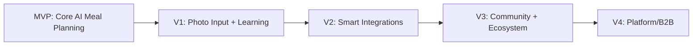
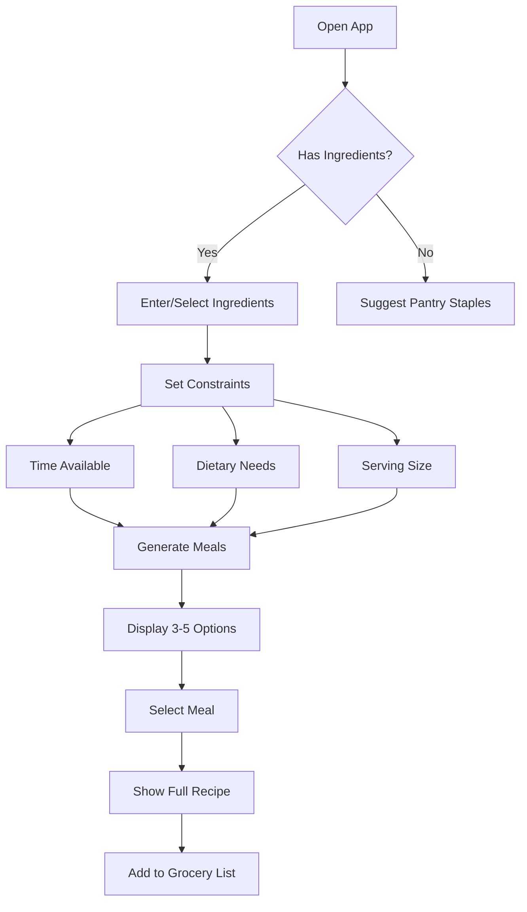
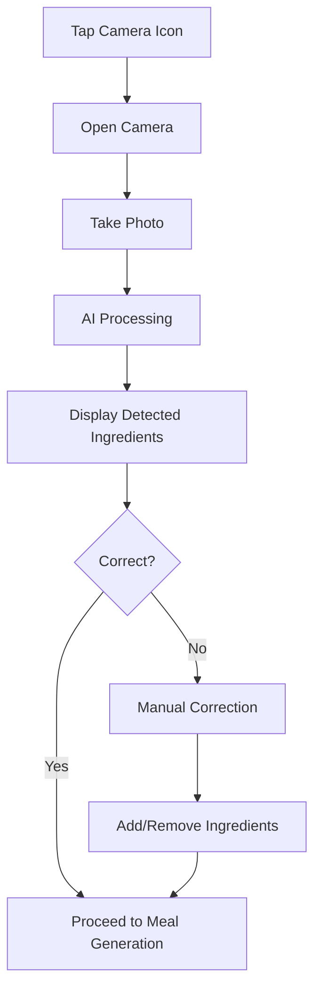
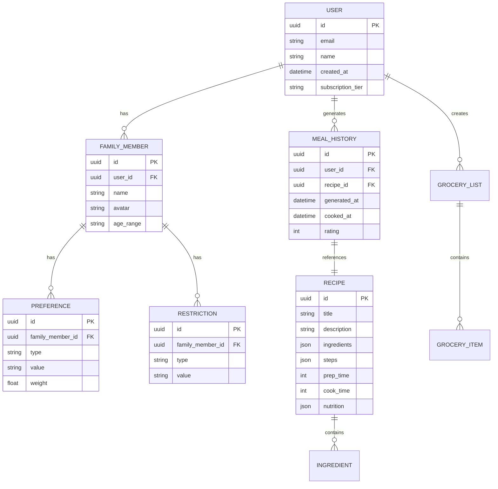
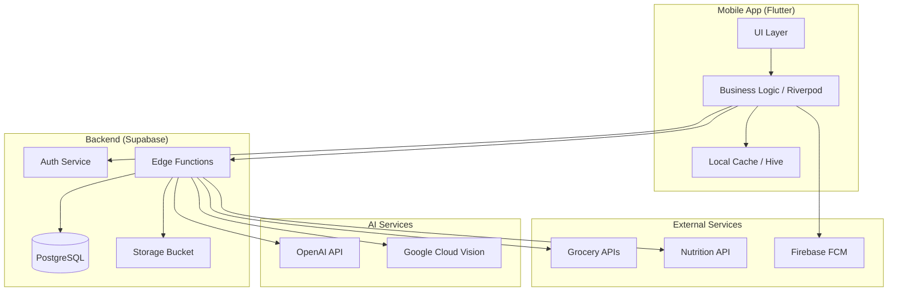
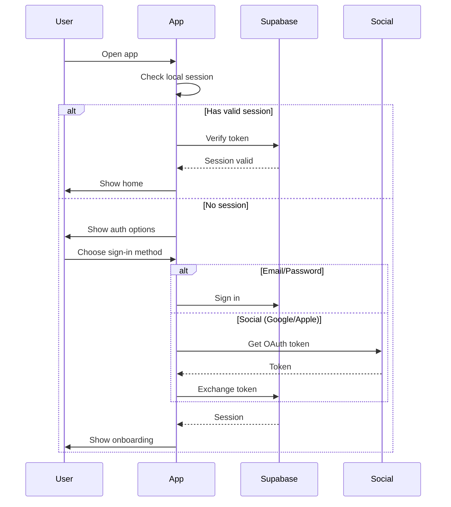
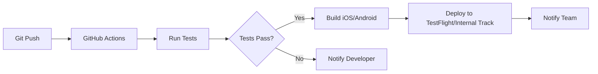

# MealMind — AI Meal Planning App Evaluation

> **Evaluation Date:** January 11, 2026  
> **App Idea Source:** [03-mealmind.md](file:///Users/javeedishaq/devwork/codelaxy/pro-dev-notes/app-prompts/03-mealmind.md)

---

## Reference Links & Competitor Analysis

### Competitor Apps (Download Counts & Ratings)

| App | Platform | Downloads | Rating | Key Features |
|-----|----------|-----------|--------|--------------|
| **[Mealime](https://apps.apple.com/app/mealime-meal-plans-recipes/id1079999103)** | iOS/Android | 5M+ | ⭐ 4.8 (iOS), 4.57 (Android) | Personalized meal plans, dietary preferences, 30-min recipes, grocery lists |
| **[Yummly](https://apps.apple.com/app/yummly-recipes-cooking-tools/id589625334)** | iOS/Android | 5M+ | ⭐ 4.8 (iOS), 4.4 (Android) | 2M+ recipes, AI recommendations, smart shopping lists, smart appliance integration |
| **[Paprika Recipe Manager](https://apps.apple.com/app/paprika-recipe-manager-3/id1303222868)** | iOS/Android | 1M+ | ⭐ 4.7 | Recipe organization, meal planning calendar, grocery lists, offline access |
| **[Eat This Much](https://apps.apple.com/app/eat-this-much-meal-planner/id981637806)** | iOS/Android | 500K+ | ⭐ 4.5 | Macro/calorie-driven automation, automatic meal plan generation |
| **[Whisk/Samsung Food](https://apps.apple.com/app/whisk-recipe-saver/id1146249498)** | iOS/Android | 1M+ | ⭐ 4.6 | Recipe organization, meal scheduling, grocery delivery integration |

### Open Source Projects on GitHub

| Project | Framework | Stars | Features | Link |
|---------|-----------|-------|----------|------|
| **Flutter-Bloc-Recipe-app** | Flutter | 300+ | 50K+ recipes, nutrition info, meal plans, Spoonacular API | [GitHub](https://github.com/Ansh-Rathod/Flutter-Bloc-Recipe-app) |
| **MealPlannerApp** | Flutter | 50+ | Firebase auth, CRUD operations, meal data storage | [GitHub](https://github.com/PrioxisTechnologies/MealPlannerApp) |
| **MealApp** | Flutter | 100+ | Categories, dietary preferences, favorites | [GitHub](https://github.com/Shahid-Fakhri/MealApp) |
| **mealplanner-react-native** | React Native | 50+ | Full-stack, recipe sorting, community blog | [GitHub](https://github.com/madisonisfan/mealplanner-react-native) |
| **react-native-recipe-app** | React Native | 200+ | Auth, categories, YouTube tutorials, favorites | [GitHub](https://github.com/burakorkmez/react-native-recipe-app) |

### AI/ML Recipe APIs & Services

- **[Spoonacular API](https://spoonacular.com/food-api)** — Recipe database, nutrition analysis, meal planning
- **[Edamam API](https://www.edamam.com/)** — Recipe search, nutrition analysis, food database
- **[LogMeal API](https://logmeal.es/)** — Food recognition, nutrition info from images
- **[Clarifai Food Model](https://www.clarifai.com/)** — Visual food recognition AI

---

## 1. Idea Summary

### Core Problem
Meal planning apps assume users have infinite time and perfectly stocked pantries. Real users face daily challenges:
- "It's 6pm, I have chicken, kids hate vegetables, and I have 20 minutes"
- Decision fatigue around "what's for dinner?"
- Wasted groceries and money on unused ingredients
- Dietary restrictions across family members

### Target Users
1. **Busy Parents** (Primary) — Time-constrained, feeding multiple people with different preferences
2. **Health-Conscious Professionals** — Want nutritious meals but limited cooking time
3. **Budget-Conscious Families** — Need to maximize groceries and minimize waste
4. **Diet-Specific Users** — Keto, vegan, allergy sufferers needing personalized solutions

### Value Proposition
**"AI that understands YOUR kitchen, YOUR family, and YOUR constraints"** — Converting chaotic dinner decisions into personalized, actionable meal solutions.

---

## 2. Market Demand & Trends

### Market Size & Growth

| Metric | Value | Source |
|--------|-------|--------|
| **2024 Market Size** | $972M - $1.59B | Market.us, ConsaInsights |
| **2025 Projected** | $830M - $1.0B | Business Research Company |
| **2034 Projected** | $11.57B | Market.us |
| **CAGR (2025-2034)** | 28.1% | Market.us |
| **North America Share** | 32.1% (2024) | Market.us |

### Supporting Trends ✅

| Trend | Impact |
|-------|--------|
| **Post-pandemic cooking fatigue** | Users want help, not just recipes |
| **Rising food costs** | Budget optimization is critical need |
| **LLM advancement** | AI now understands cuisine nuances |
| **Visual AI maturity** | Reliable ingredient recognition possible |
| **Health consciousness mainstream** | Nutrition tracking expected |
| **Smart kitchen adoption** | Integration opportunities growing |

### Potential Threats ⚠️

| Threat | Mitigation |
|--------|------------|
| **Big Tech entry** (Google, Apple) | Build deep personalization moat |
| **ChatGPT integration in recipes** | Focus on family learning, not generic responses |
| **Economic recession** | Position as money-saving tool |
| **API cost increases** | Optimize on-device processing |

### Verdict: **Strong Growing Demand** 📈
The market is in high-growth phase with 28% CAGR. The timing is excellent — AI capabilities have caught up to user expectations.

---

## 3. ASO & Discoverability Analysis

### Keyword Competition Assessment

| Keyword Category | Competition Level | Strategy |
|------------------|-------------------|----------|
| "meal plan" / "meal planning" | 🔴 Very High | Long-tail targeting |
| "recipe app" | 🔴 Very High | Avoid as primary |
| "AI meal planner" | 🟡 Medium | Primary opportunity |
| "what to cook with ingredients" | 🟡 Medium | Feature-based targeting |
| "family meal planner" | 🟡 Medium | Niche positioning |
| "pantry recipe finder" | 🟢 Low-Medium | Differentiation opportunity |
| "leftover recipe ideas" | 🟢 Low | Unique feature hook |

### Recommended ASO Strategy

**App Title:** `MealMind: AI Meal Planner`

**Subtitle:** `Snap Fridge. Get Recipes. Save Time.`

**Primary Keywords:**
- AI meal planner
- family meal planning
- what to cook with ingredients
- pantry recipe app
- leftover recipes

**Long-tail Keywords:**
- snap ingredients get recipe
- personalized family meals
- budget meal planning
- quick dinner ideas AI

### Organic vs Paid Acquisition

| Channel | Viability | Notes |
|---------|-----------|-------|
| **Organic (ASO)** | 🟡 Medium | Requires differentiation on "AI" and "family" |
| **Content Marketing** | 🟢 High | TikTok recipe content, Pinterest boards |
| **Influencer Marketing** | 🟢 High | Mom/family influencers very effective |
| **Paid UA (Meta/Google)** | 🟡 Medium | CPI $2-5, requires strong LTV |
| **App Store Features** | 🟡 Medium | AI-native apps getting editorial attention |

### Ranking Potential
**Realistic Ranking Estimate:** Top 50 in "Food & Drink" category within 6 months with proper execution. Top 20 possible with strong reviews and engagement metrics.

---

## 4. Monetization Potential

### Recommended Model: **Freemium Subscription + Affiliate**

| Tier | Price | Features | Conversion Target |
|------|-------|----------|-------------------|
| **Free** | $0/mo | 5 AI meal generations/week, basic grocery list | 100% of users |
| **Pro** | $5.99/mo ($47.99/yr) | Unlimited generations, family profiles, nutrition tracking | 3-5% of users |
| **Family** | $9.99/mo ($79.99/yr) | Up to 6 profiles, advanced preferences, meal prep mode | 1-2% of users |

### Additional Revenue Streams

| Stream | Revenue Potential | Implementation Effort |
|--------|-------------------|----------------------|
| **Grocery Affiliate** (Instacart, Amazon Fresh) | $0.50-2.00 per order | Medium |
| **Premium Recipe Collections** | $2.99-9.99 IAP | Low |
| **Meal Kit Partnerships** (HelloFresh, Blue Apron) | $10-25 per referral | Medium |
| **Sponsored Ingredients/Brands** | CPM-based | High |

### Earning Potential Estimates

| Scenario | Monthly Users | Conversion | ARPU | Monthly Revenue |
|----------|---------------|------------|------|-----------------|
| **Low Effort** | 10K | 2% | $4.50 | $900 |
| **Medium Execution** | 100K | 4% | $5.50 | $22,000 |
| **High-Quality Execution** | 500K | 5% | $7.00 | $175,000 |

### Cost Analysis

| Service | Cost Per Action | Monthly @ 100K Users |
|---------|-----------------|----------------------|
| LLM (meal generation) | $0.03/generation | $9,000 (3 gen/user) |
| Vision API (fridge scan) | $0.01/scan | $2,000 (2 scans/user) |
| Backend/Hosting | Fixed + scaling | $500-2,000 |
| **Total API Costs** | — | ~$11,500-13,000 |

**Unit Economics:** At $5.99/mo with 4% conversion, revenue of $24K vs costs of $13K = **45% gross margin** ✅

---

## 5. Development Effort & Time

### MVP Feature Set

| Feature | Priority | Complexity | Estimated Hours |
|---------|----------|------------|-----------------|
| User auth & onboarding | Must-have | Low | 20h |
| Preference questionnaire | Must-have | Low | 15h |
| Manual ingredient input | Must-have | Low | 20h |
| AI meal generation | Must-have | High | 60h |
| Recipe display & steps | Must-have | Medium | 30h |
| Basic grocery list | Must-have | Medium | 25h |
| Photo-based ingredient detection | Should-have | High | 80h |
| Preference learning | Should-have | High | 50h |
| Family profiles | Nice-to-have | Medium | 35h |
| Leftover transformation | Nice-to-have | Medium | 30h |

### Development Timeline

| Phase | Duration | Deliverables |
|-------|----------|--------------|
| **MVP (Core)** | 8-10 weeks | Auth, preferences, AI generation, recipes, grocery list |
| **MVP+ (Vision)** | +4-6 weeks | Photo ingredient detection, improved UX |
| **V1.0 (Complete)** | +4-6 weeks | Family profiles, preference learning, offline |

**Total MVP Time:** 8-10 weeks for solo developer (full-time)

### Tech Complexity Assessment

| Component | Complexity | Notes |
|-----------|------------|-------|
| Mobile App (Flutter) | Medium | Standard patterns apply |
| LLM Integration | Medium | API-based, prompt engineering key |
| Vision/Food Recognition | High | Model selection & accuracy critical |
| Preference Learning | High | ML pipeline required |
| Backend/API | Medium | BaaS can simplify |
| Grocery Store APIs | Medium | Third-party integrations |

### Developer Feasibility

| Team Size | Feasibility | Recommended Phase |
|-----------|-------------|-------------------|
| **Solo Developer** | ✅ Feasible | MVP without vision |
| **Solo + AI Focus** | ✅ Feasible | Full MVP |
| **2-Person Team** | ✅ Optimal | Complete V1.0 |
| **Small Team (3-4)** | ✅ Fast Execution | Full product + growth |

---

## 6. Competition Analysis

### Competition Level: **🟡 Medium-High**

### Competitive Landscape Matrix

| Competitor | AI Generation | Photo Input | Family Learning | Monetization |
|------------|---------------|-------------|-----------------|--------------|
| **Mealime** | ❌ No | ❌ No | ❌ Basic | Freemium |
| **Yummly** | ❌ Search only | ❌ No | ⚠️ Limited | Free + Ads |
| **Paprika** | ❌ No | ❌ No | ❌ No | One-time IAP |
| **Eat This Much** | ⚠️ Rule-based | ❌ No | ❌ No | Subscription |
| **ChatGPT** | ✅ Generic | ❌ No | ❌ No | N/A |
| **MealMind** | ✅ Personalized | ✅ Yes | ✅ Deep | Subscription |

### What Competitors Do Right

1. **Mealime:** Clean UX, quick meal times, excellent grocery list integration
2. **Yummly:** Massive recipe database, strong brand, smart appliance tie-ins
3. **Paprika:** One-time purchase model, offline-first, recipe importing
4. **Eat This Much:** Macro-focused automation, fitness integration

### What Competitors Do Wrong

1. **All:** No true AI generation — just search/filter
2. **All:** No photo-based ingredient input
3. **All:** Limited family preference learning
4. **All:** Generic recommendations, not contextual
5. **All:** No "leftover magic" functionality

### Clear Differentiation Opportunities

| Differentiator | Competitive Advantage |
|----------------|----------------------|
| **"Snap & Cook"** | Photo → meals in seconds |
| **Family DNA** | Deep preference learning across members |
| **Contextual AI** | Time, budget, dietary constraints in one query |
| **Leftover Magic** | Transform yesterday's food into new meals |
| **Budget Mode** | Cost-aware substitutions |

---

## 7. Scalability & Future Expansion

### Feature Expansion Roadmap

### Phase-by-Phase Expansion

| Phase | Features | Timeline |
|-------|----------|----------|
| **V1.0** | Core AI, photo input, preference learning | Launch |
| **V1.5** | Family profiles, nutrition tracking, meal prep mode | +3 months |
| **V2.0** | Grocery delivery integration, smart appliance sync | +6 months |
| **V2.5** | Community recipes, meal sharing, social features | +9 months |
| **V3.0** | Wearable integration, health platform sync | +12 months |
| **V4.0** | B2B API, white-label, enterprise wellness | +18 months |

### Platform Expansion

| Platform | Priority | Notes |
|----------|----------|-------|
| iOS + Android | 🟢 Launch | Flutter cross-platform |
| Web Dashboard | 🟡 V2 | Family management, meal planning calendar |
| Apple Watch/WearOS | 🟡 V3 | Quick suggestions, grocery checklist |
| Smart Display (Alexa, Nest) | 🟡 V3 | Hands-free cooking guidance |

### Moat Building Strategy

| Moat Type | Implementation |
|-----------|----------------|
| **Data Moat** | Family "food DNA" — months of preference data |
| **Switching Cost** | High — learned preferences don't transfer |
| **Network Effects** | Community recipes, shared meal plans |
| **Brand** | Position as THE AI meal assistant |

---

## 8. Risk Assessment

### Risk Matrix

| Risk Category | Specific Risk | Probability | Impact | Mitigation |
|---------------|---------------|-------------|--------|------------|
| **ASO** | Difficulty ranking for competitive keywords | 70% | Medium | Focus on long-tail, content marketing |
| **Monetization** | Low subscription conversion | 40% | High | Strong onboarding, demonstrate value fast |
| **Retention** | Users churn after novelty wears off | 50% | High | Daily habit hooks, preference learning |
| **Technical** | AI accuracy issues (wrong ingredients) | 30% | Medium | Fallback to manual input, user corrections |
| **Technical** | API cost escalation | 25% | Medium | On-device processing, caching |
| **Legal/Policy** | Health claims, nutrition liability | 20% | Medium | Clear disclaimers, no medical advice |
| **Competition** | Big Tech entry (Apple Recipes AI) | 40% | High | Build deep personalization before entry |
| **Competition** | ChatGPT adds specialized meal planning | 30% | Medium | Family context is defensible |

### Failure Probability Analysis

| Execution Level | Failure Probability | Primary Failure Mode |
|-----------------|---------------------|----------------------|
| **Low Effort** | 75% | Unable to compete on ASO, no differentiation visible |
| **Average Execution** | 45% | Retention issues, unable to convert free users |
| **High-Quality Execution** | 20% | Market timing or unexpected competitor |

---

## 9. Final Verdict

### Status: **✅ ACTIONABLE**

### Assessment Summary

| Criterion | Rating | Notes |
|-----------|--------|-------|
| Market Demand | ⭐⭐⭐⭐⭐ | Strong growth, real problem |
| Monetization Potential | ⭐⭐⭐⭐ | Sustainable unit economics |
| Competition | ⭐⭐⭐ | Crowded but differentiable |
| Development Feasibility | ⭐⭐⭐⭐ | Solo developer feasible |
| Scalability | ⭐⭐⭐⭐⭐ | Multiple expansion paths |
| Risk Level | ⭐⭐⭐ | Medium, manageable |

### Scores

| Factor | Score (1-10) |
|--------|--------------|
| Problem Validity | 9 |
| Market Timing | 9 |
| Monetization Clarity | 8 |
| Competitive Differentiation | 7 |
| Technical Feasibility | 7 |
| Solo Developer Fit | 7 |
| **Overall Score** | **7.8/10** |

### Recommendation

| Decision | Recommendation |
|----------|----------------|
| **Status** | ✅ Actionable |
| **Recommended Developer Level** | Intermediate to Experienced |
| **Clear Recommendation** | **BUILD** — with focus on AI differentiation and preference learning |

---

## 10. Improvement Suggestions

### Critical Success Factors

1. **Nail the "Snap & Cook" Experience**
   - Ingredient recognition must be 85%+ accurate
   - Fallback to easy manual input essential
   - "Magic moment" must happen within 30 seconds

2. **Build Habit-Forming Loops**
   - Daily push notification with dinner suggestion at 4pm
   - Weekly meal prep prompts on Sunday
   - Streak rewards for consistent usage

3. **Accelerate Preference Learning**
   - Ask for ratings after each meal
   - Learn from what users DON'T choose
   - Family member taste profiles distinct from household average

4. **Double Down on Family Positioning**
   - "What do the KIDS want?" as key filter
   - Track individual allergies/dislikes per person
   - "Everyone agrees!" badge for universal approval meals

### Smart Pivot/Niche Targeting Ideas

| Niche | Why It Works | Market Size |
|-------|--------------|-------------|
| **Parents with Picky Eaters** | Highly specific pain point, willing to pay | Large |
| **Meal Prep Sunday Audience** | High engagement, influencer tie-in | Large |
| **Post-Workout Nutrition** | Macro tracking integration | Medium |
| **Budget Meal Planning** | Rising food costs driving demand | Very Large |
| **Dietary Restriction Focus** (Keto, Vegan) | Deep compliance checking | Large |

### Feature Prioritization for Maximum Impact

1. **Must Ship in MVP:**
   - AI meal generation from ingredients
   - Dietary preference settings
   - Basic grocery list

2. **Ship Within 30 Days Post-Launch:**
   - Photo ingredient detection
   - Preference learning v1
   - Rating system

3. **Ship Within 90 Days:**
   - Family profiles
   - Leftover magic
   - Grocery store integration

---

## 11. Product Requirements Document (PRD)

### 11.1 Product Overview

#### Vision Statement
> "MealMind transforms chaotic dinner decisions into personalized, delicious solutions — learning your family's unique food DNA to suggest meals that everyone loves, using exactly what you have."

#### Target User Personas

**Persona 1: "Busy Mom Sarah"**
| Attribute | Details |
|-----------|---------|
| Age | 35-45 |
| Occupation | Working professional |
| Family | 2 kids (ages 6 and 10), spouse |
| Pain Points | Kids are picky, limited time, hates food waste |
| Goals | Quick healthy dinners, happy family, less stress |
| Tech Savvy | Moderate — uses apps daily but not power user |
| Budget | $150-250/week on groceries |

**Persona 2: "Health-Focused Mark"**
| Attribute | Details |
|-----------|---------|
| Age | 28-35 |
| Occupation | Tech professional |
| Living | Single or with partner |
| Pain Points | Meal prep takes too long, eating out too expensive |
| Goals | Macro-balanced meals, efficient prep, variety |
| Tech Savvy | High — early adopter of AI tools |
| Budget | $75-125/week on groceries |

**Persona 3: "Budget-Conscious Maria"**
| Attribute | Details |
|-----------|---------|
| Age | 25-40 |
| Occupation | Various |
| Family | Single parent or young family |
| Pain Points | Making groceries stretch, avoiding waste |
| Goals | Maximize every ingredient, affordable meals |
| Tech Savvy | Moderate |
| Budget | $80-120/week on groceries |

#### User Stories

| ID | As a... | I want to... | So that... |
|----|---------|--------------|------------|
| US-01 | Busy parent | Take a photo of my fridge and get dinner ideas | I don't have to think about what to cook |
| US-02 | Health-conscious user | Set my dietary restrictions once | All suggestions respect my diet |
| US-03 | Family meal planner | Create profiles for each family member | Everyone's preferences are considered |
| US-04 | Budget shopper | Get suggestions using what I already have | I don't waste food or money |
| US-05 | Meal prepper | Generate a week of meals at once | I can shop and prep efficiently |
| US-06 | Leftover user | Transform yesterday's dinner into something new | Nothing goes to waste |
| US-07 | Grocery shopper | Get an automatic shopping list | I don't forget ingredients |

#### Success Metrics & KPIs

| Metric | Target (MVP) | Target (6mo) | Target (1yr) |
|--------|--------------|--------------|--------------|
| DAU/MAU Ratio | 15% | 25% | 30% |
| Day 7 Retention | 20% | 30% | 35% |
| Day 30 Retention | 8% | 15% | 20% |
| Free-to-Paid Conversion | 2% | 4% | 5% |
| Meals Generated/User/Week | 3 | 5 | 7 |
| App Store Rating | 4.0 | 4.5 | 4.7 |
| NPS Score | 30 | 50 | 60 |

---

### 11.2 Feature Specifications

#### Feature 1: AI Meal Generation

| Attribute | Details |
|-----------|---------|
| **Priority** | Must-have (MVP) |
| **Description** | Generate personalized meal suggestions based on available ingredients, constraints, and preferences |

**User Flow:**

**Acceptance Criteria:**
- [ ] User can input ingredients manually via search
- [ ] User can specify time constraint (15/30/45/60 min)
- [ ] User can set serving size (1-8 people)
- [ ] System generates 3-5 meal options within 5 seconds
- [ ] Each suggestion shows title, image, time, and match score
- [ ] User can regenerate if unsatisfied
- [ ] Dietary restrictions from profile are automatically applied

**Edge Cases & Error Handling:**
| Scenario | Behavior |
|----------|----------|
| Too few ingredients | Suggest adding common pantry items |
| Impossible constraints | Explain which constraint is too restrictive |
| API failure | Show cached popular recipes, retry in background |
| Generation takes >10s | Show loading skeleton, allow cancel |

---

#### Feature 2: Photo Ingredient Detection (Snap & Cook)

| Attribute | Details |
|-----------|---------|
| **Priority** | Should-have (MVP+) |
| **Description** | Users take a photo of fridge/pantry contents; AI identifies ingredients |

**User Flow:**

**Acceptance Criteria:**
- [ ] Camera opens within 1 second
- [ ] Photo captured and processed within 5 seconds
- [ ] 80%+ accuracy on common ingredients
- [ ] User can easily add/remove detected items
- [ ] Works in various lighting conditions
- [ ] Supports both fridge interior and counter shots

**Edge Cases & Error Handling:**
| Scenario | Behavior |
|----------|----------|
| Poor lighting | Suggest turning on flash, still attempt |
| Unclear image | Ask to retake with guidance |
| Unknown items | Allow manual identification |
| Package only (no food visible) | Fallback to barcode scan |

---

#### Feature 3: Preference Learning

| Attribute | Details |
|-----------|---------|
| **Priority** | Should-have (V1) |
| **Description** | System learns family preferences over time based on selections, ratings, and rejections |

**Data Collection Points:**
- Meal selections (what they chose vs. alternatives)
- Explicit ratings (1-5 stars after cooking)
- Rejections (meals explicitly marked "not for me")
- Ingredient preferences (likes/dislikes)
- Cuisine preferences
- Cooking method preferences

**Acceptance Criteria:**
- [ ] Prompt for rating after meal is marked "cooked"
- [ ] Track selection patterns without explicit input
- [ ] Allow explicit marking of "never suggest X"
- [ ] Show "getting to know you" progress indicator
- [ ] Improved suggestions visible after 5+ meals rated

---

#### Feature 4: Smart Grocery List

| Attribute | Details |
|-----------|---------|
| **Priority** | Must-have (MVP) |
| **Description** | Auto-generate shopping list from selected meals, organized by store section |

**Acceptance Criteria:**
- [ ] One-tap add all ingredients from a meal
- [ ] Aggregate quantities across multiple meals
- [ ] Subtract ingredients marked as "already have"
- [ ] Organize by store section (produce, dairy, etc.)
- [ ] Easy check-off interface while shopping
- [ ] Export/share capability

---

#### Feature 5: Family Profiles

| Attribute | Details |
|-----------|---------|
| **Priority** | Nice-to-have (V1) |
| **Description** | Individual profiles for each family member with unique preferences and restrictions |

**Acceptance Criteria:**
- [ ] Add up to 6 family members
- [ ] Each profile has name, avatar, age range
- [ ] Individual dietary restrictions per member
- [ ] Individual likes/dislikes per member
- [ ] "Find meals everyone likes" mode
- [ ] Track which family member rated which meal

---

### 11.3 Technical Requirements

#### Platform Requirements

| Requirement | iOS | Android |
|-------------|-----|---------|
| **Minimum OS** | iOS 14.0 | Android 8.0 (API 26) |
| **Target OS** | iOS 17.0 | Android 14 (API 34) |
| **Required Capabilities** | Camera, Internet | Camera, Internet |
| **Optional Capabilities** | Push notifications, HealthKit | Push notifications, Google Fit |
| **Offline Mode** | View saved recipes, grocery list | View saved recipes, grocery list |

#### Performance Requirements

| Metric | Target |
|--------|--------|
| App launch time | < 2 seconds |
| Meal generation response | < 5 seconds |
| Photo processing time | < 5 seconds |
| Screen-to-screen navigation | < 300ms |
| App size (initial) | < 50MB |
| Offline functionality | Core recipes, grocery list |

#### Security & Privacy Requirements

| Requirement | Implementation |
|-------------|----------------|
| Authentication | Email/password, Google Sign-in, Apple Sign-in |
| Data encryption | TLS 1.3 in transit, AES-256 at rest |
| Password policy | Minimum 8 characters, complexity enforced |
| Personal data | Minimal collection, user control over deletion |
| Photo handling | Process and discard — no permanent storage |
| Health data | Optional HealthKit/Google Fit sync, explicit consent |

#### Accessibility Requirements (WCAG 2.1 AA)

- [ ] All interactive elements have labels for screen readers
- [ ] Color contrast ratio minimum 4.5:1
- [ ] Text scalable up to 200%
- [ ] Touch targets minimum 44x44 points
- [ ] Support Dynamic Type (iOS) / Font scaling (Android)
- [ ] Voice control compatibility

---

### 11.4 Data Requirements

#### Data Models

#### Data Retention & Backup

| Data Type | Retention Period | Backup Frequency |
|-----------|------------------|------------------|
| User account | Until deletion + 30 days | Real-time |
| Meal history | 2 years | Daily |
| Preferences | Until account deletion | Real-time |
| Generated recipes | 90 days cache | N/A (regenerable) |
| Photos | Process and delete immediately | None stored |

#### Privacy Compliance

| Regulation | Compliance Measures |
|------------|-------------------|
| **GDPR** | Consent collection, right to deletion, data portability |
| **CCPA** | Do not sell, opt-out mechanisms, disclosure |
| **Children (COPPA)** | No accounts for under 13, family guardian model |

#### Analytics & Tracking

| Event | Purpose | Data Collected |
|-------|---------|----------------|
| meal_generated | Product usage | meal_type, constraints_used |
| meal_selected | Preference learning | meal_id, alternatives_shown |
| meal_rated | Preference learning | meal_id, rating, family_member |
| photo_scanned | Feature usage | ingredient_count, accuracy_feedback |
| subscription_started | Business metrics | tier, trial_used |

---

## 12. Development Strategy & Roadmap

### 12.1 Technology Stack Recommendation

#### Mobile Framework Comparison

| Framework | Recommendation | Justification |
|-----------|----------------|---------------|
| **Flutter** | ✅ **Recommended** | Single codebase, fast development, strong UI toolkit, growing ecosystem |
| React Native | ✅ Viable | JS ecosystem, good for web-first teams |
| Native (Swift/Kotlin) | ⚠️ Not recommended | 2x development time, unnecessary for this app |

**Decision: Flutter**
- Single codebase for iOS and Android
- Hot reload speeds up development
- Rich widget library for custom UI
- Strong camera and image processing packages
- Growing AI/ML integration support

#### Backend Architecture Comparison

| Solution | Pros | Cons | Cost (10K MAU) |
|----------|------|------|----------------|
| **Supabase** | Easy setup, real-time, PostgreSQL, auth built-in | Less flexible than custom | $25/mo |
| **Firebase** | Google ecosystem, ML Kit integration, generous free tier | NoSQL limitations, lock-in | $25-50/mo |
| **Custom (Spring Boot)** | Full control, any database | More development time | $50-100/mo (hosting) |

**Decision: Supabase**
- PostgreSQL is better for relational data (users, recipes, preferences)
- Built-in auth with social logins
- Real-time subscriptions for sync
- Edge Functions for custom logic
- Cost-effective at scale

#### AI/ML Services

| Service | Use Case | Cost | Decision |
|---------|----------|------|----------|
| **OpenAI GPT-4** | Meal generation, recipe creation | $0.03/1K tokens | ✅ Primary |
| **Claude (Anthropic)** | Fallback, comparison | $0.015/1K tokens | ✅ Secondary |
| **Google Cloud Vision** | Food recognition | $0.0015/image | ✅ Primary for vision |
| **LogMeal API** | Specialized food recognition | $0.01/image | ✅ Alternative |
| **On-device (Core ML/MLKit)** | Basic ingredient detection | Free | ✅ Hybrid approach |

#### Database Decision

| Option | Decision | Reasoning |
|--------|----------|-----------|
| **PostgreSQL (via Supabase)** | ✅ Selected | Relational structure fits data model, JSON support, full-text search |
| MongoDB | ❌ Not selected | Overkill for this use case, recipe data is structured |
| Firestore | ❌ Not selected | NoSQL limitations for preference queries |

---

### 12.2 Architecture Design

#### High-Level Architecture

#### Data Synchronization Strategy

**Approach: Online-first with Offline Fallback**

| Data Type | Sync Strategy |
|-----------|---------------|
| User preferences | Real-time sync, cached locally |
| Saved recipes | Fetch on demand, cache for offline |
| Grocery list | Real-time sync, offline edits queued |
| Meal history | Sync on app open, background refresh |
| AI generations | Online only (cache recent results) |

#### Authentication Flow

---

### 12.3 Development Phases & Timeline

#### Phase 1: MVP (8 weeks)

**Weeks 1-2: Foundation**
| Task | Hours |
|------|-------|
| Project setup (Flutter, Supabase) | 8 |
| Auth implementation | 16 |
| Basic navigation & screens | 12 |
| Design system setup | 8 |

**Weeks 3-4: Core Features**
| Task | Hours |
|------|-------|
| Preference questionnaire | 16 |
| Manual ingredient input | 20 |
| AI meal generation integration | 40 |

**Weeks 5-6: Recipe & Lists**
| Task | Hours |
|------|-------|
| Recipe display screen | 24 |
| Grocery list functionality | 20 |
| User profile & settings | 12 |

**Weeks 7-8: Polish & Launch Prep**
| Task | Hours |
|------|-------|
| UI polish and animations | 16 |
| Error handling & edge cases | 16 |
| Testing & bug fixes | 24 |
| App Store preparation | 12 |

**MVP Deliverables:**
- [x] User authentication (email, Google, Apple)
- [x] Dietary preference setup
- [x] Manual ingredient input
- [x] AI-powered meal generation
- [x] Full recipe display with steps
- [x] Basic grocery list

**Success Criteria:** 100 beta users, 3.5+ rating, <5% crash rate

---

#### Phase 2: Enhancement (8 weeks)

**Weeks 1-4: Photo Input**
| Task | Hours |
|------|-------|
| Camera integration | 16 |
| Vision API integration | 32 |
| Ingredient detection UI | 20 |
| Manual correction flow | 12 |

**Weeks 5-8: Learning & Profiles**
| Task | Hours |
|------|-------|
| Rating system | 16 |
| Preference learning algorithm | 40 |
| Family profiles | 32 |
| Improved recommendations | 24 |

**Enhancement Deliverables:**
- [x] Photo ingredient detection
- [x] Meal rating system
- [x] Basic preference learning
- [x] Family member profiles
- [x] Improved grocery list (store sections)

**Success Criteria:** 30% improvement in user satisfaction, 5% conversion rate

---

#### Phase 3: Scale (12 weeks)

**Focus Areas:**
- Grocery store API integrations (Instacart, Amazon Fresh)
- Advanced preference learning (ML pipeline)
- Meal prep mode (batch cooking plans)
- Nutrition tracking integration
- Community features (recipe sharing)

**Deliverables:**
- [x] Grocery delivery ordering
- [x] Meal prep weekly plans
- [x] Nutrition dashboard
- [x] Share meal with friends
- [x] Leftover transformation feature

---

### 12.4 Team Structure & Roles

#### Solo Developer Assessment

**Feasible for MVP?** ✅ Yes, with caveats

| Aspect | Assessment |
|--------|------------|
| Core app development | ✅ Feasible |
| Backend (with Supabase) | ✅ Feasible |
| AI integration (API-based) | ✅ Feasible |
| UI/UX design | ⚠️ May need templates/assets |
| Vision/ML fine-tuning | ⚠️ Challenging alone |
| Marketing | ⚠️ Needs external help |

**Recommended Solo Developer Profile:**
- 2+ years Flutter experience
- Backend/API integration experience
- Understanding of AI/LLM integration
- Basic design skills OR budget for design assets

#### Ideal Team Structure (V1.0+)

| Role | Responsibilities | FTE |
|------|-----------------|-----|
| **Lead Developer** | Architecture, Flutter, backend | 1.0 |
| **AI/ML Engineer** | LLM integration, vision, learning | 0.5 |
| **Product Designer** | UX research, UI design | 0.25 |
| **Marketing/Growth** | ASO, content, influencer outreach | 0.25 |

**Total: 2 FTE** for optimal V1.0 execution

---

### 12.5 Infrastructure & DevOps

#### Hosting & Deployment

| Component | Service | Cost (10K MAU) | Cost (100K MAU) |
|-----------|---------|----------------|-----------------|
| Backend | Supabase Pro | $25/mo | $599/mo |
| AI APIs | OpenAI | $200/mo | $2,000/mo |
| Vision API | Google Cloud | $20/mo | $200/mo |
| Push Notifications | Firebase (free tier) | $0 | $0 |
| CDN/Assets | Cloudflare | $0 | $20/mo |
| Monitoring | Sentry | $0 (free tier) | $26/mo |
| **Total** | | **~$245/mo** | **~$2,845/mo** |

#### CI/CD Pipeline

#### Monitoring & Logging

| Purpose | Tool |
|---------|------|
| Crash reporting | Sentry / Firebase Crashlytics |
| Analytics | Mixpanel / Amplitude |
| Performance monitoring | Firebase Performance |
| Backend monitoring | Supabase Dashboard |
| User feedback | In-app feedback + Zendesk |

---

### 12.6 Quality Assurance Strategy

#### Testing Approach

| Test Type | Scope | Tools | Coverage Target |
|-----------|-------|-------|-----------------|
| **Unit Tests** | Business logic, utils | Flutter test | 70% |
| **Widget Tests** | UI components | Flutter test | 50% |
| **Integration Tests** | User flows | integration_test | 80% critical paths |
| **E2E Tests** | Full app scenarios | Maestro | Top 5 user journeys |

#### Beta Testing Plan

| Phase | Duration | Users | Focus |
|-------|----------|-------|-------|
| Alpha | 2 weeks | 10-20 (friends/family) | Core functionality, crashes |
| Closed Beta | 4 weeks | 100-200 (TestFlight) | Usability, AI quality |
| Open Beta | 2 weeks | 500-1000 | Scale, edge cases, ASO prep |

#### Security Audit Checklist

- [ ] Authentication flow security review
- [ ] API key management (no hardcoding)
- [ ] Data encryption verification
- [ ] HTTPS enforcement
- [ ] Input validation
- [ ] Rate limiting on APIs
- [ ] Privacy policy compliance

---

## 13. Go-to-Market Strategy

### 13.1 Launch Plan

#### Pre-Launch Activities (6 weeks before)

| Week | Activity |
|------|----------|
| -6 | Create landing page, start waitlist collection |
| -5 | Begin influencer outreach (family/food bloggers) |
| -4 | Prepare App Store assets, screenshots, preview video |
| -3 | Release beta to waitlist, collect testimonials |
| -2 | Final ASO optimization, press kit ready |
| -1 | Influencer content scheduled, PR outreach |

#### Launch Timeline

| Day | Activity |
|-----|----------|
| D-Day | App Store submission (already approved) |
| D+0 | Email waitlist, social media announcement |
| D+0 | Influencer posts go live |
| D+1 | Reddit/ProductHunt submissions |
| D+3 | Press embargo lifts |
| D+7 | First update based on feedback |

#### ASO Launch Strategy

**Primary Keywords:** AI meal planner, family meal planning, what to cook
**Launch Localization:** English (US), English (UK), German, Spanish
**Initial Markets:** US, UK, Canada, Australia

**Screenshot Strategy:**
1. Hero shot with "Snap & Cook" in action
2. AI generation showing personalized results
3. Family profiles feature
4. Grocery list integration
5. Before/after (chaos → organized meals)

---

### 13.2 User Acquisition

#### Organic Growth Tactics

| Channel | Strategy | Expected Impact |
|---------|----------|-----------------|
| **TikTok** | "What AI made me for dinner" series | High viral potential |
| **Instagram/Reels** | Before/after meal prep content | High engagement |
| **Pinterest** | Recipe boards linked to app | Long-tail discovery |
| **YouTube Shorts** | Quick cooking content with AI twist | Brand building |
| **SEO/Blog** | "How to meal plan" content strategy | Organic traffic |

#### Paid Acquisition

| Channel | Budget (Month 1) | Target CPI | Expected Installs |
|---------|------------------|------------|-------------------|
| Meta (IG/FB) | $2,000 | $2.50 | 800 |
| TikTok Ads | $1,000 | $1.80 | 550 |
| Apple Search Ads | $1,500 | $3.00 | 500 |
| Google UAC | $1,000 | $2.20 | 450 |
| **Total** | **$5,500** | **$2.37 avg** | **2,300** |

#### Partnership Opportunities

| Partner Type | Example | Value Exchange |
|--------------|---------|----------------|
| **Mom Influencers** | @BusyToddler, @PeasAndCrayons | Free Pro access for review |
| **Meal Prep Accounts** | @MealPrepOnFleek | Co-created content |
| **Grocery Delivery** | Instacart, Amazon Fresh | Affiliate integration |
| **Meal Kit Brands** | HelloFresh, Blue Apron | Referral partnership |
| **Health Apps** | MyFitnessPal, Noom | Data integration deal |

---

### 13.3 Retention & Engagement

#### Onboarding Optimization

| Step | Goal | Metric |
|------|------|--------|
| 1. Value proposition | Show "magic moment" preview | 90% continue |
| 2. Account creation | Low-friction signup | 70% complete |
| 3. Preference setup | Quick dietary quiz (5 questions) | 80% complete |
| 4. First generation | Generate first meal in 60 seconds | 90% complete |
| 5. Success moment | Celebration when first meal saved | 85% reach |

**Target:** 50% of signups complete first meal generation

#### Engagement Tactics

| Tactic | Implementation | Expected Impact |
|--------|----------------|-----------------|
| **Daily dinner notification** | 4pm push with suggestion | +15% DAU |
| **Weekly meal prep Sunday** | Weekly planning reminder | +20% weekend usage |
| **Streak rewards** | "7-day cooking streak" badges | +10% retention |
| **Family challenges** | "Try 3 new cuisines this month" | +25% engagement |
| **Share your plate** | Photo sharing with community | Viral loop |

#### Feedback Loop

| Method | Frequency | Action |
|--------|-----------|--------|
| In-app rating prompt | After 5th meal cooked | App Store reviews |
| Satisfaction survey | Monthly (for active users) | Feature prioritization |
| User interviews | Bi-weekly (5-10 users) | Deep insights |
| Social listening | Daily | Reputation management |

---

### 13.4 Monetization Implementation

#### Pricing Strategy

**Launch Pricing:**
- Pro Monthly: $5.99/mo
- Pro Annual: $47.99/yr (33% savings)
- Family Monthly: $9.99/mo
- Family Annual: $79.99/yr (33% savings)

**A/B Tests to Run:**
1. $4.99 vs $5.99 vs $6.99 monthly
2. 7-day vs 14-day free trial
3. Hard vs soft paywall placement
4. Annual only vs monthly+annual options

#### Paywall Strategy

**Soft Paywall Approach:**
- Free: 5 AI generations/week (enough to try, not enough to live on)
- Pro upsell trigger: User hits limit
- Value demonstration: Show what they'd unlock

**Conversion Optimization:**
- Day 3: In-app prompt showing features unlocked with Pro
- Day 7: "Your preferences are learning" — Pro shows better over time
- Day 14: Limited-time 30% off offer (if not converted)

#### Payment Integration

| Platform | Provider | Notes |
|----------|----------|-------|
| iOS | StoreKit 2 | Required for Apple |
| Android | Google Play Billing | Required for Google |
| Cross-platform | RevenueCat | Unified subscription management |
| Affiliate payouts | Internal tracking | Grocery partners integration |

#### Revenue Tracking

| Metric | Tool | Dashboard |
|--------|------|-----------|
| MRR/ARR | RevenueCat | Daily tracking |
| Conversion funnel | Amplitude | Weekly review |
| LTV by cohort | RevenueCat + custom | Monthly analysis |
| Affiliate revenue | Internal | Per-partner tracking |

---

## Summary & Next Steps

### Why MealMind Should Be Built

| Factor | Assessment |
|--------|------------|
| **Market Timing** | 🟢 Excellent — AI maturity meets user demand |
| **Problem Validity** | 🟢 Strong — universal daily pain point |
| **Differentiation** | 🟢 Clear — AI-native when competitors aren't |
| **Economics** | 🟢 Sustainable — 45% gross margin achievable |
| **Solo Feasibility** | 🟡 Possible — MVP achievable, scaling needs help |

### Immediate Action Items

1. **Week 1:** Set up development environment, Supabase project, Flutter repo
2. **Week 1:** Create brand assets, choose name/icon, reserve social handles
3. **Week 2-10:** Execute MVP development roadmap
4. **Week 6:** Begin waitlist collection and social presence building
5. **Week 10:** Beta launch to waitlist
6. **Week 12:** App Store submission

### Key Success Metrics to Track

| Metric | 30-Day Target | 90-Day Target |
|--------|---------------|---------------|
| Total installs | 2,000 | 15,000 |
| Day 7 retention | 18% | 25% |
| Paid conversion | 1.5% | 3% |
| App Store rating | 4.0 | 4.4 |
| NPS | 25 | 40 |

---

> **Final Recommendation:** MealMind represents a high-quality opportunity in a growing market with clear differentiation potential. The AI-native approach addresses real limitations of current competitors. With focused execution on the photo-to-meal experience and family learning features, this app can carve out a profitable niche. **Recommended to BUILD with priority on MVP speed and early user feedback.**
